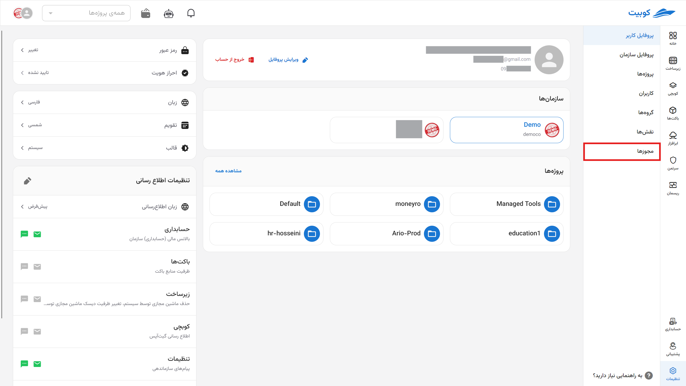
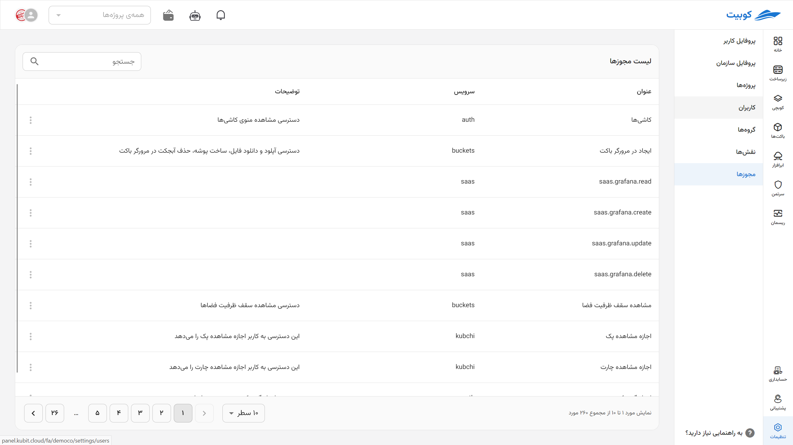

# Permissions

## Access Roles

**Access roles** are a combination of **people (users)** and **roles** that are defined on **groups of resources**. These rules specify:

> **Who has what role on which resources.**

User access is managed through **roles and permissions**.

### Permissions

For a user to access a part of the Kubit system, they must have a **specific permission**.  
However:

- Permissions are not directly assigned to users.
- Instead, they are first defined within a **role**, and then that role is assigned to the user.

To view the complete list of permissions and technical details, refer to the permissions documentation.

In Kubit, specific permissions are defined for each service, its functionalities, and access to them.

## Available Permissions

From the **Organization** section, go to the **Permissions** section:

In this section, you can view the list of available permissions for each service along with their descriptions:

