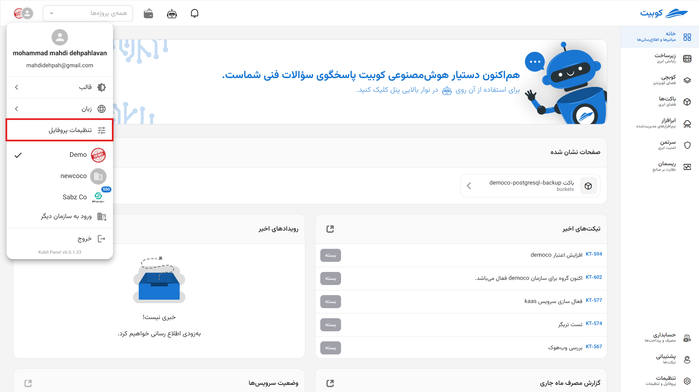
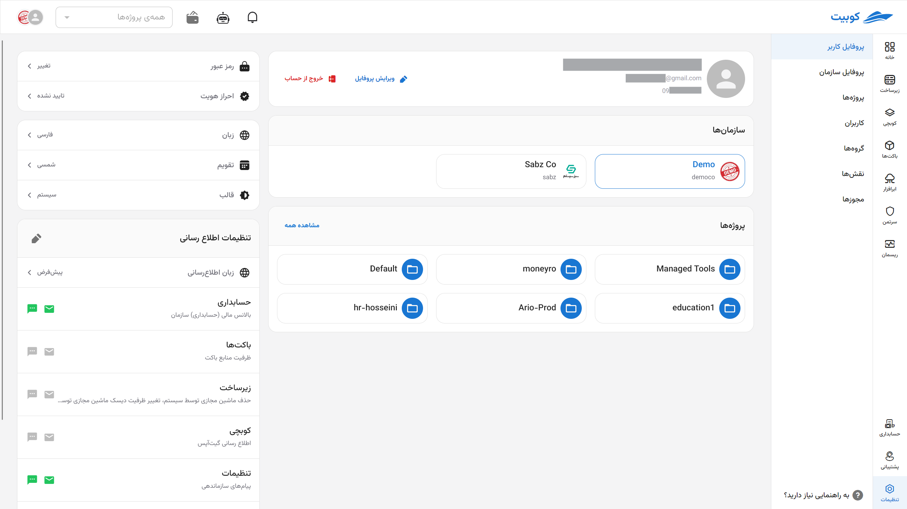
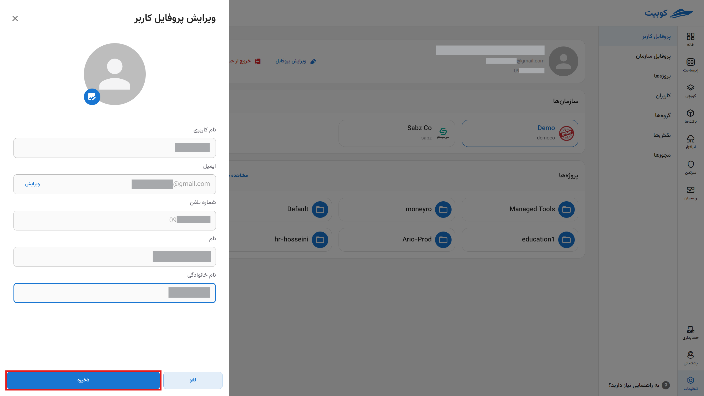
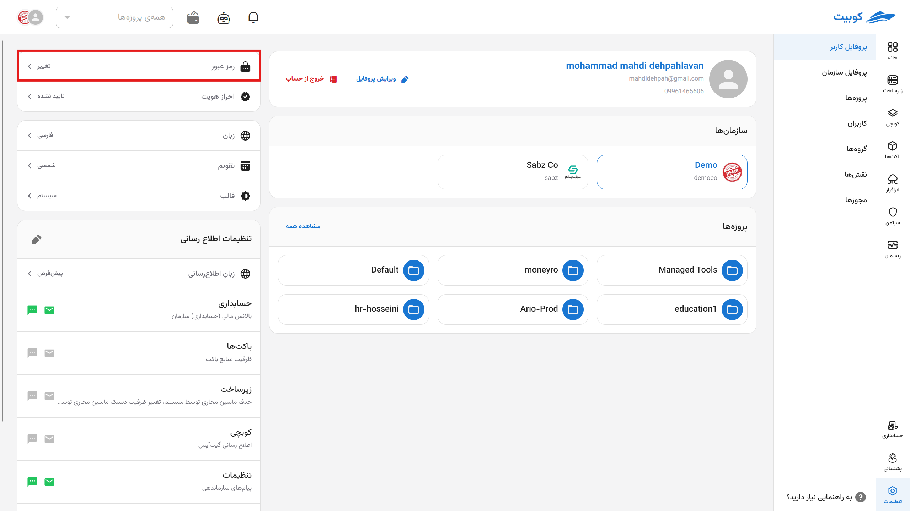
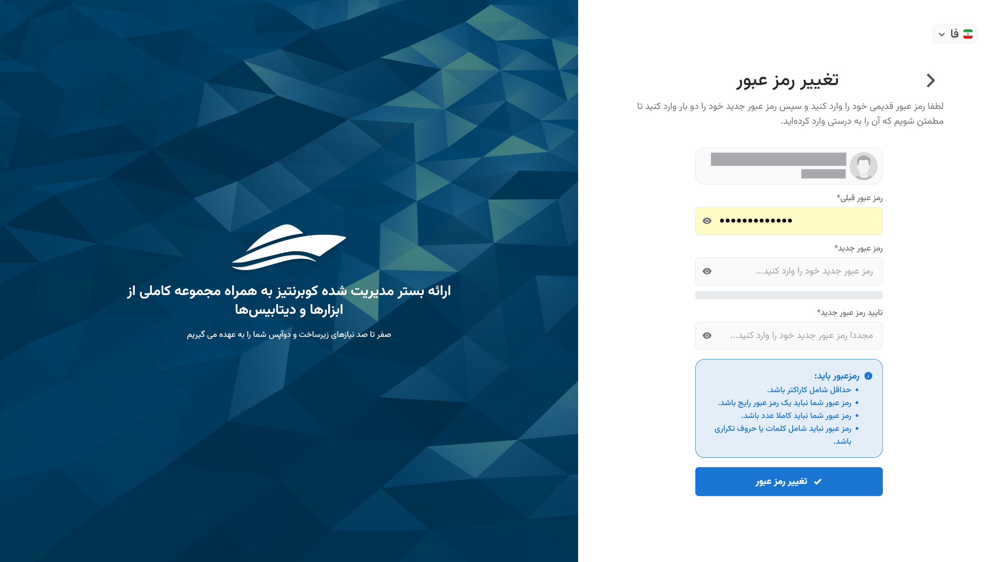
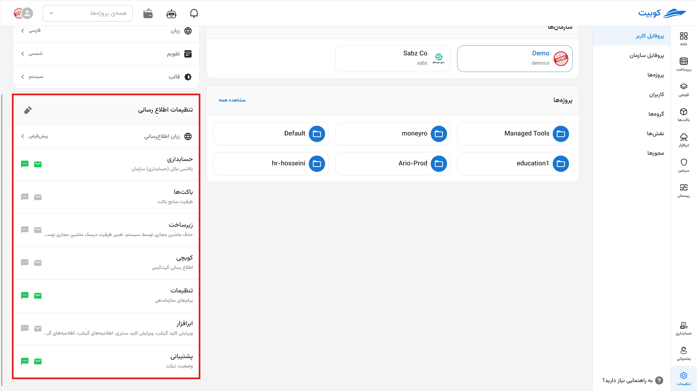
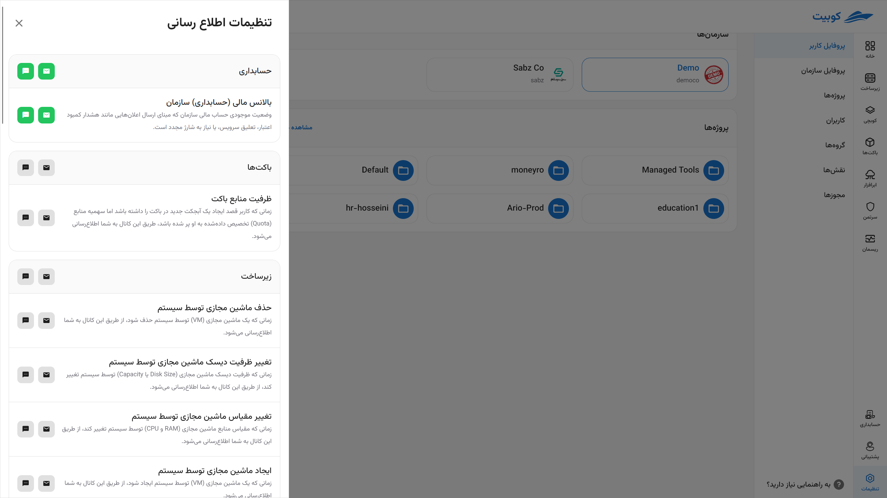

# User Profile Settings

To modify user information including email, phone number, first and last name, profile picture, as well as change the password and edit notification channels, you can use the **Profile Settings** section.

### Editing User Information

Go to the **User Information** section in **Profile Settings**, click on the three dots on the left side of the user information table, and select the **Edit** option:

You can also select and change the profile picture from this section. After entering the new information, **save** your changes:

:::caution[Note]
Please note that **username**, **email**, and **phone number** cannot be changed.
:::

### Changing the Password

:::caution[Important!]
If you have the system administrator role in the current organization in the Kubit panel, you can change your password through the **Change Password** option. Otherwise, you will not have access to change the password and must refer to the organization administrator.
:::

Go to the **User Information** section in **Profile Settings**, click on the three dots on the left side of the user information table, and select the **Change Password** option:

Then enter the old password and the new password in the change password form and click on the **Submit** button:

### Editing Notification Channels

In the **Notifications** section, a list of various channels for receiving notifications from Kubit services is available. For each service with configured notification settings, you can view the related channels and enable or disable them individually:

