# Projects

## What is a Project? {#project}

**Projects** are smaller logical units within each **organization** that are defined as containers for managing resources. Each project includes a set of resources such as:

- Virtual Machine (VM)
- Storage (Bucket)
- Software Package (Pack)

which must all **be created within a project**.

Additionally, projects allow you to **precisely control user access**, so that only authorized members of a project can view and manage its resources.

## Projects Overview

From the **Organization** section, go to the **Projects** section:

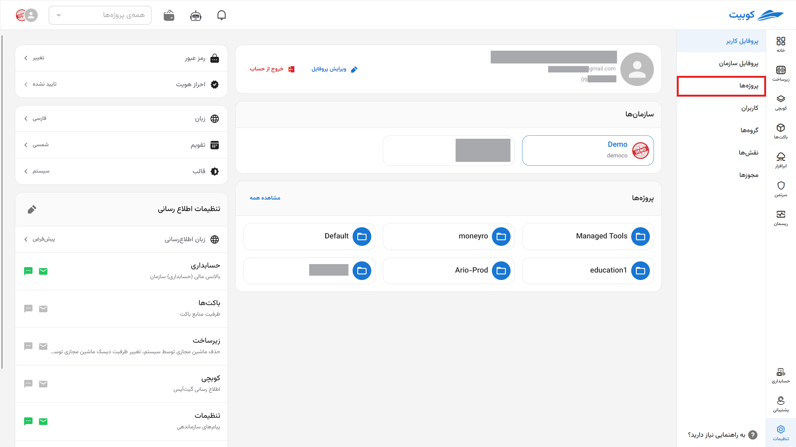

In this section, you can view the list of organization projects along with their connected services:

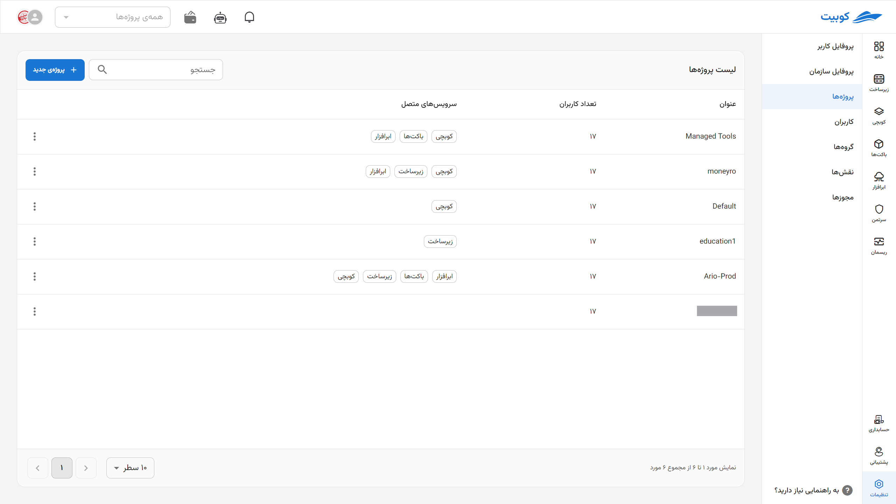

By clicking on the name of any project from the list, you will be directed to the project details page. This page includes **settings** and management of **member access**:

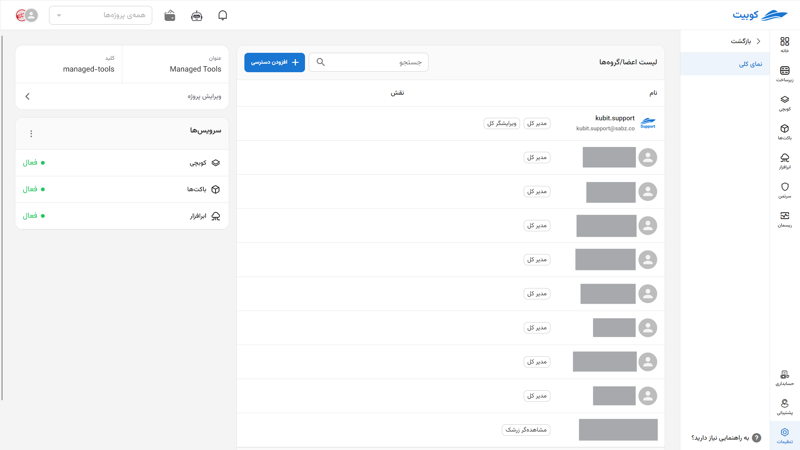

## Creating a Project {#create-project}

To create a new project, click on the **New Project** button:

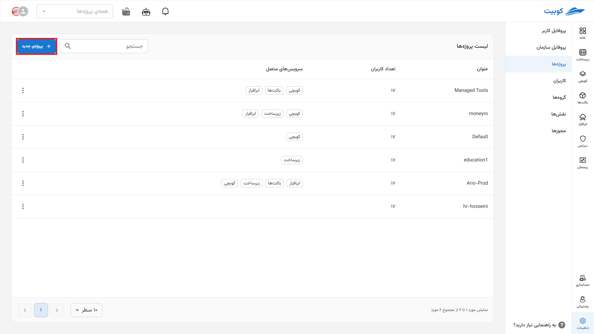

:::info[Unique Key for Each Project]
Be careful in choosing the key value, as this field acts as a unique identifier for projects and cannot be edited after the project is created.
:::
Then enter the **title** and **key** of the project and click on **Create**:

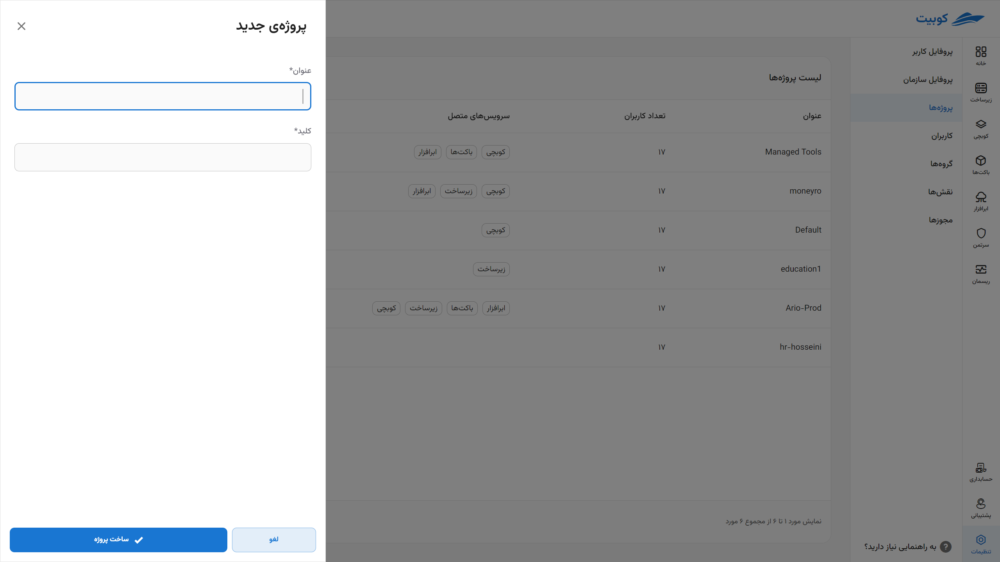

By following the mentioned steps, the project will be created and accessible through the projects list.

## Editing Project Information

First, click on the project title to enter the desired project page:

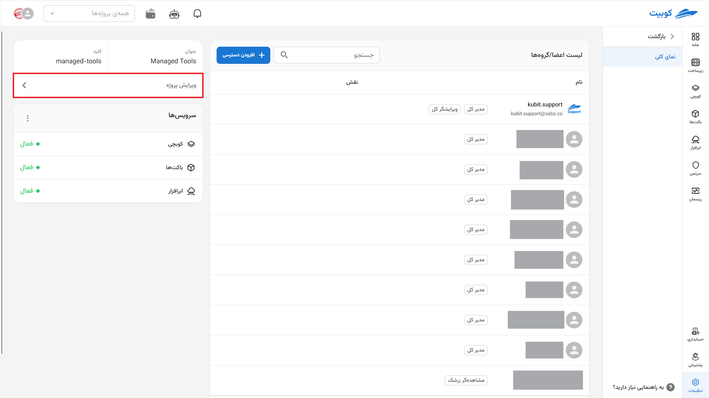

Then you can change the project title and click on **Save** to apply the changes:

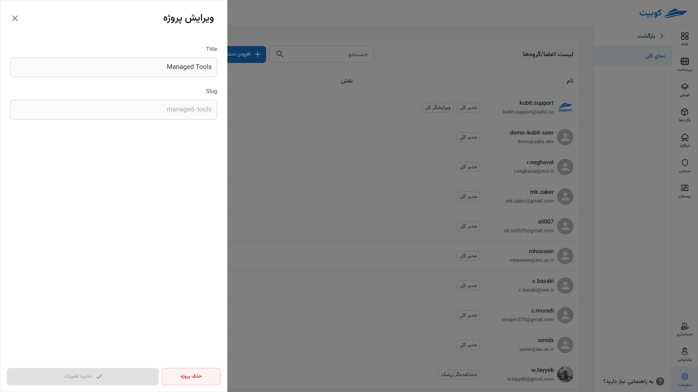

On this page, you will also have access to manage the project’s services. The management of services is explained further below.

### Connecting a Service to a Project

As explained in the definition of a [project](#project), resources and services are defined under a project. To use any service from Kubit services, you must first connect the desired service to a project in the organization. This means that the use of that service is only possible under a specific project. The connect service button will be displayed at the start of projects that do not have access to a service, and by clicking the button, the service will be connected to the project.

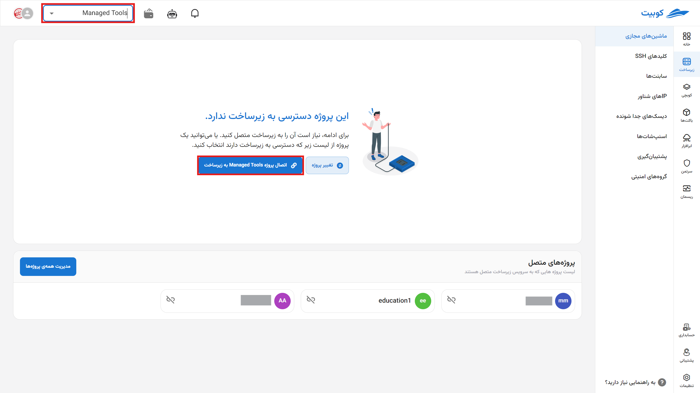

#### Disconnecting a Service from a Project

To disconnect a service from a project, click on the three-dot button of the desired service and use the **Disconnect** button:
Resources must be disconnected first before disconnecting the service.

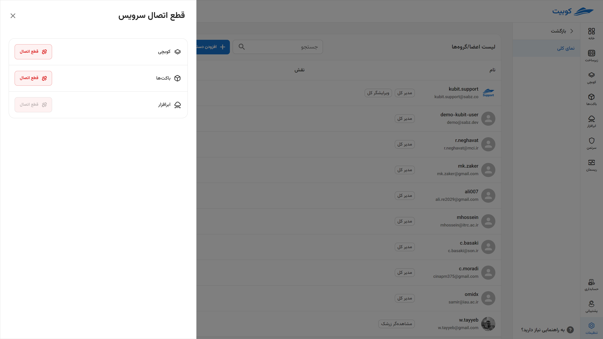

### Deleting a Project

To delete a project, two methods are provided: through the projects list and the project details page.

#### Method 1: Projects List

Click on the three-dot button of the desired project and select the **Delete** option:

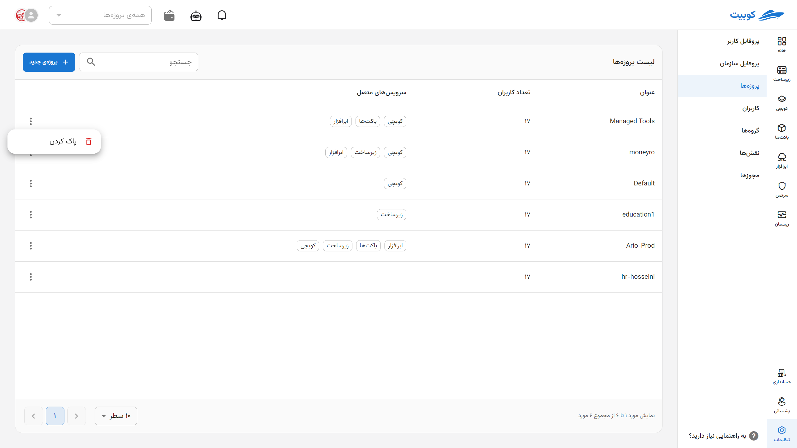
Then click on **Delete** to remove the project:

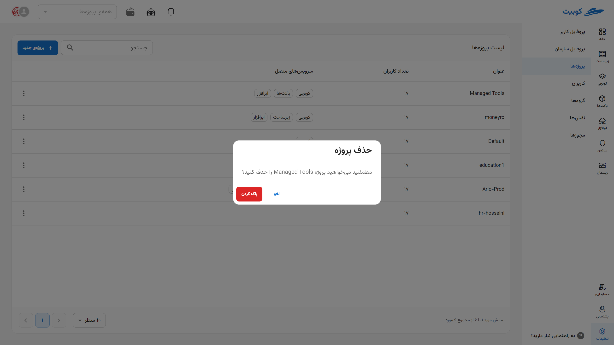

#### Method 2: Project Details Page

By clicking on the project name from the projects list, enter the details page and click on the **Delete Project** button:

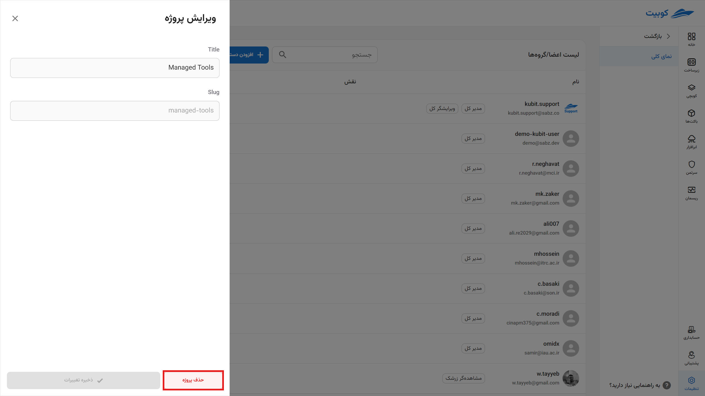

Then click on **Delete** to remove the project:

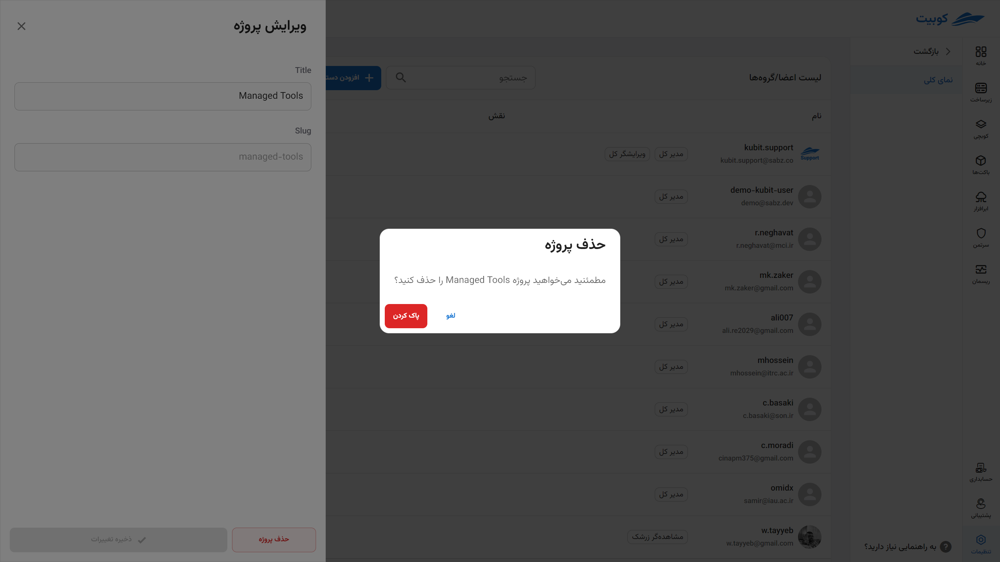

## Member Access

In the **Member Access** section, a list of project members along with their roles in the project can be viewed:

Additionally, through this section, you can add access to the project at two levels: **User** and **Group**.

Through the **Add Access** button, you can view the available options for access:

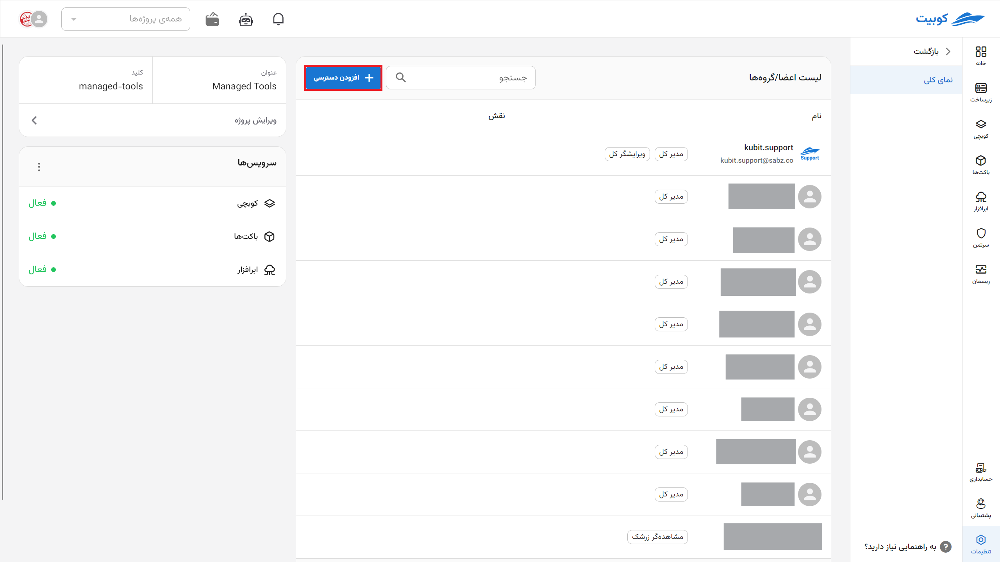
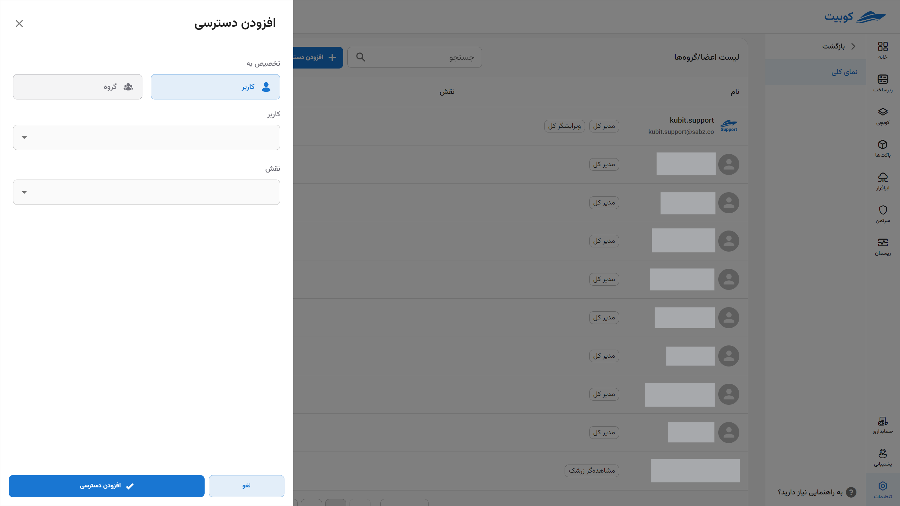

### Adding Access to a User

To add access to users, click on the **Add Access to User** option:

By selecting a user from the organization’s users and the desired role from the list of roles, add access to the project for the user:

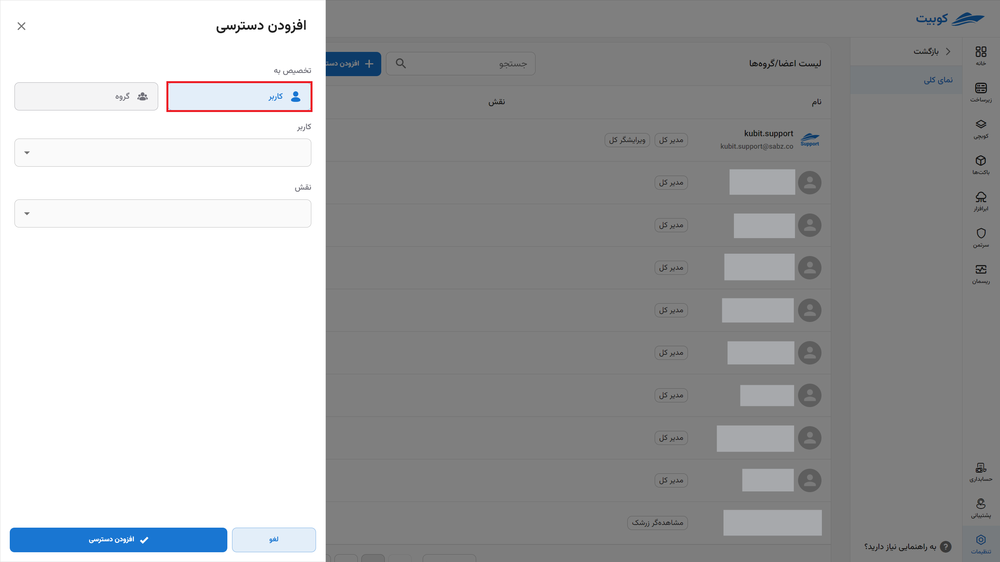

### Adding Access to a Group

To add access to a group, click on the **Add Access to Group** option:

By selecting a group from the organization’s groups and the desired role from the list of roles, add access to the project for the user group:

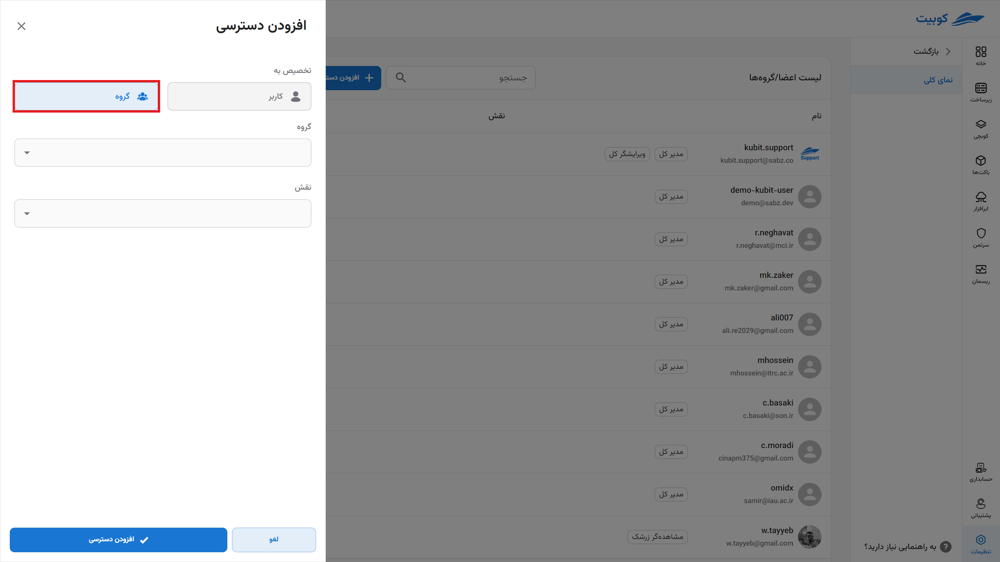
