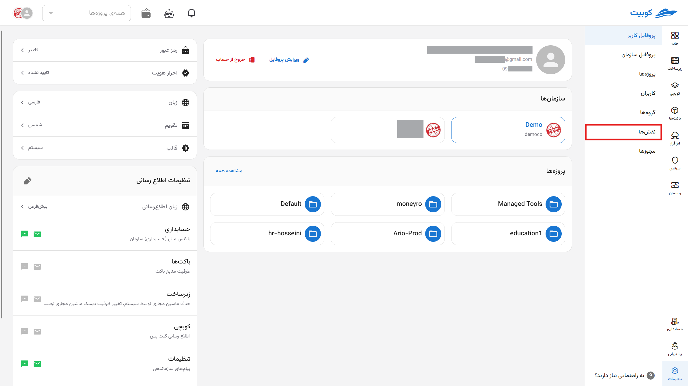

# Roles {#roles}

### Role Definition

**Roles are a collection of permissions** used to control users' access levels.

- By defining a role and assigning it to a user, the corresponding permissions are granted to the user.
- Roles can **inherit** from each other **in a hierarchical structure**.

To configure roles, refer to the roles documentation.

:::info[Types of Roles in Kubit]

In Kubit, there are two types of roles:

### 1. Default Role

Roles that are predefined in the system and can be used across all organizations.

### 2. Base Role

Roles that serve as the foundation for the inheritance of other roles.  
For example, if role A inherits from roles B and C, roles B and C are the base roles of A.

:::

## Roles Overview

From the **Organization** section, go to the **Roles** section:

Here, you can view the list of available roles:

By clicking on the name of any role, you will be directed to the role details page:

## Creating a Role

To create a new role, click the **New Role** button:

Then, enter the role name and its description and click **Create**:

After this step, you will be directed to the role details page:

However, this role is just an empty role, and you need to add the desired permissions to it. Below, we discuss adding a base role and granting permissions to the created role.

### Adding a Base Role to the Current Role

:::tip[Base Roles]
In this section, you can make the new role inherit from existing roles. This way, the permissions and access levels of the inherited role will also be assigned to this role.
:::

To do this, go to the **Base Roles** tab and click the **Edit Base Roles** button:

Then, select the desired role from the list of base roles:

After confirming and clicking **Add Base Role**, this role will be added to the organization’s role list.

As you can see, by adding a base role to the current role, the permissions of that base role are also added to the permissions of the current role:

:::tip[Assigning Permissions to a Role]
In addition to the permissions added through the base role to the current role, you can also separately add your desired permissions to the role.
:::

### Assigning Permissions to a Role

To add a permission to the role, click the **Grant New Permission** button:

Then, select the desired permission from the list of available permissions:

After confirming and clicking **Grant New Permission**, the selected permission will be added to the current role’s permissions:

:::tip[Note]

Each role inherits all the permissions of all its base roles.  
In other words, by selecting a new base role for the new role, you are effectively adding all the permissions of that role to it!  
Thus, each role has the power of all its base roles plus the permissions explicitly assigned to it.

:::

:::caution[Restriction on Removing Permissions]

Note that permissions added to the current role through a base role cannot be removed. You can only remove permissions that you have explicitly added to the role. This can be done by clicking the **X** icon next to the permission name:

:::

## Deleting a Role

To delete a role, two methods are provided: through the roles list and the role details page.

### Method 1: Roles List

Click the three-dot button next to the desired role and select **Delete**:

Then, click **Delete** to remove the role:

### Method 2: Role Details Page

By clicking on the role name from the roles list, go to the role details page and click the **Delete Role** button:

Then, click **Yes, Delete** to remove the role:

## Editing Role Information

To edit the role’s name and description, click the **Edit Role Information** button and enter the new information:

By clicking the **Edit** button, your changes will be applied:

:::tip[Editing Base Roles and Permissions List]

To add or remove base roles and permissions assigned to each role, you can do so through the role details page.

:::
