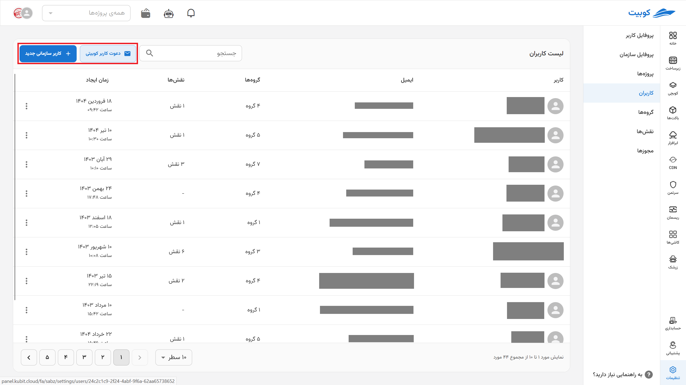
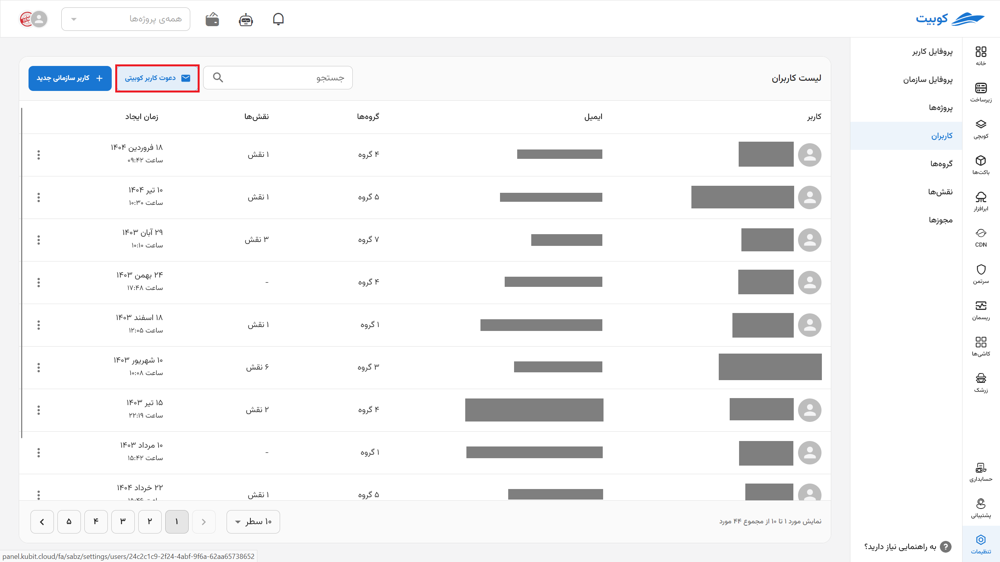
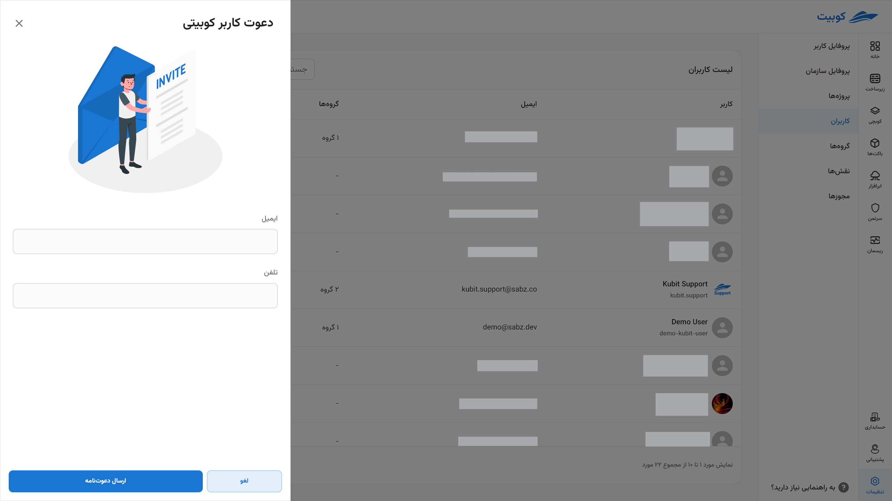
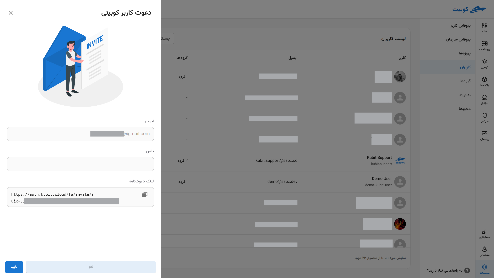
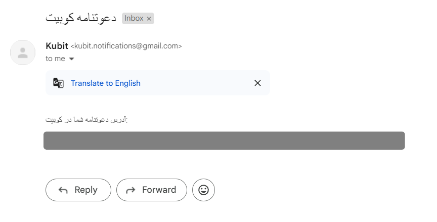
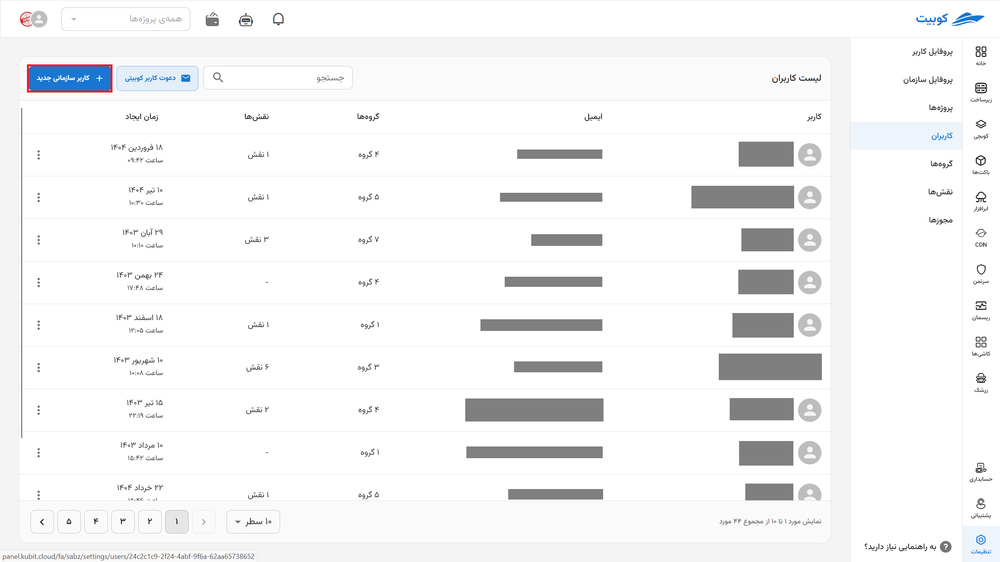
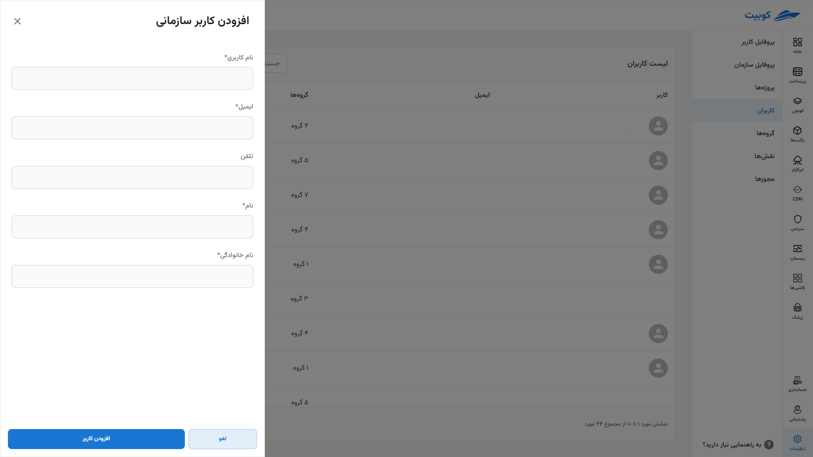
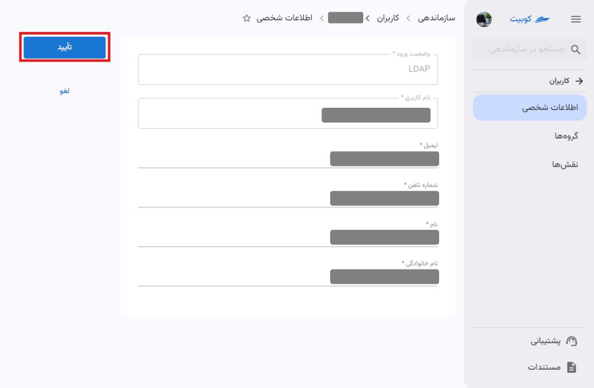

# User Management

:::info[Access Management]

- The document [Member Access Management](iam) explains the management of user and organization access.  
  :::

## User Types {#users-type}

In Kubit, there are two types of users:

- **Kubit Users** who have directly registered in the system.
- **LDAP Users** who connect through the organization’s authentication systems, such as LDAP, typically via Single Sign-On (SSO).

### Kubit Users

Users who register in Kubit normally are considered **Kubit Users** and are managed through **Kubit’s internal authentication and management system**.

#### LDAP System {#ldap}

LDAP (Lightweight Directory Access Protocol) is a protocol for accessing and managing directory information on networks. When an organization connects to LDAP, users can access important information, such as user accounts, groups, and access levels, through a centralized database. This LDAP connection enables simpler management, enhanced security, and seamless authentication.

### LDAP Users

:::info[Single Sign-On (SSO)]

Single Sign-On (SSO) authentication is a scheme that allows a user to log in with a single identifier to multiple related but independent software systems. SSO enables users to log in once and access organizational systems without re-entering authentication credentials.

:::

If an organization is connected to an LDAP system, LDAP user management can be performed within the system. If SSO is enabled for the organization, users authenticated via SSO are defined through LDAP and recognized in the system as **LDAP Users**.

## Adding an Organization User

Based on the [user types in Kubit](../#users-type), you can add new users of either LDAP or Kubit type to the organization.  
:::caution[Organization Connection to LDAP]

Note that you can only add an LDAP user to your organization if it is connected to an LDAP system. The [LDAP System](../#ldap) section provides details about this system.

:::

To add a user, go to the **Users** section in **Organization** and click the **New User** button:

You will then see various options for adding a user:  
  
The steps for each method are explained below.

#### Adding a Kubit User

Click on the **Kubit User** option:  

Enter the requested information to invite the user and click **Send Invitation**:  
  
In addition to sending the invitation link to the user, the link will also be displayed for you:  

Sample invitation link sent to the user:  
  
By clicking the sent link, the user will be added to your organization.

#### Adding an LDAP User

Click on the **LDAP** option:  

Then enter the requested user information:  

After verifying the information and clicking **Add LDAP User**, the user will be added to the organization.

##### Editing and Deleting an LDAP User

To edit user information, go to the **Users** section in **Organization**, select the desired user, and click the **Edit** button. Make the necessary changes and then click the **Confirm** button:  

:::caution[Note]  
Note that you cannot change the **username** or **login status type** of the user.  
:::  

