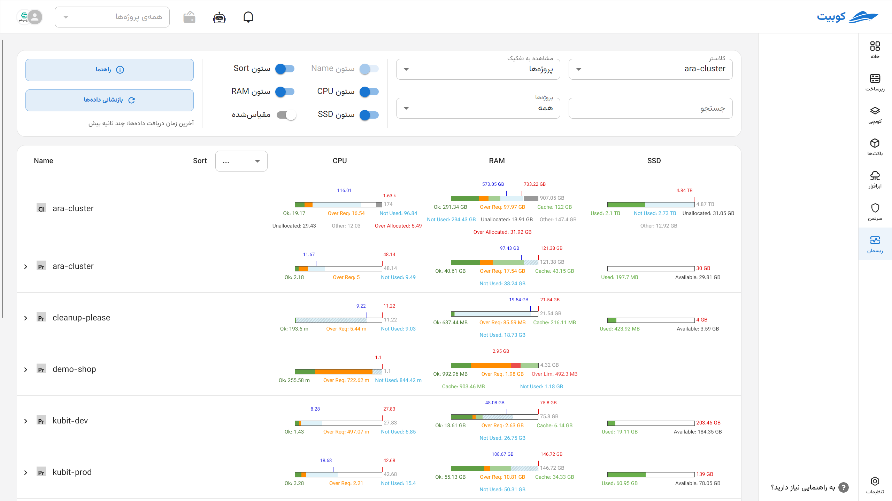
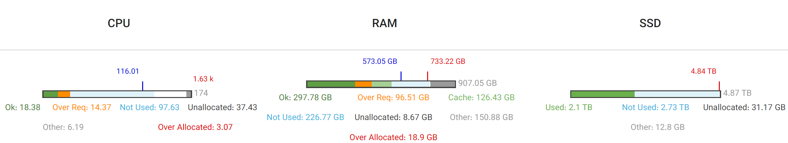
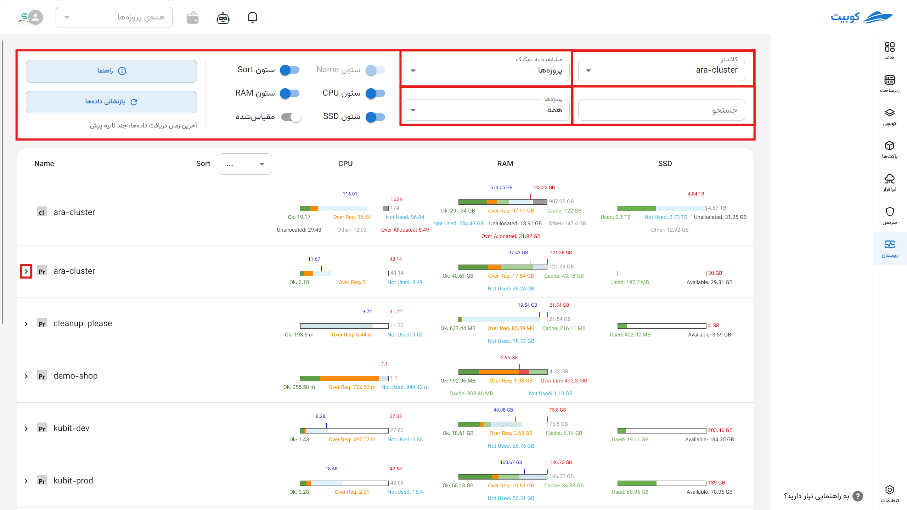
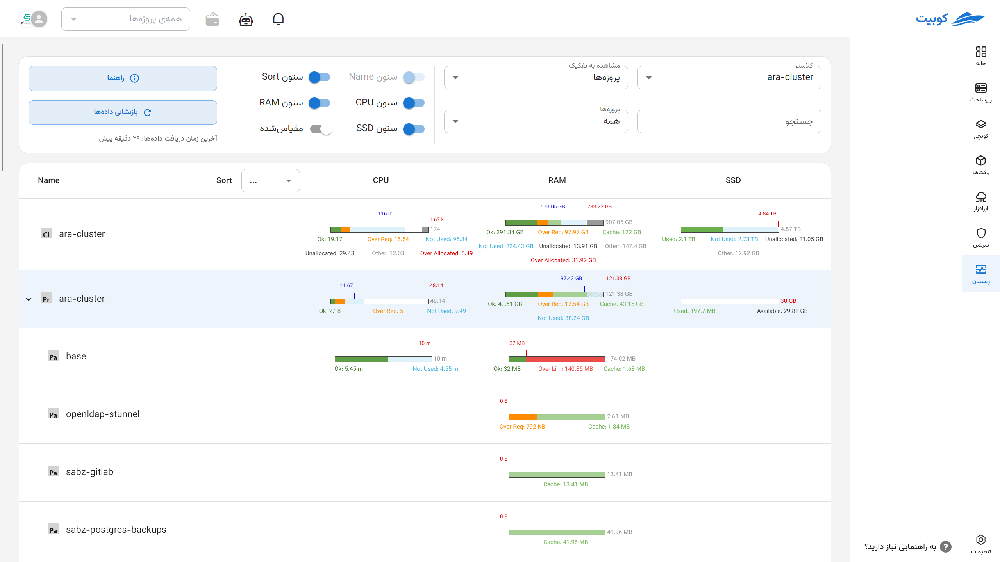
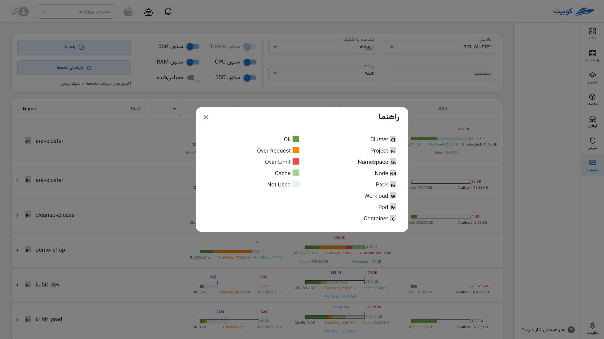
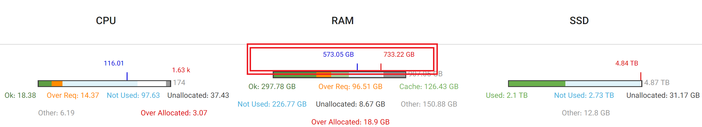
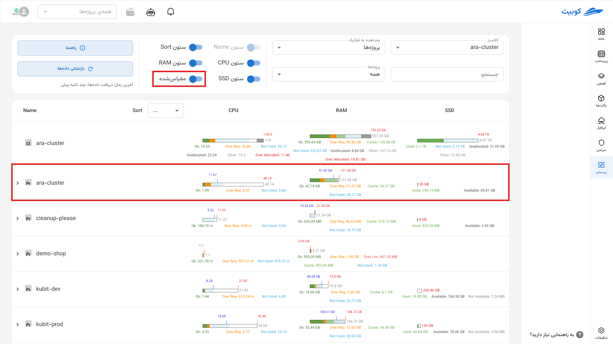

# Resman (Resource Monitoring)

In cluster-based systems like Kubernetes and other cloud environments, managing hardware and software resources is of utmost importance. In the **Resman (Resource Monitor) Subsystem**, various parameters are defined and reported to enable precise monitoring, optimal resource allocation, and health status identification. This document provides a detailed description of parameters related to various resources (CPU, memory, disk) across cluster subsections and presents their categorization in a precise and structured manner. The goal is to assist DevOps and infrastructure specialists in quickly and efficiently understanding key parameters.

This document explains [how charts are calculated and displayed](#monitoring) along with [basic concepts](#concepts).

---

## Basic Concepts {#concepts}

- **Cluster:** A set of nodes (servers) that collectively manage and allocate their resources to workloads.
- **Node:** A physical or virtual server within a cluster where workloads are executed.
- **Namespace:** A logical scope for separating resources and workloads within a cluster.
- **Workload:** Executable workloads in the form of a set of pods (e.g., applications or services).
- **Pod:** The smallest executable unit containing one or more containers in Kubernetes.
- **Container:** An isolated environment for running applications within a pod.

:::info[Basic Concepts]
For a better understanding, refer to the [Concepts](../../kubchi/concepts) section of Kubchi.
:::

---

## Resource Parameter Categorization

Resource parameters are divided into three main categories:

- **CPU**
- **Memory**
- **Disk** (SSD or HDD)

:::success[Memory Resource Units in Kubernetes]

Memory units are based on the [Kubernetes standard](https://kubernetes.io/docs/concepts/configuration/manage-resources-containers/).

In Kubernetes, memory for containers is defined in **bytes** and can be specified with a number or a suffix.

### Suffix Types:

- **Decimal (Base 10):**  
   `k`, `M`, `G`, `T`, `P`, `E`  
   Example: `400M` means 400 megabytes
- **Binary (Base 2):**  
   `Ki`, `Mi`, `Gi`, `Ti`, `Pi`, `Ei`  
   Example: `400Mi` means 400 mebibytes (approximately 420 megabytes)

### Important Note:

:::warning

Units are **case-sensitive**. For example:

- `400m` means 0.4 bytes
- `400M` or `400Mi` represents the actual memory value

For greater precision, use binary units like `Mi` and `Gi`, and always pay attention to case sensitivity.

:::

Each of these resources has specific parameters in different cluster subsections (node and non-node). The table below shows the general categorization of parameters:

| Resource       | Node Parameters                                               | Non-Node Parameters                   |
| -------------- | ------------------------------------------------------------- | ------------------------------------- |
| CPU and Memory | Capacity - Limit - Request - Used - Over Request - Child Used | Limit - Request - Used - Over Request |
| Disk           | Allocated - Child Capacity - Used - Capacity - Available      | Used - Capacity - Available           |

---

## Detailed Description of Key Parameters by Resource

| Parameter      | Node CPU & Memory | Non-Node CPU & Memory | Node Disk | Non-Node Disk | Description                                                          | Related Kubernetes Resources/Files                                      |
| -------------- | :---------------: | :-------------------: | :-------: | :-----------: | -------------------------------------------------------------------- | ----------------------------------------------------------------------- |
| Capacity       |        ✔         |          ✔           |    ✔     |               | Maximum available capacity for the resource                          | Node specifications (`status.capacity` in `kubectl get node -o yaml`)   |
| Limit          |        ✔         |          ✔           |           |               | The defined limit for the resource; zero or no value means unlimited | Pod/Container YAML file (e.g., `deployment.yaml`)                       |
| Request        |        ✔         |          ✔           |           |               | The guaranteed requested resource amount                             | Pod/Container YAML file (e.g., `deployment.yaml`)                       |
| Used           |        ✔         |          ✔           |    ✔     |      ✔       | The amount of resource currently consumed                            | Metrics Server, kubelet, cAdvisor, and `kubectl top` reports            |
| Over Request   |        ✔         |          ✔           |           |               | The amount of usage exceeding the request                            | Extracted by monitoring systems (e.g., PrometheusRule and AlertManager) |
| Available      |                   |                       |    ✔     |      ✔       | The remaining usable resource amount                                 | Metrics Server, kubelet, cAdvisor, and `kubectl top` reports            |
| Allocated      |                   |                       |    ✔     |               | Resources officially allocated to various components                 | Combination of Requests and ResourceQuotas                              |
| Child Capacity |                   |                       |    ✔     |               | Total capacity allocated to child components                         | Data collected from pods and containers on the node                     |
| Child Used     |        ✔         |                       |           |               | Resource consumption by child components                             | Data collected from pods and containers on the node                     |

---

## Resource Status Chart Segments

Each resource status chart displays segments with different colors and labels, indicating the status of resource consumption and allocation. The table below describes the various chart segments:

| Usage Status  | Label         | Color            | Node CPU & Memory | Non-Node CPU & Memory | Node Disk | Non-Node Disk |
| ------------- | ------------- | ---------------- | :---------------: | :-------------------: | :-------: | :-----------: |
| Normal Usage  | Ok            | Green            |        ✔         |          ✔           |           |               |
| Over Request  | Over Req      | Orange           |        ✔         |          ✔           |           |               |
| Over Limit    | Over Lim      | Red              |        ✔         |          ✔           |           |               |
| Not Used      | Not Used      | Blue             |        ✔         |          ✔           |    ✔     |               |
| Unallocated   | Unallocated   | White            |        ✔         |                       |    ✔     |               |
| Other         | Other         | Gray             |        ✔         |                       |    ✔     |               |
| Total Used    | Used          | Green/Orange/Red |                   |                       |    ✔     |      ✔       |
| Available     | Available     | White            |                   |                       |           |      ✔       |
| Not Available | Not Available | Gray             |                   |                       |           |      ✔       |

---

## Chart Indicators

Resource charts include indicators to highlight key statuses:

| Indicator          | Indicator Color | Related Resource | Description                                                                                                |
| ------------------ | --------------- | ---------------- | ---------------------------------------------------------------------------------------------------------- |
| Request Indicator  | Blue            | CPU and Memory   | Indicates the guaranteed requested resource amount; if overlapping with the limit, only the limit is shown |
| Limit Indicator    | Red             | CPU and Memory   | Indicates the allowed resource limit; if overlapping with the request, only the limit is shown             |
| Capacity Indicator | Red             | Disk             | Indicates the total disk resource capacity                                                                 |

---

## Practical Example

Suppose a node has a CPU capacity of 16 cores, a request of 12 cores, a limit of 14 cores, and current usage of 13 cores. In the status chart:

- The green (Ok) section shows up to 12 cores (request amount).
- The orange (Over Req) section shows between 12 and 13 cores (over request usage).
- The red (Over Lim) section appears if usage exceeds 14 cores.

This structure helps quickly understand the CPU consumption status and whether limits are being adhered to.

## Resource Monitoring Page in the Cluster {#monitoring}

This section explains the capabilities of the **Resman Subsystem** and details about the charts.

## Selectable Settings

Users can view a customized and precise representation of resource status by selecting combinations of the following settings:

- **Cluster Selection:** Specify the cluster from which data is extracted.
- **Display Type:**
  - **Default:** Compares resource consumption status without relative scaling.
  - **Scaled:** Scaled relative to the actual or reference capacity.
- **Search by Name:** Filter subsections (e.g., specific pod or container names).
- **Display Categorization:**

  - By **Project**
  - By **Node**
    - By **Namespace**

- By clicking (**<**), you can view the subcategories of that category.
- By clicking **[Guide](#guide)**, you can see the colors and resource acronyms.
- By clicking **Reset Data**, the latest cluster status information is reloaded.
  
  

---

## Table Data Structure {#guide}

In the selected view, information is displayed in a table format where:

- **Rows:** Represent the hierarchical structure of resources.
- **Columns:** Resource types (CPU, Memory, Disk).

### Hierarchical Row Structure:

| Hierarchical Column Name Structure     | Categorization Type |
| -------------------------------------- | ------------------- |
| Node → Pod → Container                 | Node                |
| Namespace → Workload → Pod → Container | Namespace           |

By clicking **[Guide](#guide)**, you can see these colors and resource acronyms.

---

## Meaning of Each Table Cell in Default (Absolute) View

In the default view, the length of all charts within a cell is equal (100%), and resource consumption or allocation ratios are indicated using colors, labels, and indicators.

### Reference Chart Length:

| Resource       | At Node Level | At Non-Node Level                                                                                                      |
| -------------- | ------------- | ---------------------------------------------------------------------------------------------------------------------- | ---- | -------- | -------- |
| CPU and Memory | Capacity      | Maximum between the defined limit and the used amount (may include cache depending on the data source, eDop and Memory | Disk | Capacity | Capacity |

---

## Resource Chart Segments

Each chart consists of segments with specific colors and labels, collectively forming 100% of the chart. The following explanations provide the formula for calculating the length of each segment under different conditions:

| Label                | Node CPU & Memory                                                | Non-Node CPU & Memory                                        | Node Disk                                                                           | Non-Node Disk                 |
| -------------------- | ---------------------------------------------------------------- | ------------------------------------------------------------ | ----------------------------------------------------------------------------------- | ----------------------------- |
| Ok\*                 | min(limit, used - over_request) (zero limit means unlimited)     | min(limit, used - over_request) (zero limit means unlimited) | -                                                                                   | -                             |
| Over Req\*\*         | min(over_request, limit - ok)                                    | min(over_request, limit - ok)                                | -                                                                                   | -                             |
| Over Lim\*           | max(0, used - limit)                                             | max(0, used - limit)                                         | -                                                                                   | -                             |
| Not Used\*           | max(0, limit - used)                                             | max(0, limit - used)                                         | max(0, min(capacity, sum(child_capacity)) - allocated)                              | -                             |
| Unallocated          | capacity - limit                                                 | -                                                            | capacity - sum(child_capacity)                                                      | -                             |
| Other                | max(0, used - sum(child_used))                                   | -                                                            | allocated - used                                                                    | -                             |
| Used                 | -                                                                | -                                                            | Total used (color depends on usage percentage: <85% green, 85–95% orange, >95% red) | Same as node disk             |
| Available            | -                                                                | -                                                            | -                                                                                   | Available                     |
| Not Available        | -                                                                | -                                                            | -                                                                                   | capacity - (used + available) |
| Over Allocated\*\*\* | max(0, other + sum(child_used) + sum(child_not_used) - capacity) | -                                                            | -                                                                                   | -                             |

- The `limit - used` value is not always accurate, as the resource limit may not be defined, meaning it is unlimited.

\*\* This value is always equal to `over_request = max(0, used - request)` and cannot be calculated if the request is not defined.

\*\*\* This value is only meaningful when the total reserved capacity for downstream components (pod, container) exceeds the reported physical capacity, which may be allowed in some overcommit models (e.g., memory).

---

## Chart Indicators

Each chart may include one or more indicators. These indicators provide more precise information about key statuses:

| Indicator      | CPU and Memory            | Disk                       | Description                                                                          |
| -------------- | ------------------------- | -------------------------- | ------------------------------------------------------------------------------------ |
| Request        | Blue (in both categories) | -                          | Guaranteed allocated amount; its position on the chart is based on the request ratio |
| Limit          | Red (in both categories)  | -                          | Allowed resource usage ceiling; its position is calculated based on the limit ratio  |
| Child Capacity | -                         | Red line (node level only) | Total capacity allocated to child components at the node level                       |
| Total Capacity | -                         | Red line (non-node level)  | Total resource capacity at the non-node level                                        |

> If an indicator’s position exceeds the allowed chart length (i.e., its numerical ratio is greater than 100%), it is displayed as a **dashed line** to indicate this deviation.

## Scaled View

In this mode, all chart segment values and indicator positions are **scaled relative to a maximum value in each column (resource type)**. The purpose is to provide a more accurate numerical comparison among resources with different sizes.

### Ratio Calculation Method

For any value X, its displayed length in the chart is calculated using the formula:

**Chart Length = 100 \* (X ÷ Maximum in Column)**

Thus, if the maximum value in a column is 200 and a value is 50, the chart length for that value will be 25%.

---

### Maximum Value Determination Method per Column

| Resource Type              | Maximum Formula                                                     | Description                                                                                                                                                                                                                           |
| -------------------------- | ------------------------------------------------------------------- | ------------------------------------------------------------------------------------------------------------------------------------------------------------------------------------------------------------------------------------- |
| CPU and Memory (Namespace) | max(max(request, used), min(max(request, used) \* 1.2, max(limit))) | Takes the larger of the maximum `request` or `used` in the column, multiplies it by 1.2, compares it with the maximum `limit`, and selects the smaller value; the final maximum is the largest value between this and `used/request`. |
| CPU/Memory (Node)          | max(capacity)                                                       | The highest reported capacity among nodes in that column                                                                                                                                                                              |
| Disk (Node and Non-Node)   | max(capacity)                                                       | The highest disk capacity (SSD or HDD) in that column                                                                                                                                                                                 |

---

## Difference Between Scaled and Default Views

In the **scaled view**, due to the selection of a reference maximum for comparison, the total length of a chart’s segments may exceed 100%. In such cases, some chart segments **must be displayed at less than their actual ratio** (i.e., compressed) to keep the chart within the 100% range.

To indicate this compression, **the visual display of compressed segments changes**; these segments are shown as **discontinuous or with a different style** (e.g., dashed lines or a distinct visual pattern) to clarify that their size is not accurate and has been distorted.

### Indicator Behavior in Scaled View

- **As long as an indicator’s value does not exceed the defined maximum**, its position on the chart is accurate and proportional to the actual value.
- **If an indicator’s value exceeds the defined maximum**, as in the default view:
  - Its position can no longer be displayed accurately.
  - Its appearance changes (e.g., dashed line) to indicate it is **outside the chart’s scale range**.

Thus, the scaled view is designed for **comparing resources across multiple table rows**, even if their values differ significantly, while the default view scales each row **based on its own resources**, making it suitable for relative intra-row analysis.

> This model is more suitable for technical users and resource analysts who need to view and compare actual consumption/allocation values in large units.

---

## Chart Compression Logic in Scaled View

In some cases, the total length of a chart’s segments may exceed 100%. In such cases, the system automatically performs compression to make the chart displayable.

### Compression Algorithm:

1. **Check Total Segment Length**  
   If the total ≤ 100%, the chart is displayed unchanged.  
   If the total > 100%, proceed to the compression stage.
2. **Remove Segments from the End Until Reaching the Allowed Length**  
   Starting from the end of the segment list (which may be ordered logically, e.g., `Other → Unused → OverLimit`), temporarily remove segments until the total of the remaining segments is ≤ 100.
3. **Restore Compressed Removed Segments**  
   The removed segments are compressed equally. The remaining length up to 100% is divided by the number of these segments, and the resulting value is assigned to all of them.
4. **Display Removed Segments Differently**  
   These segments are displayed as **discontinuous (e.g., dashed lines or a specific style)** to indicate that their ratio is not accurate and is preserved only for visual representation.
