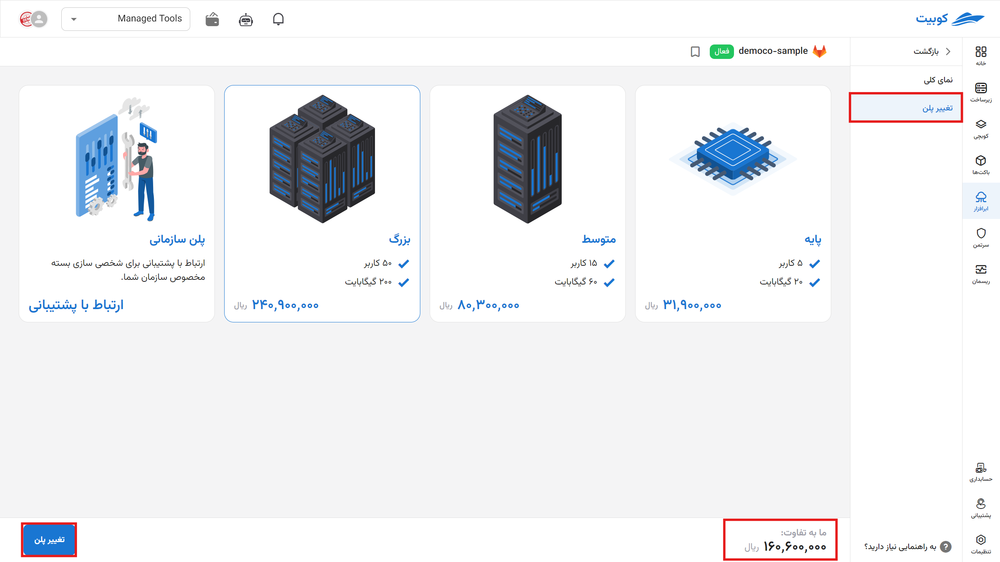

# Getting Started with Docker

To begin using the Docker Registry software, click on "Install Software."


To proceed, select the **name** (slug) of the Docker Registry and the desired plan.
:::info[Basic Plan]

The cost calculation policy for this plan is Pay As You Go, and the final cost is determined based on your usage of the service.

:::


You are now on the overview page.

This page includes codes and links for connecting to the registry, your storage usage, and information about your current plan and its features.


:::info[Change Plan]
By selecting "Change Plan," you will be redirected to the plans page, where you can choose a new plan and pay the difference to upgrade your plan.



:::

## Connecting to Docker

There are several methods to connect to a Docker Registry. Here, we will connect using **docker-cli**.

First, navigate to the overview page:

1. **Address**: Copy the registry address from this field.
2. **FULL_ACCESS**: From this section, obtain the **username** and **token** for full access connection.
3. **READ_ONLY**: From this section, you can grant limited access to users.

Enter the following command in the terminal (you can also use the **Docker Desktop** terminal):

```bash
echo "YOUR_PASSWORD" | docker login YOUR_REGISTRY_ADDRESS --username YOUR_USERNAME --password-stdin
```

Or:

```bash
docker login YOUR_REGISTRY_ADDRESS -u YOUR_USERNAME -p YOUR_PASSWORD
```

:::warning[in-line login]
**Note:** Inline login is not a secure method for logging into an account. Executing this command creates a log in the system, and if unauthorized individuals gain access, there is a risk of security incidents. For more information, [click](https://docs.docker.com/reference/cli/docker/login/).
:::


After a successful connection, you can **push** and **pull** from your registry.

:::info[Deleting Software]
To delete the cloud software via the panel, click on the options icon and then select delete.


:::

:::warning[Permanent Deletion from Servers]

\*After deletion, each application is placed in a deletion queue for permanent removal from the server within one to three days. During this period, you can restore it.


:::
