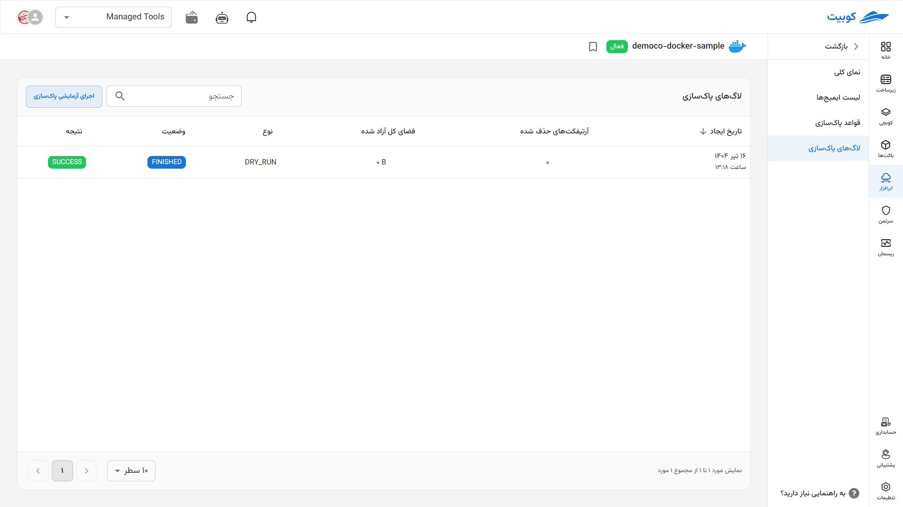
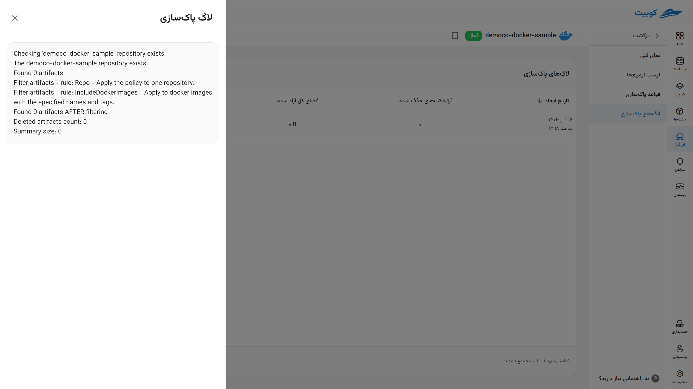
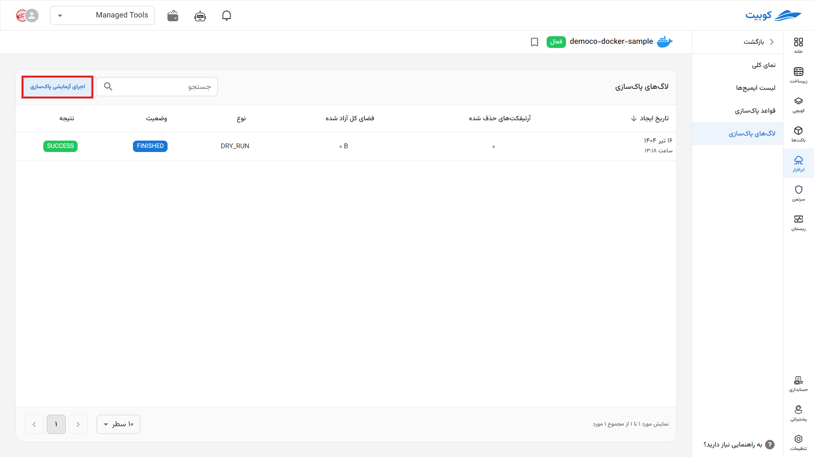

# Lifecycle Rule Execution History

The execution history of lifecycle rules and periodic image cleanup includes the **status** of rule execution in two states—running and completed—and the **result** of rule execution along with any potential errors, displayed systematically in this section.

By selecting each option, you can also view the execution details.

By clicking on **Test Cleanup Execution**, a simulation of the rule execution is performed **without making changes** to your files.

