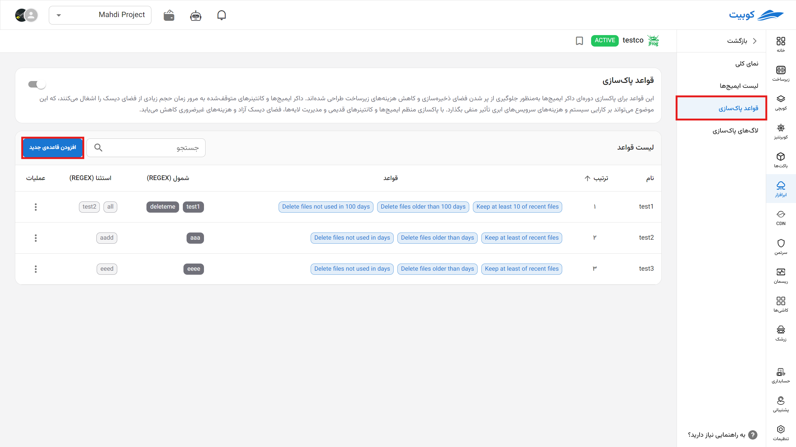
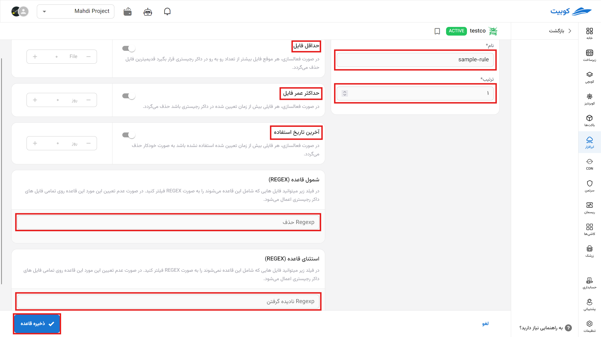
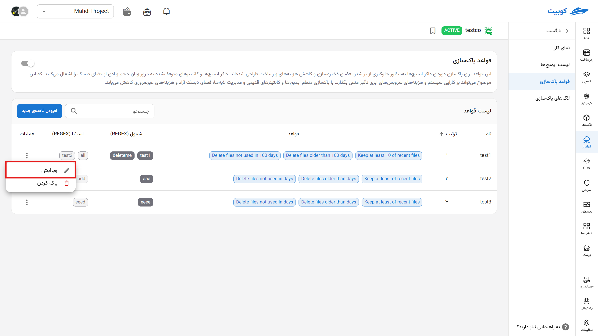
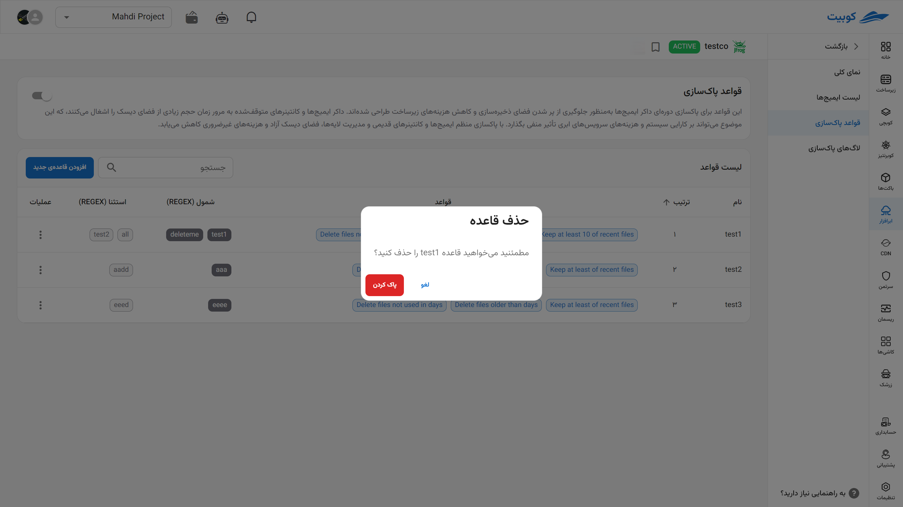

# File Lifecycle Configuration

To prevent storage space from filling up and to reduce infrastructure costs, rules can be enabled for periodic cleanup of Docker images. Docker images and stopped containers can gradually occupy significant disk space, which may negatively impact system performance and cloud service costs. By regularly cleaning up old images and containers and managing layers, disk space is freed up, and unnecessary costs are reduced.

## Adding a New Rule

To add a new rule, click on its button.

The opened page includes:

1. **Name**: Choose a name for the rule.
2. **Order**: Prioritize the execution order of rules in the rule list.
3. **Minimum Files**: The minimum number of files present in the registry; if this limit is exceeded, the oldest file is deleted.
4. **Maximum File Age**: This limit causes files to be deleted from the registry after this time has passed _since the file's creation date_.
5. **Last Used Date**: Deletes files based on the time elapsed _since the last use of the file_.
6. **Rule Inclusion (REGEX)**: By filling in this field, the rule applies to files with this pattern in their names; otherwise, it applies to all files.
7. **Rule Exclusion (REGEX)**: By filling in this field, you can specify exceptions for the rule. The rule will not apply to files with this pattern in their names; otherwise, it applies to all files.

New rules can be **edited** (options are the same as those for creating rules above).

Or they can be deleted.

