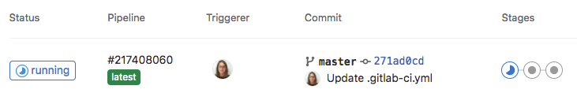

# Getting Started with GitLab Runner

To **create** and **connect** a new **runner** to your repository after creating a [GitLab repository](../../gitlab/getting-started), proceed through the cloud software installation page. (You can also use this software to automate CI/CD processes in other repositories.)

Before starting, obtain the **repository address**, **group**, and **token** for the repository where you want the runner to be active.

### Repository or Group Address

Log into the [GitLab panel](../../gitlab/getting-started) and find this address from your browser or enter it manually. The format is as follows:

`gitlab.example.com/YourRepoName/YourProjectOrGroupName`

### Token

Go to the **Build** section and click on the **Runners** option to create a new runner.

Enter the runner specifications as needed.

After creating the runner, obtain the token from this section.

### Software Installation

On the start page, select to install new software.

Then enter the **name** (slug) of your runner.
If you want to choose the capacity yourself, from the specified section, select a capacity in multiples of five and greater than your current plan.

You can see the **repository** address connected to the runner on the overview page.

:::info[Change Plan]
By selecting change plan, you will return to the plans page, and by choosing a new plan and paying the difference, your plan will be updated.

:::

In your panel, you can view the list of available runners and pause, edit, or delete them.

You can also create a new runner from the `不1`Settings > CI/CD` section.

### Running a Sample Job

After creating the runner, to run a CI job in your repository, create a file named `yml`.

Copy your script into it.

Now from the Build section, you can view your **pipeline** and the **stage** it is in, as well as how it is executed.

**Pipeline** graph:

Status of each **runner**:

:::info[Delete Cloud Software]
To delete the cloud software through the panel, click on the options icon and then hit delete.

:::

:::warning[Permanent Deletion from Servers]

\*After deletion, each application is queued for permanent deletion from the server within one to three days, during which you can take action to restore it.

:::
