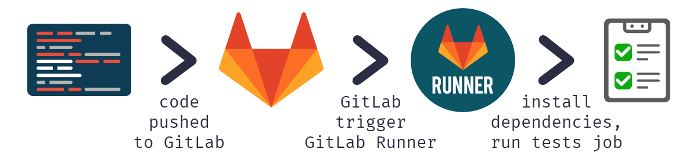

---
subDocuments:
  - concepts
  - getting-started
---

# Abrafzar GitLab Runner (Automation and Execution of CI/CD Tasks)

Using this software, developers can automate and manage the processes of **building**, **testing**, and **deploying** software at any stage and **environment** (Development, Staging, Production, etc.). This capability not only increases the speed and accuracy of development but also enables rapid bug detection and ensures software stability across **various environments**.

