# Getting Started with GitLab

To **create** and **connect** to a new repository, proceed through the software installation page.

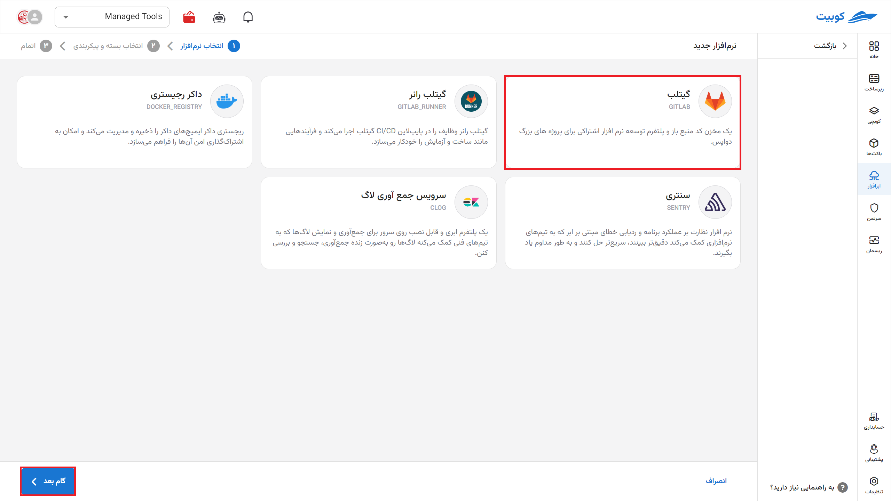

Then, specify the **name** (slug, which will be part of your repository’s URL) for your repository.

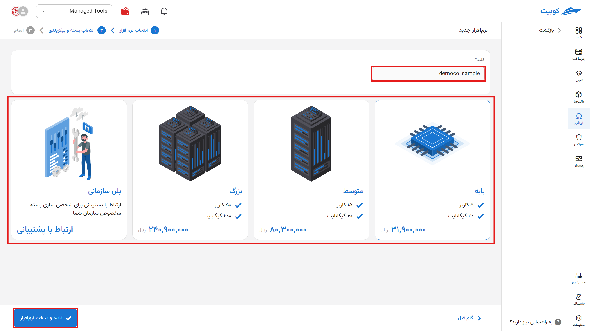

On this page, you can view the details of your repository. By clicking on the address, you will be redirected to your GitLab panel. You can also access it via git or similar tools.

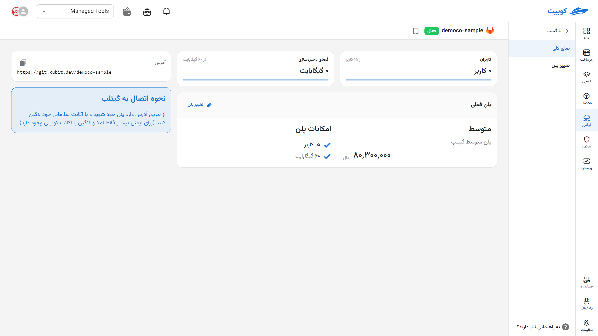

:::info[Change Plan]
By selecting "Change Plan," you will be redirected to the plans page, where you can choose a new plan and pay the difference to upgrade your plan.

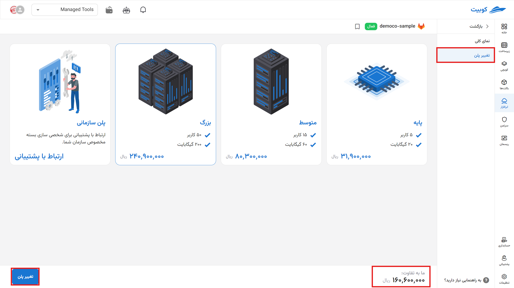

:::

Then, access your panel via the address and log in with your [Kubit account](../../../account/). (For enhanced security, access to Kubit services is only possible by logging in with a Kubit account.)

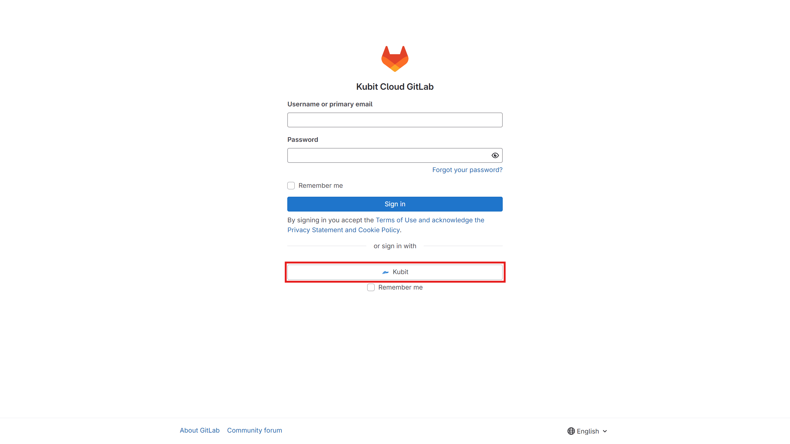

You will be greeted with the GitLab homepage. From this section, you can create a new **project** or **group** or upload your project.

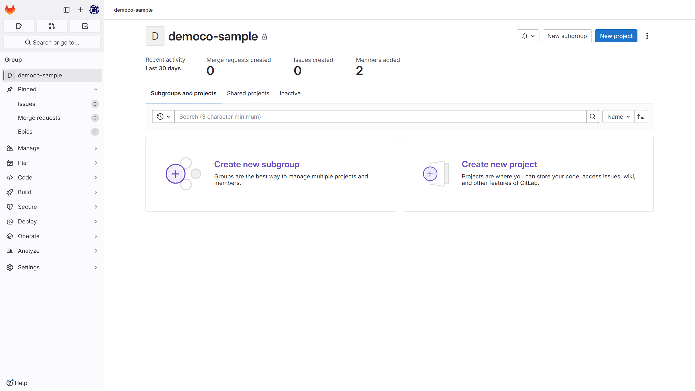

If you want to **import** a project from GitHub, you will need an **Access Token**. Refer to this [link](https://docs.github.com/en/authentication/keeping-your-account-and-data-secure/managing-your-personal-access-tokens) for assistance.

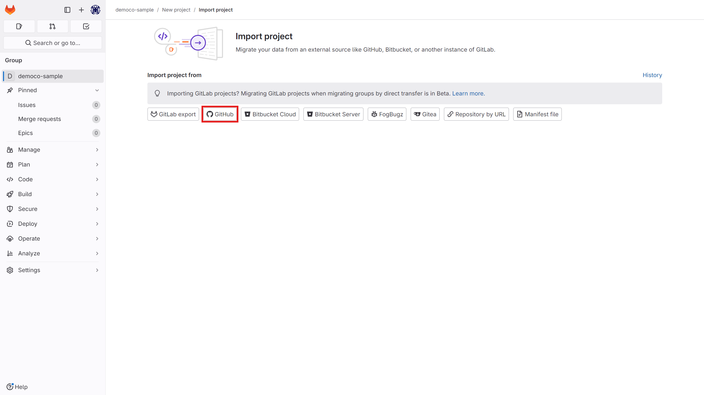

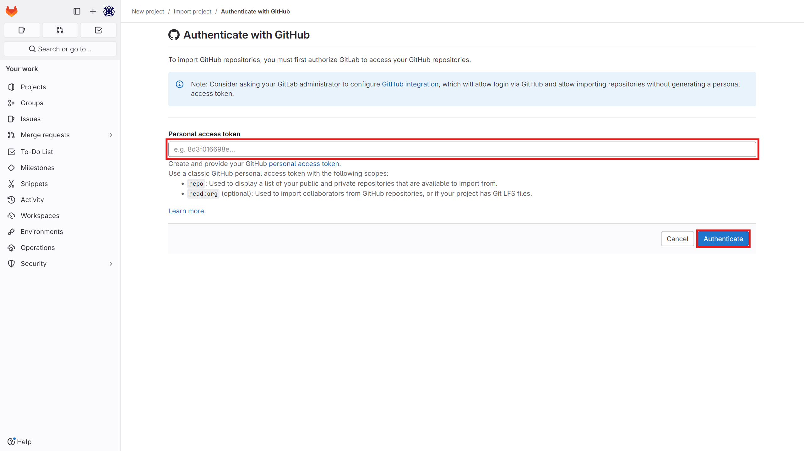

:::info[Deleting Software]
To delete the cloud software via the panel, click on the options icon and then select delete.

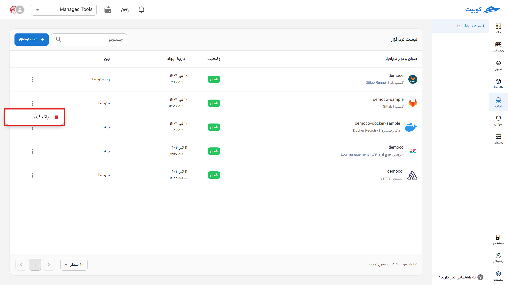
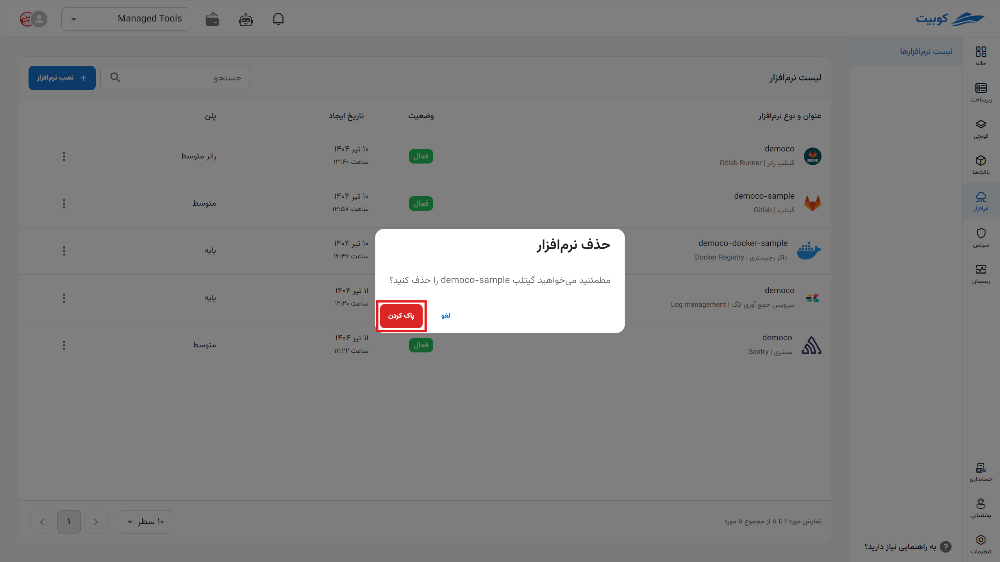
:::

:::warning[Permanent Deletion from Servers]

\*After deletion, each application is placed in a deletion queue for permanent removal from the server within one to three days. During this period, you can restore it.

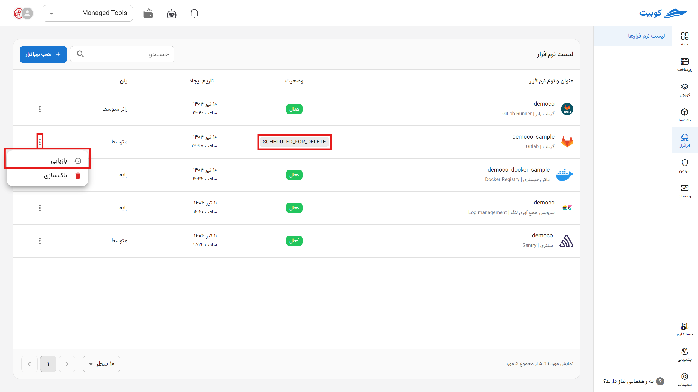
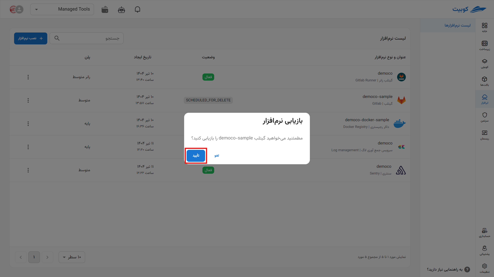
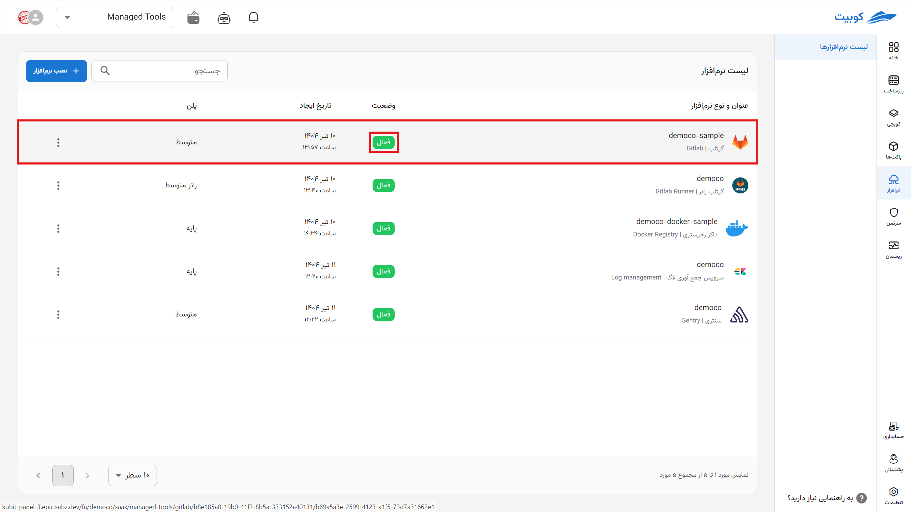

:::
