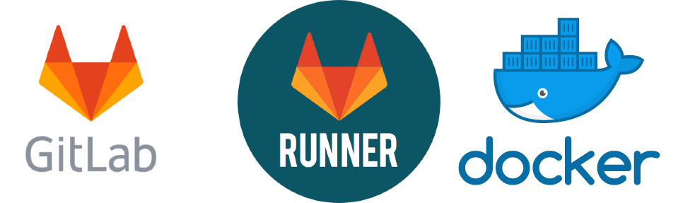

---
subDocuments:
  - gitlab
  - gitlab-runner
  - docker
  - sentry
---

# Cloud Software (Managed Software)

**Cloud Software** (SaaS) is a cloud-based service designed to facilitate, accelerate, and secure developers' access to necessary software tools. This platform provides an integrated infrastructure that requires no local installation or configuration, enabling immediate, simultaneous use without dependency on non-native services with just a few clicks. **Cloud Software** is designed to deliver a stable, secure, and locally-compatible experience for development teams.

After creating your [user account](../account) on the **Kubit** website and [selecting the relevant project](../organization), follow the step-by-step service guide below.

## Quick Access:

- **[GitLab (gitlab)](gitlab)**: Version control software compatible with DevOps processes

- **[GitLab Runner (gitlab runner)](gitlab-runner)**: Integrated CI/CD management system compatible with GitLab for DevOps development

- **[Docker Registry (docker registry)](docker)**: Storage for Docker container images

- **[Sentry (sentry)](sentry)**: Performance management and tracking of code and platform issues and errors
