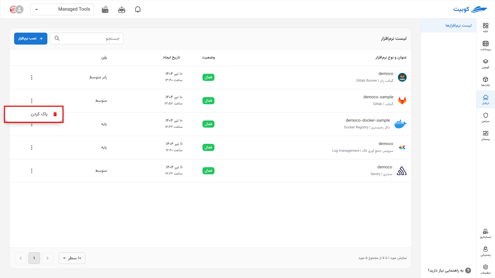
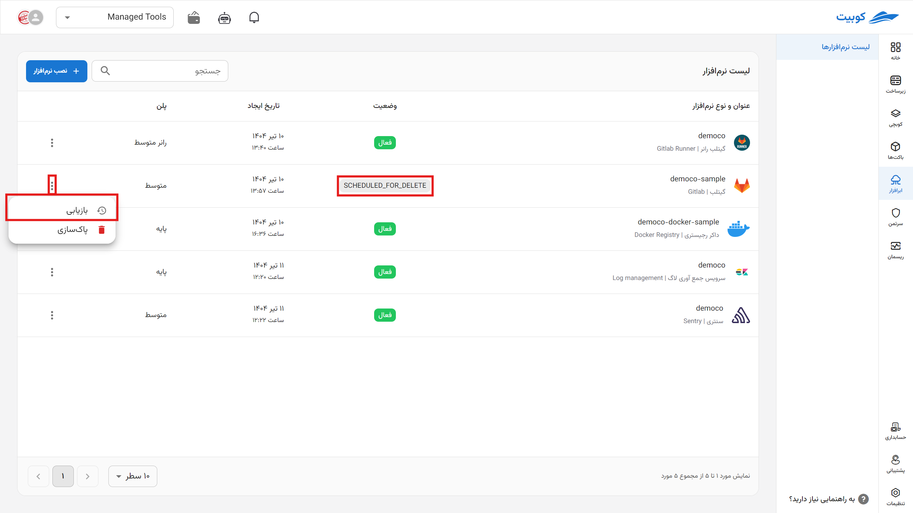
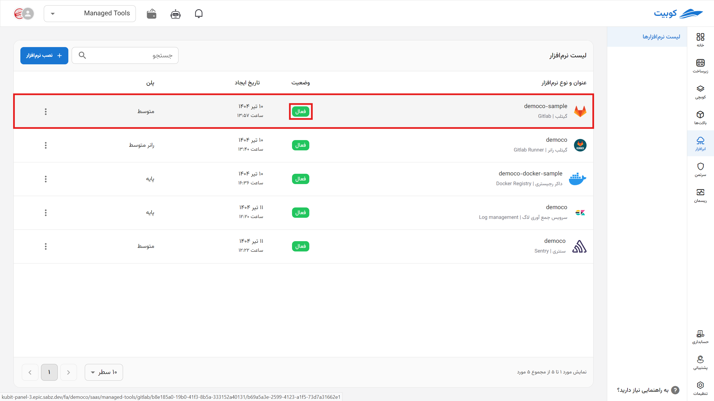

# Getting Started with Sentry

To start using the Sentry cloud software, first install it through the cloud software page.

Then specify the **name** (slug, which will be part of your panel’s URL) for your Sentry panel.

On this page, view your repository details. By clicking on the address, you will be redirected to your GitLab panel. You can also access it via git or similar tools.

:::info[Change Plan]
By selecting change plan, you will return to the plans page, and by choosing a new plan and paying the difference, your plan will be updated.

:::

Then, log into your panel using the provided address with your [Kubit account](../../../account/). (For security reasons, access to Kubit services is only possible by logging in with a Kubit account.)

Grant the usage permission.

This page is the panel that displays issues to you.

To connect Sentry to your project, click on Create project on this page. You will be taken to the project type selection page, where you can enter details according to your needs. For example, to create a Python project, proceed as follows.

Now, follow the guide to set up the SDK connection to your code.

The specified section in the code indicates that errors should be sent to the service address. The service then collects these errors and displays them with relevant details as shown below.

:::info[Delete Cloud Software]
To delete the cloud software through the panel, click on the options icon and then hit delete.

:::

:::warning[Permanent Deletion from Servers]

\*After deletion, each application is queued for permanent deletion from the server within one to three days, during which you can take action to restore it.

:::
