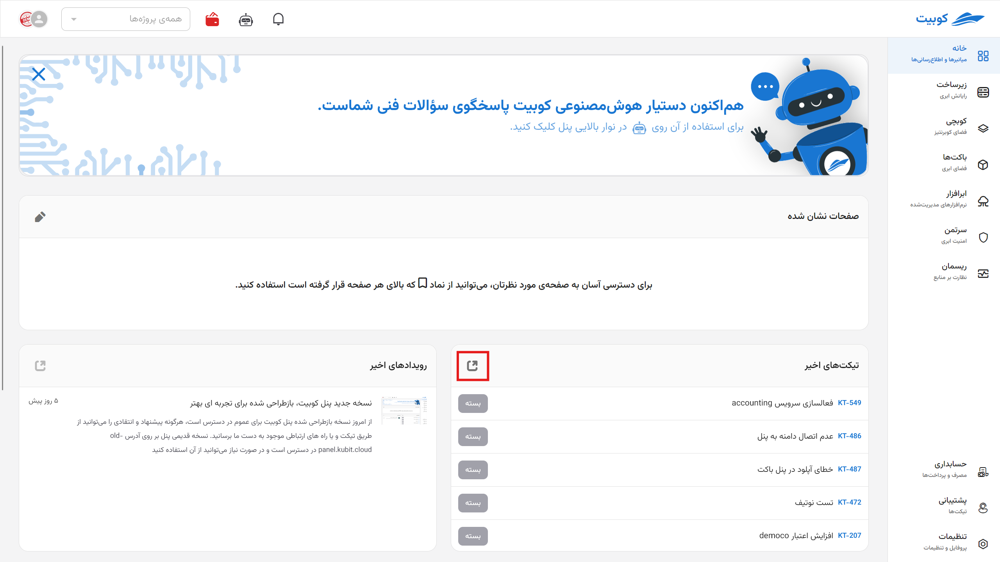
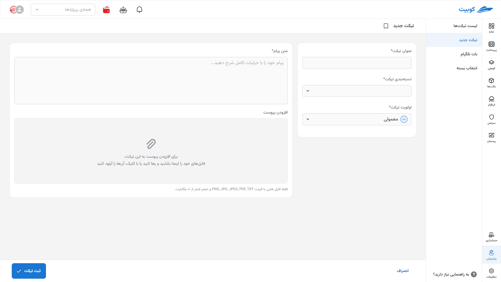
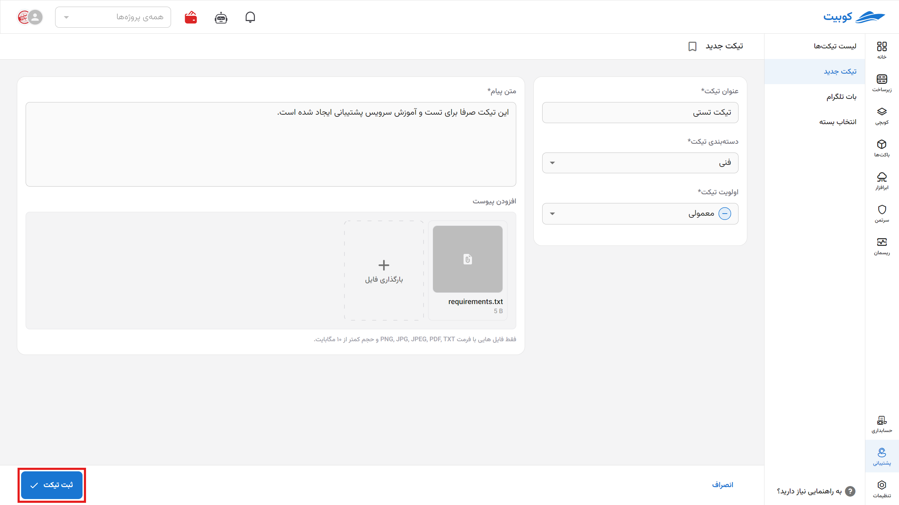

# Creating a New Ticket

Two access points have been provided for creating a ticket:

- The **Recent Tickets** section on the panel’s homepage
- The **New Ticket** section on the support service page

:::tip[Ticket Creation Form]
The only difference is the initial access to the **Create Ticket** option, and regardless of the chosen path, you will be directed to the ticket creation form.
:::

## Path 1: Panel Homepage

From the panel’s homepage, click on the **Shortcut** button to be directed to the support page:

## Path 2: Support Service Page

From the support service page, first enter the **Support** service from the Kubit panel:

Then click on the **New Ticket** option to be directed to the ticket creation form:

## Ticket Creation Form

Using either of the mentioned paths, you will be directed to the ticket creation form. In this form, information such as **Title**, **Priority**, **Category**, **Description**, and **Attachments** is entered.
:::tip[Mandatory Fields]
All ticket fields except file uploads are mandatory. Ensure your request is described comprehensively and clearly in the ticket to allow the support team to conduct the initial review more quickly and accurately.
:::

:::info[Default Priority]
When creating a ticket, the **Normal** priority is selected by default, which you can change.
:::

Finally, click the **Submit** button to send your ticket:

If there is a response from support or any change in the ticket status, the customer will be notified via SMS to their mobile number.
