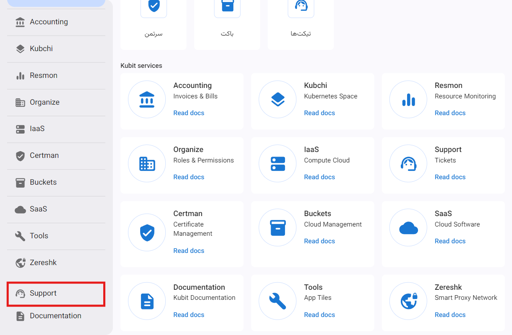
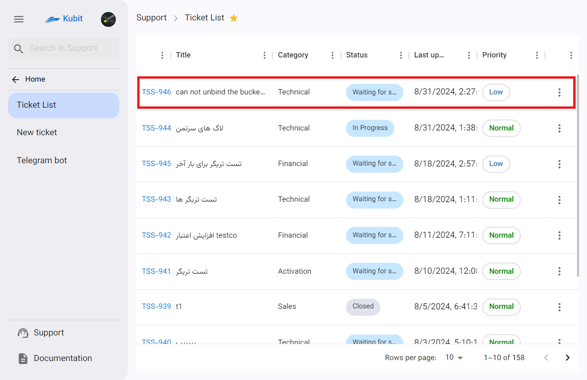

# Creating a New Ticket

To access ticket creation, two access points have been established:

- **Recent Tickets** section on the main panel page
- **New Ticket** section on the support service page

:::tip[Ticket Creation Form]
The only primary access to the ticket creation option is different, and when using either of the paths, you will be directed straight to the ticket creation form.
:::

## First Path: Main Panel Page

From the main panel page, click on the **New Ticket** button to be directed to the ticket creation form:

## Second Path: Support Service Page

From the Support service page, first access the Support service through the Kubit panel:

Then click on the **New Ticket** button to be directed to the ticket creation form:

## Ticket Creation Form

If you use any of the mentioned paths, you will be directed to the ticket creation form:

Then, enter the ticket title:

Select the priority and category from the list:

:::info[Default Priority]
When creating a ticket, the default priority is set to **Normal**, which you can change.
:::

Also, enter your ticket description:

If you need to upload a file, in the **Attachments** section, click on the **Add Attachment** button and select the file you want to upload:

At the end, click the **Send** button to send your ticket:

After creating the ticket, you will be directed to the ticket list page, where you can view the new ticket:

