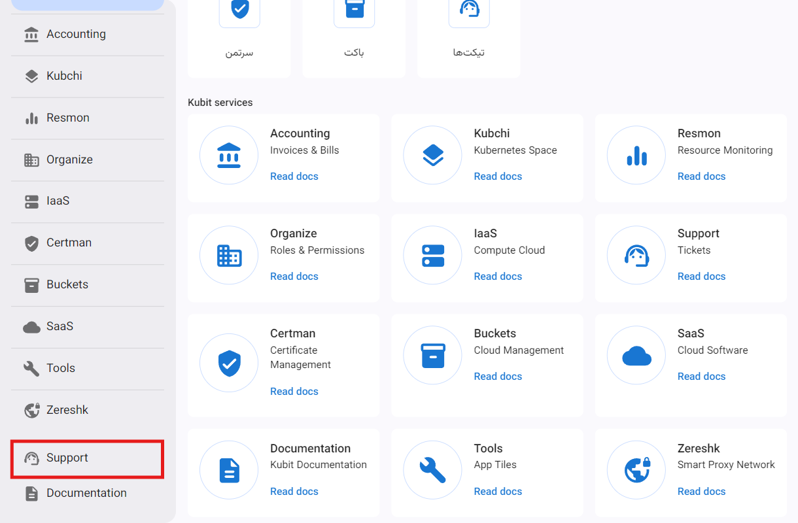

---
subDocuments:
  - settings
  - create-ticket
---

# Support (Ticketing)

The Kubit support service is designed based on a ticketing system, ensuring that users have access to support services in the quickest and most efficient manner possible. Each ticket is carefully reviewed and responded to by our experienced specialists. Users have full access to the tickets they have submitted and the responses they have received through the company's dedicated panel. Users can create tickets with different priorities and in various categories to make the support process more organized and efficient. This flexible structure ensures that each organization receives the highest level of support services according to its needs and priorities.

## Basic Concepts

### Ticket

A ticket is a request or complaint from a customer that is submitted to resolve an issue or provide a service.

### Support System (Ticketing)

The support system is a system used to manage tickets and provide support services to customers.

### Ticket Status

Ticket status indicates the various stages that a ticket goes through during its lifecycle.

#### List of Statuses

- Waiting for Response: Any ticket created by the customer in the panel initially changes to the Waiting for Response status.
- In Progress: When one of the support agents accepts the ticket for review, the ticket status changes to In Progress.
- Waiting for Customer: If a response is sent from support to the customer, the ticket status changes to Waiting for Customer.
- Closed: When the user's request is fulfilled and the issue is resolved or the ticket is closed by the user, the status changes to Closed.

### Ticket Priority

Priority determines the importance or urgency of reviewing a ticket.

#### List of Priorities

- Critical
- Urgent
- High
- Normal
- Low

:::info[Default Priority]
When creating a ticket, the default priority is set to Normal, which can be changed.
:::

### Ticket Categorization

Categories used for dividing tickets based on the type of issue or request.

#### Categories List

- Activation
- Technical
- Financial
- Sales

### Lifecycle of a Ticket

Any ticket submitted by a customer is initially in the **Waiting for Response** status. When a support agent starts reviewing the ticket, the status changes to **In Progress**. After the review, if there are any questions for the customer or more information is needed from the customer, a message is created under the same ticket for the customer, and the status changes to **Waiting for Customer**. This cycle continues until the issue is resolved. After the problem is resolved, and if no further messages are sent by the customer within 48 hours after the support response, the ticket is automatically closed.

### SLA (Service Level Agreement)

SLA stands for Service Level Agreement, which specifies the commitments, standards, and performance metrics between the service provider and the customer. Each organization receives SLAs for tickets with different priorities according to their support plan.

### Support Plans

The table below shows the support plans provided by Kubit:

| Priority                                 |  Organizational   |   Advanced   |   Medium   |      Base      |
| :--------------------------------------- | :---------------: | :----------: | :--------: | :------------: |
| Low (General Guidance)                   |    < 24 hours     |  < 24 hours  | < 48 hours |   < 48 hours   |
| Normal (System Disruption)               |     < 4 hours     |  < 12 hours  | < 12 hours |   < 24 hours   |
| High (Disruption in Production System)   |     < 4 hours     |  < 8 hours   | < 8 hours  |       -        |
| Urgent (Production System Halt)          |     < 1 hour      |  < 2 hours   | < 2 hours  |       -        |
| Critical (Business-Critical System Halt) | < 10 - 30 minutes | < 30 minutes |     -      |       -        |
| Technical Support                        |       24/7        |     24/7     |    24/7    | Business hours |

:::info[Default Support Plan]
By default, the base support plan is set for new organizations.
:::

:::tip[Custom Support Plan ]
It is also possible to set up a custom support plan for large organizations, which can be arranged by contacting the Kubit support team.
:::
