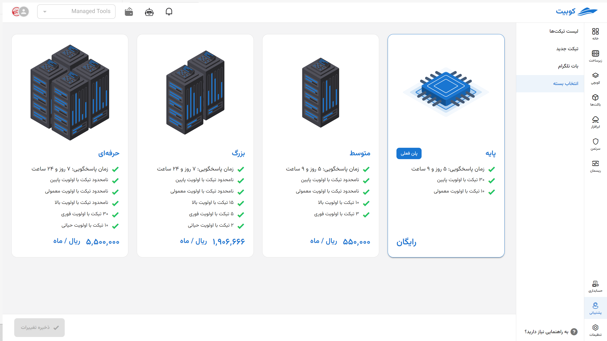

---
subDocuments:
  - ticketing
  - create-ticket
---

# Support

Kubit's support service is based on a ticketing system, ensuring that users have access to support services in the fastest and most efficient way possible. Each ticket is carefully reviewed and responded to by our experienced specialists. Users can access all the tickets they have submitted and the responses received through the company’s dedicated panel. Users can create tickets with different priorities and in various categories to ensure a more organized and efficient support process. This flexible structure guarantees that each organization receives the highest level of support services tailored to its needs and priorities.

## Basic Concepts

### Ticket

A ticket is a request or complaint from a customer submitted to resolve an issue or provide a service.

### Support System (Ticketing)

The support system is used to manage tickets and provide customer support services.

### Ticket Status

The ticket status indicates the various stages a ticket goes through during its lifecycle.

#### List of Statuses

- **Awaiting Response**: Every ticket created by a customer in the panel initially changes to the **Awaiting Response** status.
- **In Progress**: When a support agent accepts the ticket for review, the ticket status changes to **In Progress**.
- **Awaiting Customer**: If a response is sent from support to the customer, the ticket status changes to **Awaiting Customer**.
- **Closed**: When the user’s request is fulfilled and the issue is resolved, or the ticket is closed by the user, the status changes to **Closed**.

### Ticket Priority

Priority indicates the importance or urgency of reviewing a ticket.

#### List of Priorities

- Critical
- Urgent
- High
- Normal
- Low

:::info[Default Priority]
When creating a ticket, the **Normal** priority is selected by default, which can be changed.
:::

### Ticket Categorization

Categories are used to classify tickets based on the type of issue or request.

#### Categories

- Activation
- Technical
- Financial
- Sales

## Ticket Lifecycle

Every ticket submitted by a customer is initially placed in the **Awaiting Response** status. When a support agent begins reviewing the ticket, the status changes to **In Progress**. After review, if there is a question for the customer or additional information is needed from the customer, a message is created under the same ticket, and the ticket status changes to **Awaiting Customer**. This cycle continues until the issue is resolved. If no further message is sent by the customer within 48 hours after the support response, the ticket is automatically closed.

### SLA (Service Level Agreement)

SLA stands for Service Level Agreement, which specifies the commitments, standards, and performance metrics between the service provider and the customer.
Each organization receives SLAs for tickets with different priorities based on their support plan.

## Support Plans

From the plan selection section, you can choose a **support plan** tailored to your needs.

:::info[Default Support Plan]
By default, the **Basic** support plan is set for new organizations.
:::
:::tip[Custom Support Plan]
It is also possible to set up a custom support plan for large organizations by contacting the Kubit support team.
:::
