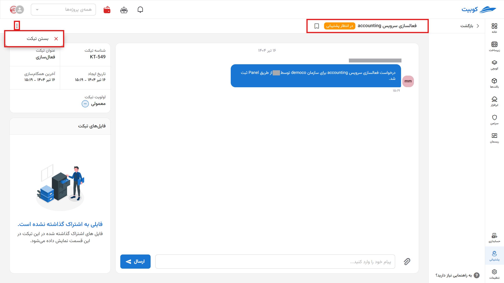
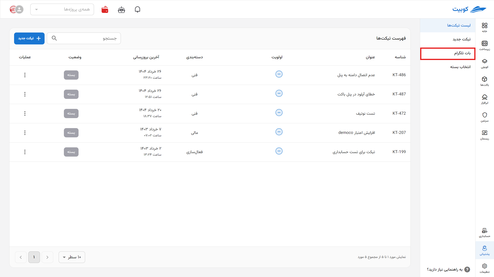
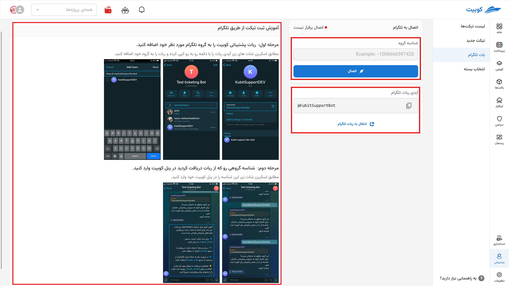

# Managing the Support Service

In the support section of the Kubit panel, you have access to the **list of tickets**, the ability to **create a new ticket**, and a **Telegram bot**.

First, enter the **support service** from the Kubit panel:

On the main page of the support service, you will have access to the list of tickets:

Through the top bar of the list, you can sort, filter, or hide the ticket list based on each column according to your needs:

To view the options, click on the three-dot button next to the name of each column:

Additionally, by clicking on a ticket, you can view the ticket details:

## Closing a Ticket by the User

If the user's issue has been resolved and no further follow-up is needed from support, the user can change the status of their ticket to **Closed**. This can be done in two ways: the Close Ticket option from the **ticket list** and the Close Ticket button on the **ticket details page**.

### Method 1: Ticket List

### Method 2: Ticket Details

:::tip[Ticket Status Notification via SMS]
At each stage of ticket status changes, a message containing the change is sent to the customer's mobile number (ticket creator).
:::

## Telegram Bot

By connecting the Telegram bot to the Kubit panel, you can access the support service via Telegram and use the bot to submit tickets and track your tickets.
To view the Telegram bot settings, select the **Telegram Bot** option from the support page:

- Follow the steps mentioned to add the Telegram bot, [@KubitSupportBot](https://t.me/KubitSupportBot), to your desired Telegram group.
- Then enter the group ID received from the bot in the **Group ID** section and select **Activate**:
  

So, through the relevant group, you can perform operations such as **creating a ticket**, **deleting the Telegram ID**, and **canceling the ticket** creation process.
