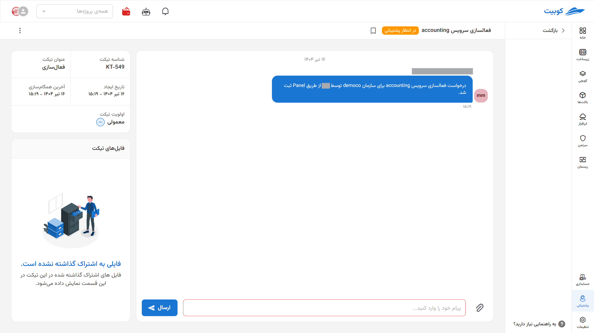

# Support Service Management

In the Kubit panel's support section, access to the **ticket list**, **creating a new ticket**, and **Telegram bot** is provided.

First, from the Kubit panel, enter the **Support** service:
You can also access recent tickets from the homepage and view details by clicking on each one.

On the main support service page, you will have access to the ticket list, and by clicking on a ticket, you can view its details:

## Closing a Ticket by the User

If the user's issue is resolved and no further follow-up by support is needed, the user can change the ticket status to **Closed**.
This can be done in two ways: the close ticket option from the **ticket list** and the close ticket button on the **ticket details page**.

### Method 1: Ticket List

### Method 2: Ticket Details

You can reactivate a ticket after closing it.

:::tip[Sending Ticket Status via SMS]
At each stage of ticket status changes, a message containing the change is sent to the mobile number of the ticket creator.
:::

## Telegram Bot

By connecting the Telegram bot to the Kubit panel, you can access the support service via Telegram and use the bot to create and track tickets.

To view Telegram bot settings, select the **Telegram Bot** option from the support page:

- Follow the steps outlined in the **Guide to Creating Tickets via Telegram** section, add the Telegram bot [@KubitSupportBot](https://t.me/KubitSupportBot) to your desired Telegram group, and grant the bot group admin access.
- Then, enter the group ID received from the bot in the **Group ID** section and select **Activate**:
  

From now on, you can perform operations such as **creating a ticket**, **deleting the Telegram ID**, and **canceling the ticket creation process** through the respective group.
