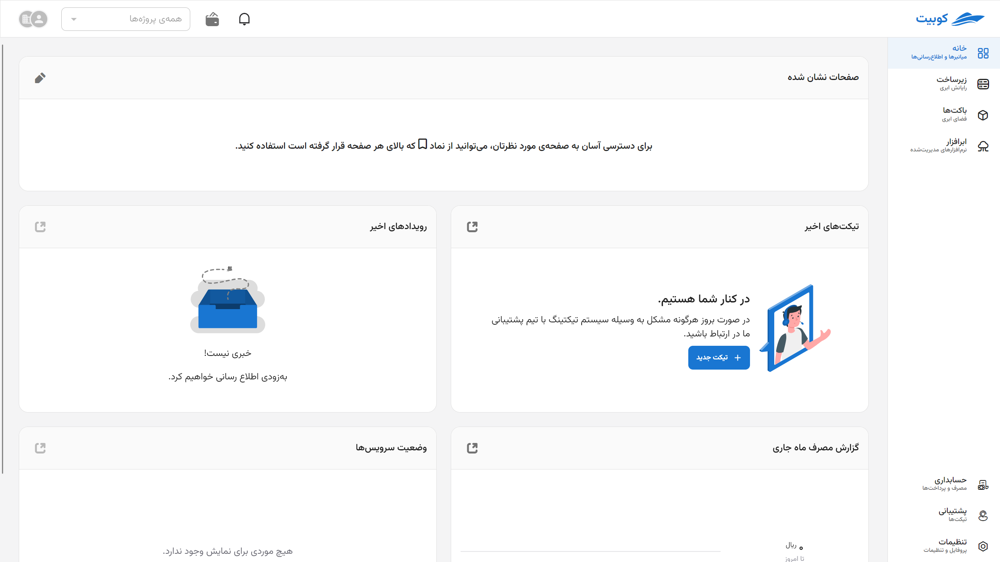
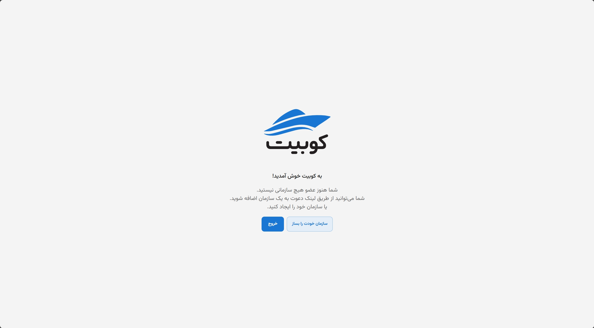
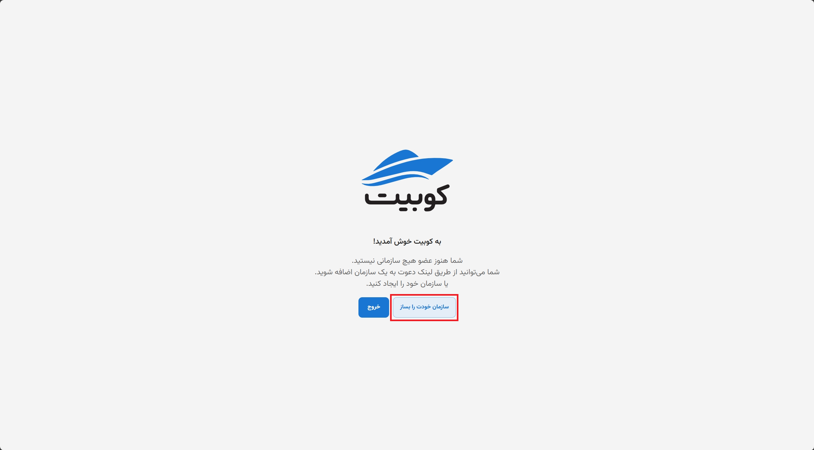
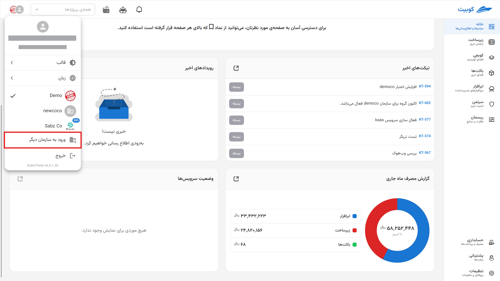
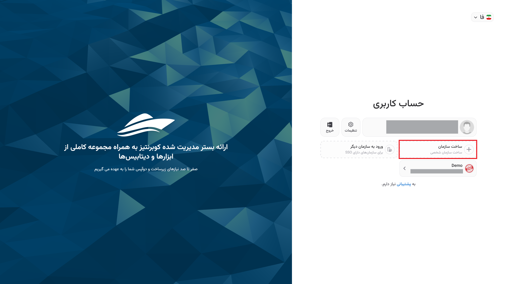

# ساخت سازمان

برای ساخت سازمان، سه مسیر و حالت وجود دارد: حین ایجاد حساب کاربری، پس از ایجاد حساب کاربری و از طریق پنل کوبیت.

## شیوه اول: حین ایجاد حساب کاربری

پس از تایید [ثبت‌نام](../register) در کوبیت توسط کد تاییدیه ارسال شده و قبل از ورود به پنل، به فرم ساخت سازمان هدایت می‌شوید.

اطلاعات موردنیاز در فرم ساخت سازمان شامل **نام سازمان** و **کلید سازمان** را وارد کرده و روی **ساخت** کلیک کنید:

در انتها، تحت سازمان ساخته شده وارد پنل کوبیت می‌شوید:

## شیوه دوم: پس از ایجاد حساب کاربری{#after-register}

در صورتی که پس از ثبت‌نام کوبیتی نسبت به ساخت سازمان خود اقدام نکرده باشید، درصورت ورود به پنل با پیغام زیر روبه‌رو می‌شوید:

همانطور که در توضیح [مفهوم سازمان](../..#organization) ذکر شد، برای دسترسی به امکانات پنل، باید سازمانی منتسب به حساب کاربری وجود داشته باشد. برای این کار، روی دکمه **سازمان خودت را بساز** کلیک کنید:

اطلاعات موردنیاز در فرم ساخت سازمان شامل **نام سازمان** و **کلید سازمان** را وارد کرده و روی **ساخت** کلیک کنید:

در انتها ذیل سازمان ساخته شده وارد پنل خواهید شد.

:::info[انتخاب کلید مناسب برای سازمان]
توجه کنید که برای **کلید سازمان** باید یک اسلاگ معتبر متشکل از حروف، اعداد، خط زیر یا خط فاصله، انتخاب کنید.
:::

## شیوه سوم: از طریق پنل کوبیت

در صورتی که پیش از این تحت سازمان دیگری به پنل دسترسی داشته‌اید و می‌خواهید سازمان خود را ایجاد کنید، ابتدا روی پروفایل کلیک کرده و سپس از منوی باز شده، گزینه **ورود به سازمان دیگر** را انتخاب کنید:

سپس به صفحه **حساب کاربری** هدایت می‌شوید. روی ساخت سازمان جدید کلیک کنید.

پس از این، به فرم ساخت سازمان مرتبط با حساب کاربری هدایت می‌شوید. همانطور که در توضیح [مفهوم سازمان](../#organization) ذکر شد، برای دسترسی به امکانات پنل، باید سازمانی منتسب به حساب کاربری وجود داشته باشد.
با وارد کردن اطلاعات خواسته‌شده (نام و کلید سازمان)، می‌توانید سازمان خود را ایجاد کنید:

:::info[توجه]
در صورت عدم تمایل به ساخت سازمان، می‌توانید روی **بعدا** کلیک کرده و از بخش [شیوه دوم: پس از ایجاد حساب کاربری](./#after-register) برای ساخت سازمان استفاده کنید.
:::

در انتها به پنل وارد شده و به پنل سازمان شخصی خود دسترسی خواهید داشت.
