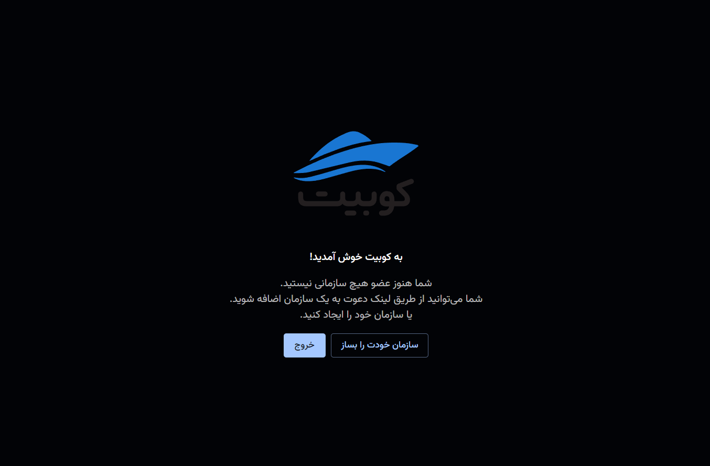
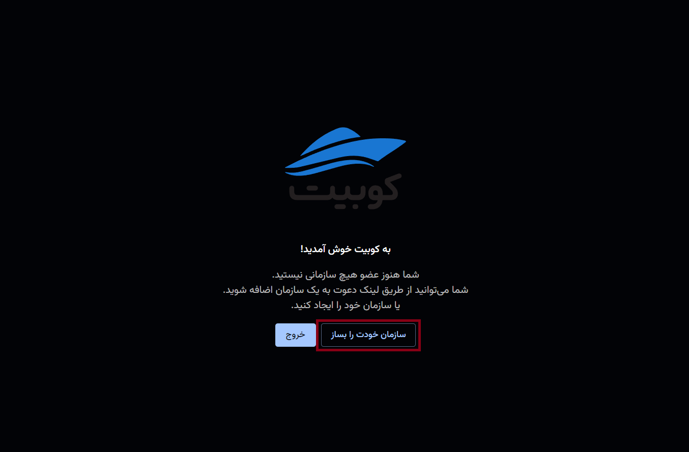
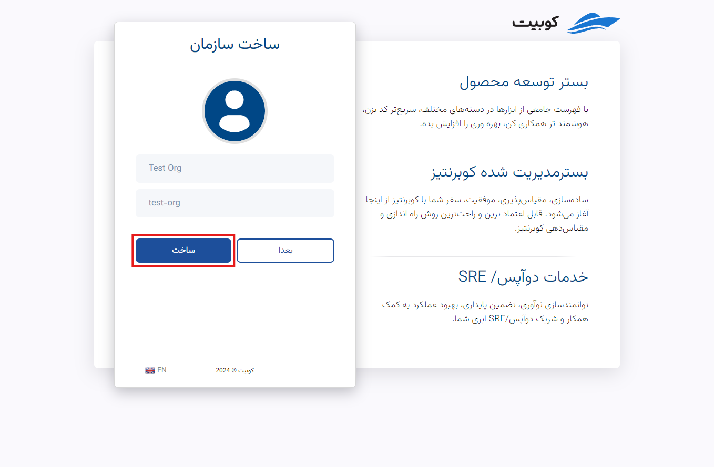

# ساخت سازمان

برای ساخت سازمان، دو شیوه وجود دارد. بعد از ساخت حساب کاربری، از طریق پنل کوبیت.

## شیوه اول: ساخت سازمان در حین ایجاد حساب کاربری

پس از تایید [ثبت‌نام](https://auth.kubit.ir/fa/register) در کوبیت توسط کد تاییدیه ارسال شده و قبل از ورود به پنل، به فرم ساخت سازمان هدایت می‌شوید.
اطلاعات موردنیاز در فرم ساخت سازمان شامل **نام سازمان** و **کلید سازمان** را وارد کرده و روی **ساخت** کلیک کنید:

## شیوه دوم: ساخت سازمان از طریق پنل کوبیت

در صورتی که پس از ثبت‌نام کوبیتی نسبت به ساخت سازمان خود اقدام نکرده باشید، درصورت ورود به پنل با پیغام زیر روبه‌رو می‌شوید:

همانطور که در توضیح [مفهوم سازمان](../..#organization) ذکر شد، برای دسترسی به امکانات پنل، باید سازمانی منتسب به حساب کاربری وجود داشته باشد. برای این کار، روی دکمه **سازمان خودت را بساز** کلیک کنید:

اطلاعات موردنیاز در فرم ساخت سازمان شامل **نام سازمان** و **کلید سازمان** را وارد کرده و روی **ساخت** کلیک کنید:

در انتها، ذیل سازمان ساخته شده، وارد پنل خواهید شد.

:::info[انتخاب کلید مناسب برای سازمان]
توجه کنید که برای **کلید سازمان** باید یک اسلاگ معتبر متشکل از حروف، اعداد، خط زیر یا خط فاصله، انتخاب کنید.
:::
