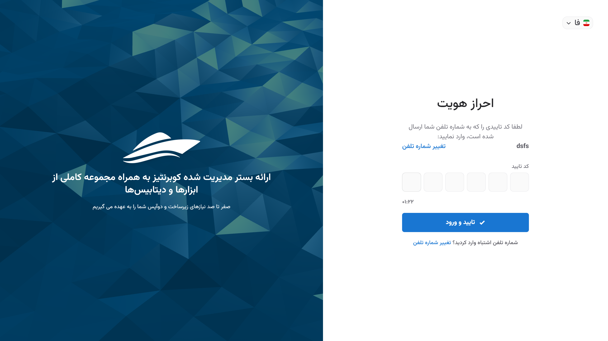

# فراموشی رمز عبور

اگر رمز عبور خود را فراموش کرده‌اید، می‌توانید از طریق [صفحه ورود](https://panel.kubit.ir/fa/login/) و انتخاب گزینه **فراموشی رمز عبور**، مراحل زیر را برای تغییر رمز عبور دنبال کنید.

ابتدا بر روی **بازیابی** کلیک کنید:

شماره موبایل یا ایمیل حساب کاربری خود را وارد کرده و روی **ارسال** کلیک کنید:

کد تأیید ارسال شده را وارد کنید تا عملیات احراز هویت انجام شود:

در انتها، رمز عبور جدید خود را وارد کرده و روی **ارسال** کلیک کنید:

پس از تغییر و تأیید رمز عبور جدید، به پنل کاربری کوبیت هدایت می‌شوید.
