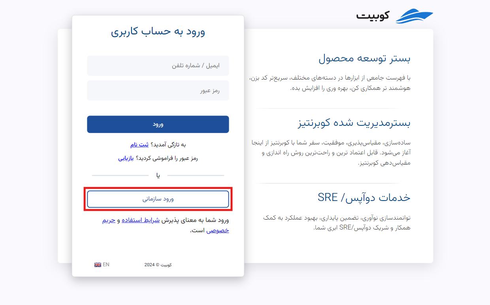
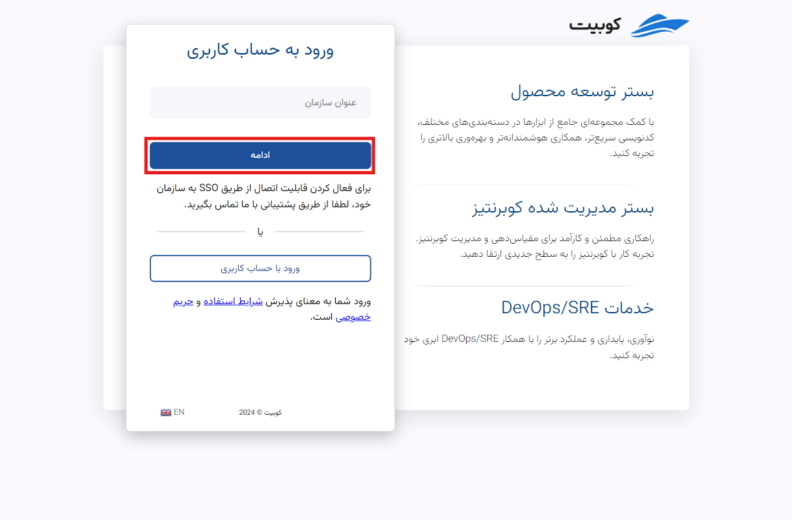

# ورود به حساب کاربری

باتوجه به امکان مدیریت چند سازمان با یک حساب در کوبیت، دو روش برای ورود به حساب کاربری در نظر گرفته شده است: ورود با ایمیل/شماره تلفن و ورود سازمانی.
هر دو روش از طریق [صفحه ورود](https://panel.kubit.ir/fa/login/) قابل دسترسی هستند. در ادامه به توضیح هر یک از این روش‌ها می‌پردازیم.

## روش اول: ورود با ایمیل/شماره تلفن

- ابتدا ایمیل یا شماره تلفن ثبت‌نام شده خود را به همراه رمز عبور وارد کنید.
- سپس روی دکمه **ورود** کلیک کنید تا وارد حساب کاربری خود شوید.
  

## روش دوم: ورود سازمانی

در صورت نیاز به دسترسی به پنل کوبیت سازمانی که در آن عضو هستید، در صفحه ورود ابتدا روی گزینه **ورود سازمانی** کلیک کنید:

در این مرحله نام سازمان مربوطه را وارد کرده و گزینه **ادامه** را بزنید:

در انتها، نام کاربری و رمز عبور خود را وارد کرده و گزینه **ورود** را بزنید:

با دنبال کردن این مراحل، می‌توانید به پنل کوبیت وارد شوید.

## ورود به سازمان دعوت شده

در صورتی که به سازمانی دعوت شده‌اید، از دو روش زیر برای ورود به پنل سازمانی می‌توانید استفاده کنید:

### لینک دعوت‌نامه (کاربر کوبیت)

اگر نوع عضویت شما **کاربر کوبیت** است، با کلیک روی لینک ارسال شده به ایمیل یا شماره تلفن خود، می‌توانید وارد پنل شوید.

اگر تا پیش از این حساب کاربری نداشته‌اید، به صفحه [صفحه ثبت‌نام](https://panel.kubit.ir/fa/register/) هدایت خواهید شد و با [ایجاد حساب کاربری](../register)، به سازمان مربوطه ملحق خواهید شد.

اگر حساب کاربری داشته باشید و وارد پنل شده باشید، به طور مستقیم به پنل سازمانی مربوطه هدایت خواهید شد.

### کاربر LDAP

اگر به عنوان کاربر LDAP به سازمان افزوده شده‌اید، باید به [صفحه ورود](https://panel.kubit.ir/fa/login/) مراجعه کنید و از گزینه **بازیابی رمز عبور** برای تعیین رمز عبور جدید استفاده کنید.

در صفحه ورود به حساب کاربری، روی **ورود سازمانی** کلیک کنید:

در این مرحله نام سازمان مربوطه را وارد کرده و گزینه **ادامه** را بزنید:

سپس روی **بازیابی** کلیک کنید:

برای مطالعه ادامه مراحل فراموشی رمز عبور، به سند [فراموشی رمز عبور](../forgot-password) مراجعه کنید.
