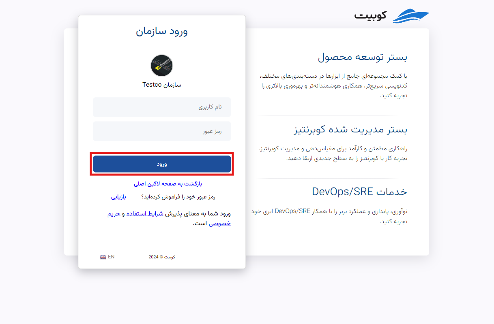

# ورود به حساب کاربری

باتوجه به امکان مدیریت چند سازمان با یک حساب در کوبیت، دو روش برای ورود به حساب کاربری در نظر گرفته شده است: ورود با ایمیل/شماره تلفن و ورود سازمانی.
هر دو روش از طریق [صفحه ورود](https://auth.kubit.ir/fa/login/) قابل دسترسی هستند. در ادامه به توضیح هر یک از این روش‌ها می‌پردازیم.

## روش اول: ورود با ایمیل/شماره تلفن

- ابتدا ایمیل یا شماره تلفن ثبت‌نام شده خود را به همراه رمز عبور وارد کنید.
- سپس روی دکمه **ورود** کلیک کنید تا وارد حساب کاربری خود شوید.

## روش دوم: ورود سازمانی

در صورت نیاز به دسترسی به پنل کوبیت سازمانی که در آن عضو هستید، در صفحه ورود ابتدا روی گزینه **ورود سازمانی** کلیک کنید:

در این مرحله نام سازمان مربوطه را وارد کرده و گزینه **ادامه** را بزنید:

در انتها، نام کاربری و رمز عبور خود را وارد کرده و گزینه **ورود** را بزنید:

با دنبال کردن این مراحل، می‌توانید به پنل کوبیت وارد شوید.
