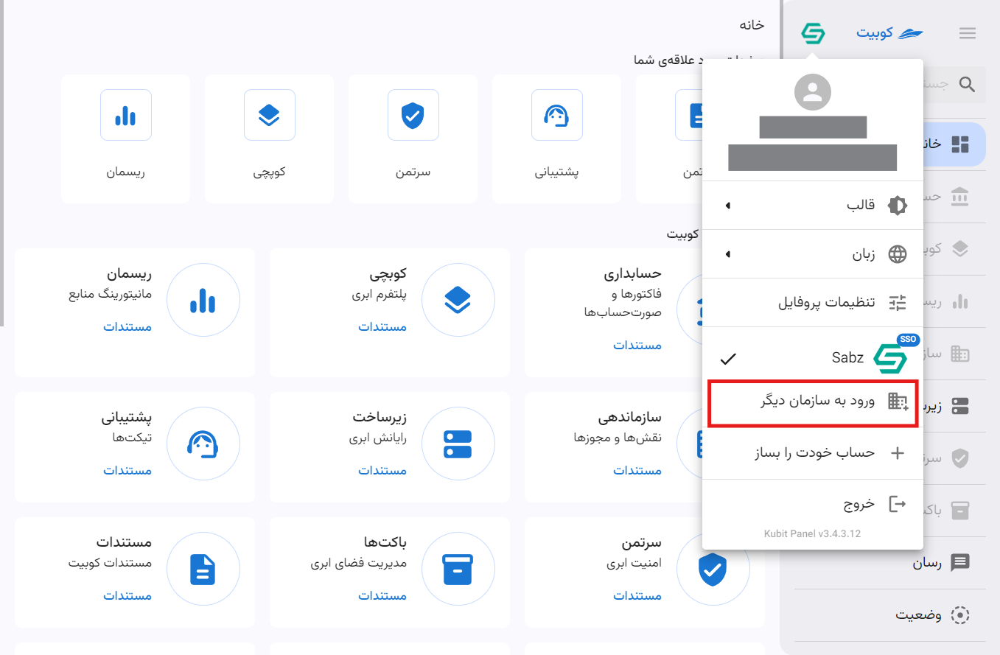
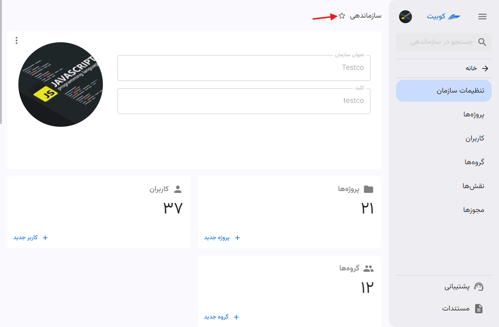

# پنل کوبیت

با [ورود به پنل کاربری کوبیت](https://auth.kubit.ir/fa/login) می‌توانید به تمامی سرویس‌های موجود و تنظیمات کاربری و سیستمی دسترسی پیدا کنید. این پنل امکان مدیریت و مشاهده جزئیات کامل سرویس‌ها، از قبیل مدیریت کاربرها و پروژه‌ها را برای شما فراهم می‌کند، به طوری که می‌توانید به‌راحتی تمام تنظیمات و قابلیت‌های موجود را مورد استفاده قرار دهید.

:::info[توجه]
تمام تنظیمات و مدیریت بخش های مختلف، تحت عنوان مرتبط در زیرمجموعه مستند حساب کاربری، قابل دسترسی است.
:::

صفحه اصلی پنل، شامل دسترسی به پروفایل، منوی سمت راست، صفحات موردعلاقه، سرویس‌های کوبیت، رویدادها و تیکت‌های اخیر میباشد.
در ادامه به بررسی اجمالی آنها می پردازیم.

## منوی سمت راست

دسترسی سریع به لیست سرویس های موجود در پنل و پروفایل کاربری از طریق منوی سمت راست فراهم شده است. از قابلیت **سرچ در کوبیت** نیز میتوانید برای سرچ میان سرویس ها استفاده کنید.

## تنطیمات پروفایل

تمام تنظیمات مربوط به پروفایل و حساب کاربری، از بخش پروفایل در پنل کوبیت، قابل دسترسی می‌باشد: در مقاله [تنظیمات پروفایل کاربری](../profile-settings) به تنظیمات پروفایل پرداخته‌ایم.

## تغییر قالب

برای تغییر قالب پنل کاربری، ابتدا روی پروفایل خود کلیک کنید. سپس از منوی باز شده، گزینه **قالب** را انتخاب کرده و قالب موردنظر خود را از میان گزینه‌های موجود انتخاب نمایید:

## تغییر زبان

برای تغییر زبان پنل کاربری، ابتدا روی پروفایل خود کلیک کنید. سپس از منوی باز شده، گزینه **زبان** را انتخاب کنید و زبان دلخواه خود را از میان زبان‌های موجود انتخاب نمایید:

## ساخت سازمان {#create-organization}

برای ساخت سازمان، دو شیوه وجود دارد. بعد از ساخت حساب کاربری، از طریق پنل کوبیت.

### شیوه اول: ساخت سازمان در حین ایجاد حساب کاربری

### شیوه دوم: ساخت سازمان از طریق پنل کوبیت

## سوییچ کردن بین سازمان

برای مدیریت چندین سازمان مختلف در پنل کاربری، ابتدا روی پروفایل خود کلیک کرده و سپس گزینه **ورود به سازمان دیگر** را انتخاب کنید:

نام سازمان موردنظر را وارد کرده و روی گزینه **ادامه** کلیک کنید:

_تصویر وارد کردن نام سازمان_

سپس با نام کاربری خود در آن سازمان، لاگین کنید:

_تصویر وارد کردن اطلاعات کاربری آن سازمان_

از این طریق می‌توانید سازمان‌های دیگری که در آن عضو هستید را به پنل خود اضافه کرده و تنها با کلیک بر روی نام سازمان، بین سازمان‌ها جابه‌جا شوید:

## صفحات مورد علاقه‌ی شما

بخش صفحات موردعلاقه در صفحه اصلی پنل، دسترسی سریع به سرویس‌های موردعلاقه کاربران را فراهم میکند.

:::tip[افزودن سرویس به لیست موردعلاقه ها]
با کلیک روی آیکون ستاره در نوار بالایی صفحه هر سرویس، میتوانید سرویس موردنظر خود را به موردعلاقه ها اضافه کنید.

:::

## سرویس‌های کوبیت

علاوه بر منوی سمت راست پنل، می‌توانید از صفحه اصلی پنل نیز به لیست سرویس‌های کوبیت دسترسی داشته باشید:

## رویدادها و تیکت‌های اخیر

### رویدادها

از طریق بخش **رویدادهای اخیر** می‌توانید به اعلانات کوبیت دسترسی پیدا کنید. در این بخش، اعلانات سازمانی (به تفکیک هر سازمان) و اعلانات عمومی قابل مشاهده هستند:

### تیکت‌ها

آخرین تیکت‌های ثبت شده در سرویس پشتیبانی از طریق بخش **تیکت‌های اخیر** قابل دسترسی هستند:

