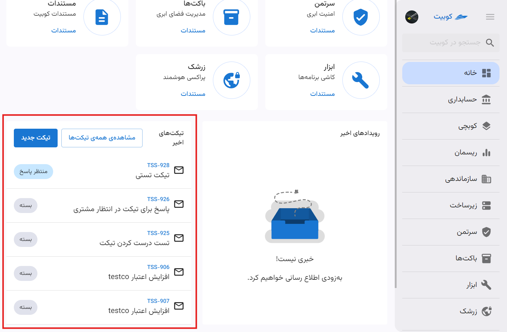

# پنل کوبیت

پنل کاربری کوبیت به گونه‌ای طراحی شده است که از طریق آن می‌توانید به تمامی سرویس‌های موجود و تنظیمات کاربری و سیستمی دسترسی داشته باشید. این پنل امکان مدیریت و مشاهده جزئیات کامل سرویس‌ها، از قبیل مدیریت کاربرها و پروژه‌ها را برای شما فراهم می‌کند، به طوری که می‌توانید به‌راحتی تمام تنظیمات و قابلیت‌های موجود را مورد استفاده قرار دهید.

_تصویر پنل_

## ساخت سازمان {#create-organization}

برای ساخت سازمان، دو شیوه وجود دارد. بعد از ساخت حساب کاربری، از طریق پنل کوبیت.

### شیوه اول: ساخت سازمان در حین ایجاد حساب کاربری

### شیوه دوم: ساخت سازمان از طریق پنل کوبیت

## سوییچ کردن بین سازمان

برای مدیریت چندین سازمان مختلف در پنل کاربری، ابتدا روی پروفایل خود کلیک کنید و سپس گزینهٔ **ورود به سازمان دیگر** را انتخاب کنید. با این کار می‌توانید سازمان‌های جدیدی را به پنل خود اضافه کنید و بین آن‌ها به‌سادگی جابجا شوید. برای تغییر بین سازمان‌ها، کافیست روی نام سازمان مورد نظر کلیک کنید تا به آن وارد شوید.

_تصویر ورود به سازمان دیگر_

## تنطیمات پروفایل

تمام تنظیمات مربوط به پروفایل و حساب کاربری، از بخش پروفایل در پنل کوبیت، قابل دسترسی می‌باشد. در مقاله [تنظیمات پروفایل کاربری](../profile-settings) به تنظیمات پروفایل پرداخته‌ایم.

## تغییر قالب

برای تغییر قالب پنل کاربری، ابتدا روی پروفایل خود کلیک کنید. سپس از منوی باز شده، گزینه **قالب** را انتخاب کرده و قالب موردنظر خود را از میان گزینه‌های موجود انتخاب نمایید.

## تغییر زبان

برای تغییر زبان پنل کاربری، ابتدا روی پروفایل خود کلیک کنید. سپس از منوی باز شده، گزینه **زبان** را انتخاب کنید و زبان دلخواه خود را از میان زبان‌های موجود انتخاب نمایید.

## صفحات مورد علاقه‌ی شما

از طریق بخش صفحات موردعلاقه در صفحه اصلی پنل، می‌توانید به سرویس‌های موردنظر خود به‌سرعت دسترسی پیدا کنید.

_تصویر صفحات موردعلاقه با باکس قرمز_

## سرویس‌های کوبیت

علاوه بر منوی سمت راست پنل، می‌توانید از صفحه اصلی پنل نیز به لیست سرویس‌های کوبیت دسترسی داشته باشید.

_تصویر سرویسهای کوبیت_

## رویدادها و تیکت‌های اخیر

### رویدادها

از طریق بخش **رویدادهای اخیر** می‌توانید به اعلانات کوبیت دسترسی پیدا کنید. در این بخش، اعلانات سازمانی (به تفکیک هر سازمان) و اعلانات عمومی قابل مشاهده هستند.

### تیکت‌ها

آخرین تیکت‌های ثبت شده در سرویس پشتیبانی از طریق بخش **تیکت‌های اخیر** قابل دسترسی هستند.

