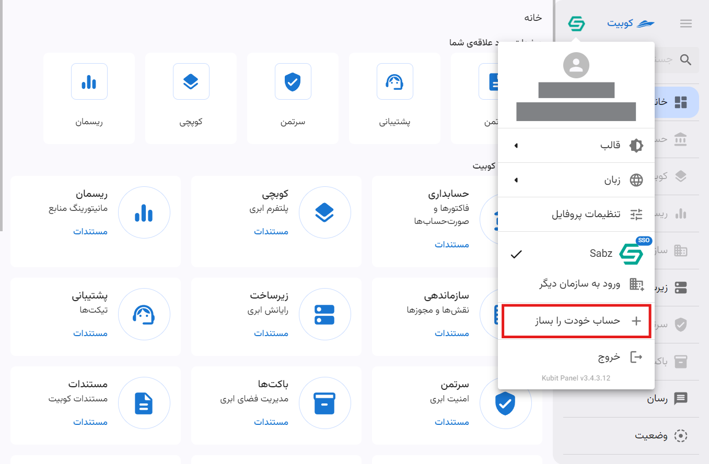
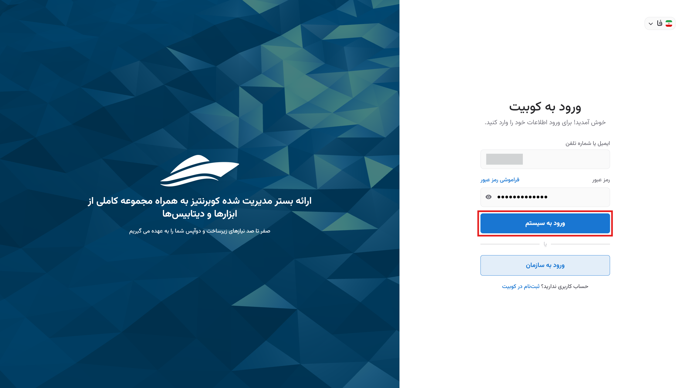

# پنل کوبیت

با [ورود به پنل کاربری کوبیت](https://panel.kubit.ir/fa/login) می‌توانید به تمامی سرویس‌های موجود و تنظیمات کاربری و سیستمی دسترسی پیدا کنید. این پنل امکان مدیریت و مشاهده جزئیات کامل سرویس‌ها، از جمله مدیریت کاربران و پروژه‌ها را فراهم می‌کند، به طوری که می‌توانید به‌راحتی تمام تنظیمات و قابلیت‌های موجود را مورد استفاده قرار دهید.

:::info[توجه]
تمام تنظیمات و مدیریت بخش‌های مختلف، تحت عنوان‌های مرتبط در زیرمجموعه سند حساب کاربری قابل دسترسی است.
:::

صفحه اصلی پنل شامل دسترسی به پروفایل، منوی سمت راست، صفحات مورد علاقه، سرویس‌های کوبیت، رویدادها و تیکت‌های اخیر می‌باشد. در ادامه به بررسی اجمالی آن‌ها می‌پردازیم.

## منوی سمت راست

دسترسی سریع به لیست سرویس‌های موجود در پنل و پروفایل کاربری از طریق منوی سمت راست فراهم شده است. از قابلیت جستجو در کوبیت نیز می‌توانید برای جستجو میان سرویس‌ها استفاده کنید:

## تنطیمات پروفایل

تمام تنظیمات مربوط به پروفایل و حساب کاربری، از بخش پروفایل در پنل کوبیت، قابل دسترسی می‌باشد. در سند [تنظیمات پروفایل کاربری](../profile-settings) به شرح تنظیمات پروفایل پرداخته شده است.

## تغییر قالب

برای تغییر قالب پنل کاربری، ابتدا روی پروفایل کلیک کنید. سپس از منوی باز شده، گزینه **قالب** را انتخاب کرده و قالب موردنظر خود را از میان گزینه‌های موجود انتخاب نمایید:

## تغییر زبان

برای تغییر زبان پنل کاربری، ابتدا روی پروفایل کلیک کنید. سپس از منوی باز شده، گزینه **زبان** را انتخاب کنید و زبان دلخواه خود را از میان زبان‌های موجود انتخاب نمایید:

## ساخت حساب شخصی {#create-organization}

در صورتی که پیش از این تحت سازمان دیگری به پنل دسترسی داشته‌اید و حال می‌خواهید حساب شخصی (کوبیتی) خود را ایجاد کنید، ابتدا روی پروفایل کلیک کرده و سپس از منوی باز شده، گزینه **حساب خودت را بساز** را انتخاب کنید:

به صفحه **ایجاد حساب کاربری** هدایت می‌شوید. مشخصات کاربری موردنیاز را وارد کرده و روی **ثبت‌نام** کلیک کنید:

سپس باید کد ۶ رقمی ارسال‌شده به ایمیل یا شماره تلفن خود را برای احراز هویت و تأیید ثبت‌نام وارد کرده و روی **ارسال** کلیک کنید:

در نهایت پس از ارسال کد تأیید، فرآیند ثبت‌نام شما تکمیل شده و حساب کاربری کوبیتی شما ایجاد می‌شود.

پس از این، به فرم ساخت سازمان مرتبط با حساب کاربری هدایت می‌شوید. همانطور که در توضیح [مفهوم سازمان](../..#organization) ذکر شد، برای دسترسی به امکانات پنل، باید سازمانی منتسب به حساب کاربری وجود داشته باشد.
با وارد کردن اطلاعات خواسته‌شده (نام و کلید سازمان)، می‌توانید سازمان خود را ایجاد کنید:

در انتها به پنل وارد شده و به پنل سازمان شخصی خود دسترسی خواهید داشت.

:::info[ساخت سازمان در پنل]
در صورت عدم تمایل به ایجاد سازمان پس از ثبت‌نام (انتخاب گزینه **بعدا** در تصویر بالا)، می‌توانید از طریق پنل کوبیت نیز سازمان مرتبط با حساب کاربری خود را ایجاد کنید. از سند [ساخت سازمان](../create-organization)، می‌توانید به راهنمای گام به گام ایجاد سازمان دسترسی پیدا کنید.
:::

## سوییچ کردن بین سازمان

برای مدیریت چندین سازمان مختلف در پنل کاربری، ابتدا روی پروفایل کلیک کرده و سپس گزینه **ورود به سازمان دیگر** را انتخاب کنید:

نام سازمان موردنظر را وارد کرده و روی گزینه **ادامه** کلیک کنید:

سپس با نام کاربری خود در آن سازمان، لاگین کنید:

از این طریق می‌توانید سازمان‌های دیگری که در آن عضو هستید را به پنل خود اضافه کرده و تنها با کلیک بر روی نام سازمان، بین سازمان‌ها جابه‌جا شوید:

## صفحات مورد علاقه‌ی شما

بخش صفحات مورد علاقه در صفحه اصلی پنل، دسترسی سریع به سرویس‌های مورد علاقه کاربران را فراهم می‌کند:

:::tip[افزودن سرویس به لیست موردعلاقه‌ها]
با کلیک روی آیکون ستاره در نوار بالایی صفحه هر سرویس، می‌توانید سرویس موردنظر خود را با نام دلخواه به موردعلاقه‌ها اضافه کنید:

:::

## سرویس‌های کوبیت

علاوه بر منوی سمت راست پنل، می‌توانید از صفحه اصلی پنل نیز به لیست سرویس‌های کوبیت دسترسی داشته باشید:

## رویدادها و تیکت‌های اخیر

### رویدادها

از طریق بخش **رویدادهای اخیر** می‌توانید به اعلانات کوبیت دسترسی پیدا کنید. در این بخش، اعلانات سازمانی (به تفکیک هر سازمان) و اعلانات عمومی قابل مشاهده هستند:

### تیکت‌ها

آخرین تیکت‌های ثبت شده در [سرویس پشتیبانی ](../../ticketing) از طریق بخش **تیکت‌های اخیر** قابل دسترسی هستند:

