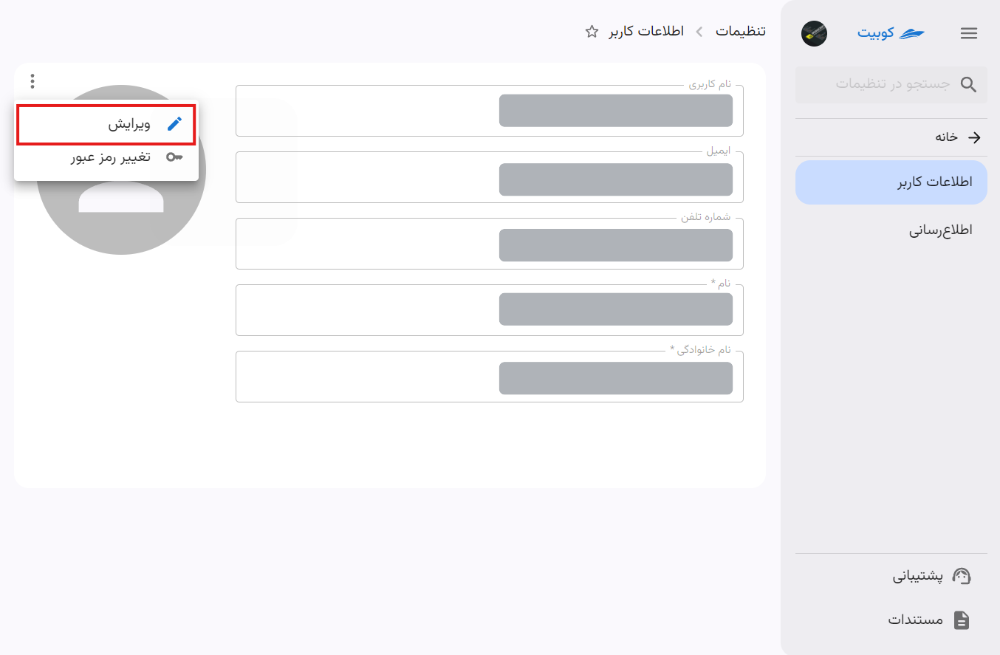
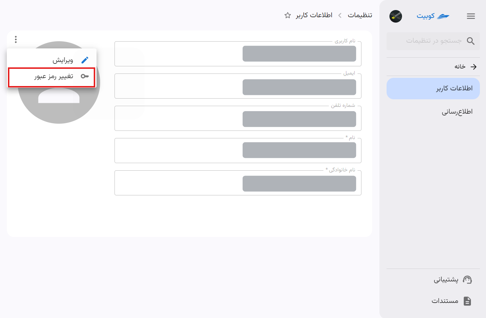
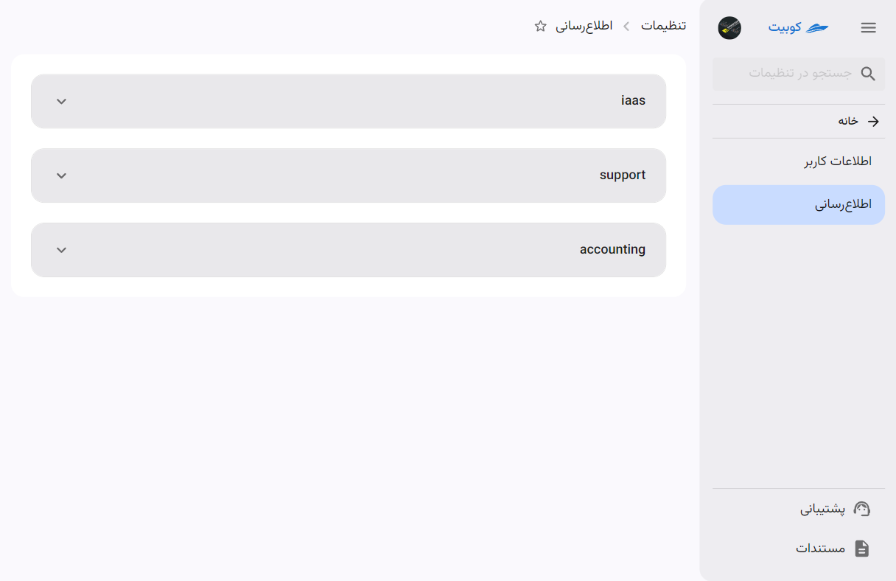

# تنظیمات پروفایل کاربری

برای تغییرات اطلاعات کاربری (ایمیل، شماره تلفن، نام و نام خانوادگی و عکس پروفایل)، تغییر رمز عبور و ویرایش کانال های اطلاع رسانی، از بخش تنظیمات پروفایل میتوانید اقدام کنید.

### ویرایش اطلاعات کاربری

وارد بخش **اطلاعات کاربر** در **تنظیمات پروفایل** شده و روی سه نقطه سمت چپ جدول اطلاعات کاربر کلیک کرده و گزینه **ویرایش** را انتخاب کنید:

همچنین، امکان انتخاب و تغییر عکس پروفایل نیز از این بخش فراهم شده است.

_تصویر تغییر اطلاعات کاربری_

### تغییر رمز عبور

وارد بخش **اطلاعات کاربر** در **تنظیمات پروفایل** شده و روی سه نقطه سمت چپ جدول اطلاعات کاربر کلیک کرده و گزینه **تغییر رمز عبور** را انتخاب کنید:
اگر در سازمان فعلی در پنل کوبیت نقش مدیر سیستم را داشته باشید، می‌توانید از طریق گزینه **تغییر رمز عبور** در انتهای جدول اطلاعات کاربر، رمز عبور خود را تغییر دهید.

:::caution[توجه!]
اگر نقش و دسترسی مدیر سیستم را نداشته باشید، برای تغییر رمز عبور باید به مدیر سازمان مراجعه کنید.
:::

_تصویر تغییر رمز عبور در auth_

### ویرایش کانال‌های اطلاع‌رسانی

در بخش **اطلاع‌رسانی**، لیستی از کانال‌های مختلف جهت دریافت اعلان‌های سرویس‌های کوبیت موجود است. برای هر سرویسی که سیستم اطلاع‌رسانی آن تنظیم شده باشد، می‌توانید کانال‌های مرتبط را مشاهده کرده و به صورت جداگانه فعال یا غیرفعال نمایید.

