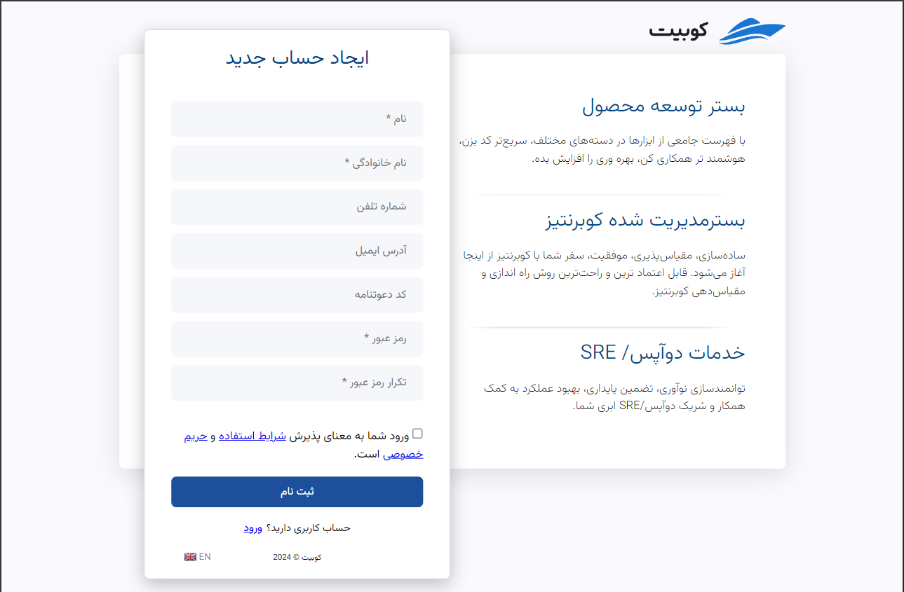
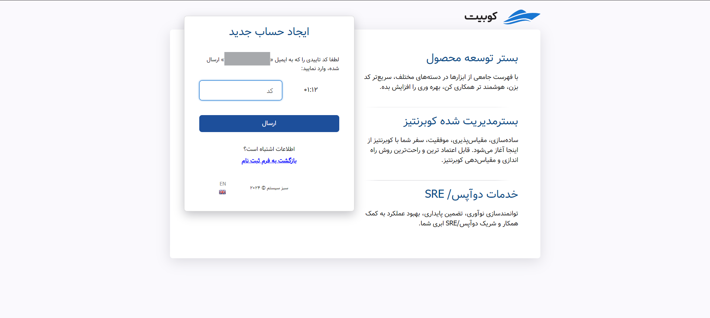
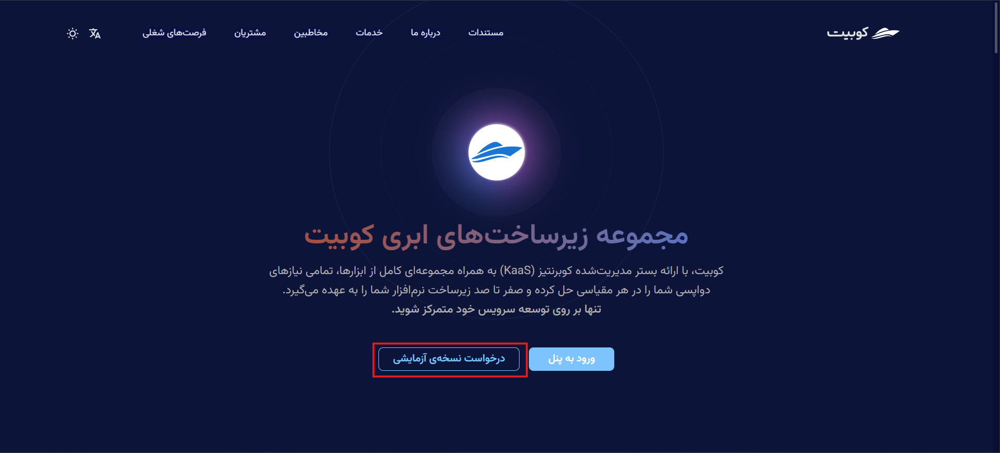
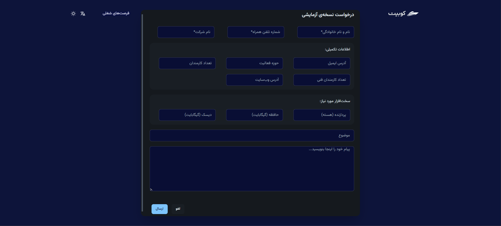

# ایجاد حساب کاربری و ثبت‌نام

برای استفاده از هر یک از محصولات کوبیت، ابتدا باید حساب کاربری داشته باشید. اگر پیش از این ثبت‌نام کرده‌اید، برای ورود به حساب کاربری خود، می‌توانید از مقاله [ورود به حساب کاربری](../login)
استفاده کنید. اگر هنوز ثبت‌نام نکرده‌اید، این راهنما شما را مرحله به مرحله در فرآیند ثبت‌نام همراهی می‌کند.

## ثبت‌نام

ابتدا به صفحه‌ی [ثبت‌نام](https://auth.kubit.ir/fa/register) بروید. سپس، اطلاعات خود را در فیلدهای مربوطه وارد کرده و یک رمز عبور قوی مطابق با دستورالعمل‌های موجود تعیین کنید:

سپس باید کد ۶ رقمی ارسال‌شده به ایمیل یا شماره موبایل خود را برای احراز هویت و تأیید ثبت‌نام وارد کنید:

در نهایت پس از وارد کردن کد تأیید، فرآیند ثبت‌نام شما تکمیل می‌شود. پس از تکمیل ثبت‌نام، مرحله ساخت سازمان آغاز می‌شود. با وارد کردن اطلاعات خواسته‌شده (نام و کلید سازمان)، می‌توانید سازمان خود را ایجاد کنید:

_تصویر ایجاد سازمان پس از ثبت نام_

در انتها به حساب کاربری وارد شده و به پنل سازمان دسترسی خواهید داشت.

:::info[ساخت سازمان در پنل]
در صورت عدم تمایل به ایجاد سازمان پس از ثبت‌نام، می‌توانید از طریق پنل کوبیت نیز سازمان مرتبط با حساب کاربری خود را ایجاد کنید. از بخش [ساخت سازمان](../panel#create-organization) مستندات، می‌توانید به راهنمای گام به گام ایجاد سازمان دسترسی پیدا کنید.
:::

## دریافت کد دعوت

برای دریافت کد دعوت برای جهت ایجاد حساب کاربری، ابتدا به [صفحه وبسایت کوبیت](https://kubit.ir/fa/) رفته و روی گزینه **درخواست نسخه آزمایشی** کلیک کنید:

سپس اطلاعات خواسته شده در فرم **درخواست نسخه آزمایشی** را تکمیل کرده و درخواست خود را ارسال کنید:

پس از بررسی درخواست شما توسط تیم پشتیبانی کوبیت، کد دعوت برای شما ارسال خواهد شد و با استفاده از این کد می‌توانید نسبت به ایجاد حساب کاربری اقدام کنید.

## ورود به حساب کاربری

پس از ورود به پنل، به تمامی خدمات و سرویس‌های ارائه شده توسط کوبیت دسترسی پیدا خواهید کرد. در هر بخش از پنل، راهنماهای جامعی برای کمک به کاربران در استفاده بهتر از امکانات فراهم شده است.
