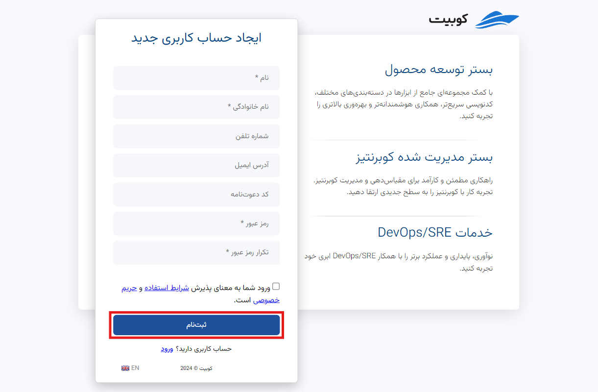
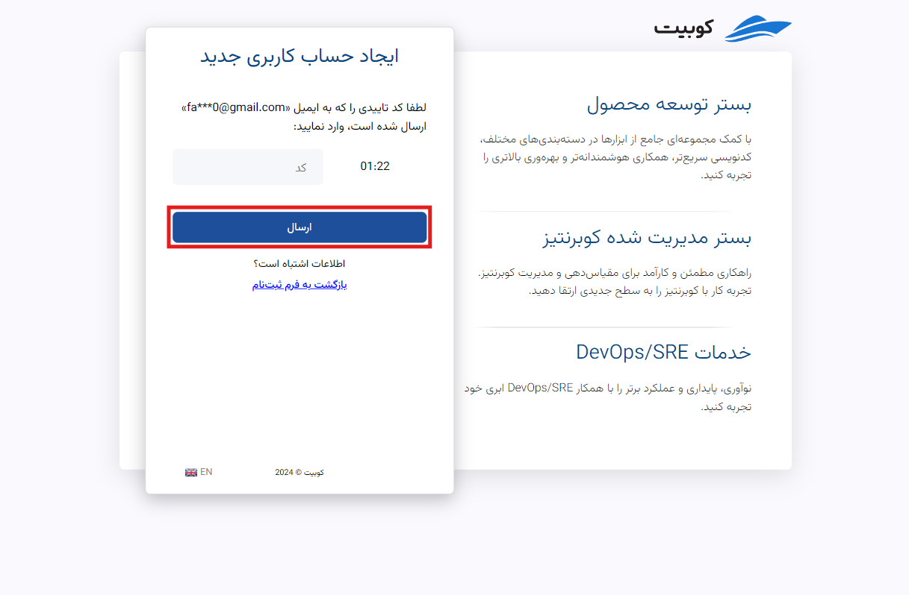
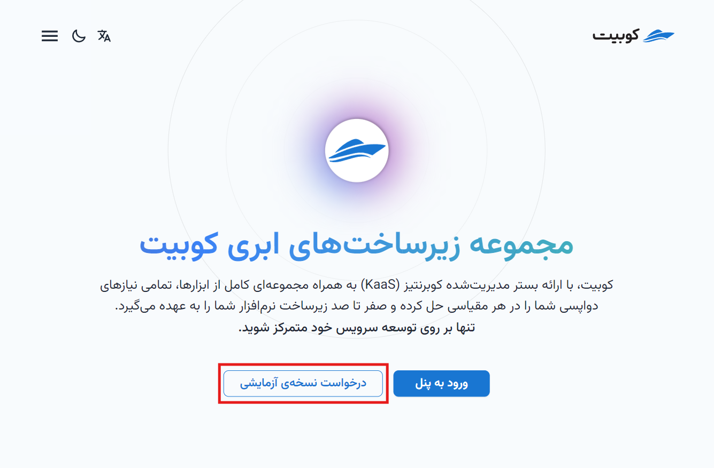
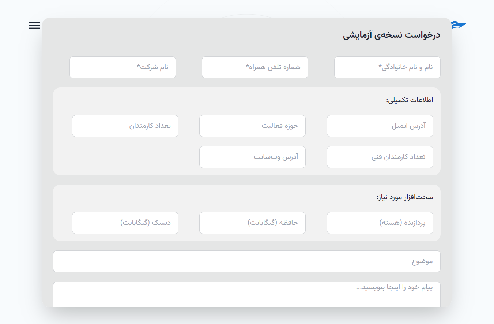
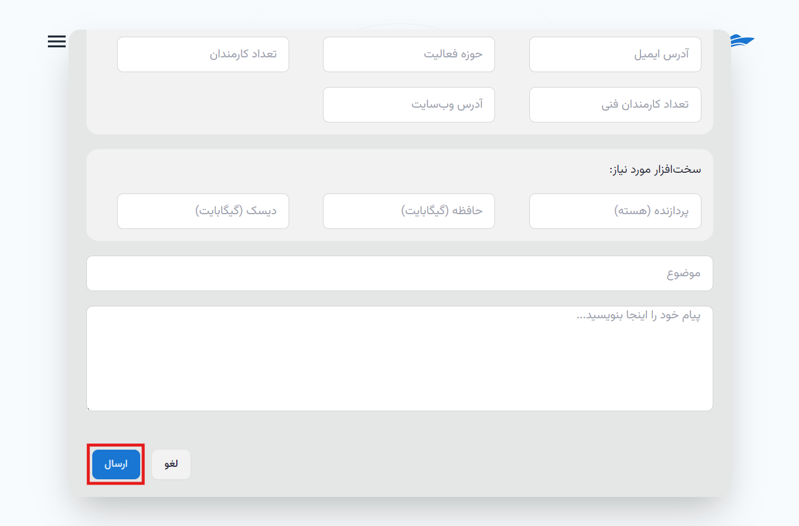

# ایجاد حساب کاربری و ثبت‌نام

برای استفاده از هر یک از محصولات کوبیت، ابتدا باید حساب کاربری داشته باشید. اگر پیش از این ثبت‌نام کرده‌اید، برای ورود به حساب کاربری خود، می‌توانید از سند [ورود به حساب کاربری](../login)
استفاده کنید. اگر هنوز ثبت‌نام نکرده‌اید، این راهنما شما را مرحله به مرحله در فرآیند ثبت‌نام همراهی می‌کند.

## ثبت‌نام

- ابتدا به صفحه‌ی [ثبت‌نام](https://panel.kubit.ir/fa/register) بروید.
- سپس، اطلاعات خود را در فیلدهای مربوطه وارد کرده و یک رمز عبور قوی مطابق با دستورالعمل‌های موجود تعیین کنید.

:::caution[توجه]
دقت کنید که وارد کردن یکی از مقادیر **شماره تلفن** و **آدرس ایمیل** برای ساخت حساب و ارسال کد تایید هویت الزامی می‌باشد.
:::

سپس باید کد ۶ رقمی ارسال‌شده به ایمیل یا شماره تلفن خود را برای احراز هویت و تأیید ثبت‌نام وارد کرده و روی **ارسال** کلیک کنید:

در نهایت پس از ارسال کد تأیید، فرآیند ثبت‌نام شما تکمیل شده و حساب کاربری کوبیتی شما ایجاد می‌شود.

پس از این، به فرم ساخت سازمان مرتبط با حساب کاربری هدایت می‌شوید. همانطور که در توضیح [مفهوم سازمان](../..#organization) ذکر شد، برای دسترسی به امکانات پنل، باید سازمانی منتسب به حساب کاربری وجود داشته باشد.
با وارد کردن اطلاعات خواسته‌شده (نام و کلید سازمان)، می‌توانید سازمان خود را ایجاد کنید:

در انتها به حساب کاربری وارد شده و به پنل سازمان دسترسی خواهید داشت.

:::info[ساخت سازمان در پنل]
در صورت عدم تمایل به ایجاد سازمان پس از ثبت‌نام (انتخاب گزینه **بعدا** در تصویر بالا)، می‌توانید از طریق پنل کوبیت نیز سازمان مرتبط با حساب کاربری خود را ایجاد کنید. از سند [ساخت سازمان](../panel#create-organization)، می‌توانید به راهنمای گام به گام ایجاد سازمان دسترسی پیدا کنید.
:::

## دریافت کد دعوت

برای دریافت کد دعوت برای جهت ایجاد حساب کاربری، ابتدا به [صفحه وبسایت کوبیت](https://kubit.ir/fa/) رفته و روی گزینه **درخواست نسخه آزمایشی** کلیک کنید:

اطلاعات خواسته شده در فرم **درخواست نسخه آزمایشی** را تکمیل کنید:

در انتها روی دکمه **ارسال** کلیک کنید تا درخواست شما ارسال شود:

پس از بررسی درخواست شما توسط تیم پشتیبانی کوبیت، کد دعوت برای شما ارسال خواهد شد و با استفاده از این کد می‌توانید نسبت به ایجاد حساب کاربری اقدام کنید.

## ورود به حساب کاربری

پس از ورود به پنل، به تمامی خدمات و سرویس‌های ارائه شده توسط کوبیت دسترسی پیدا خواهید کرد. در هر بخش از پنل، راهنماهای جامعی برای کمک به کاربران در استفاده بهتر از امکانات فراهم شده است.
