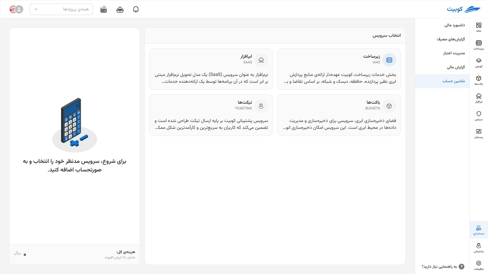
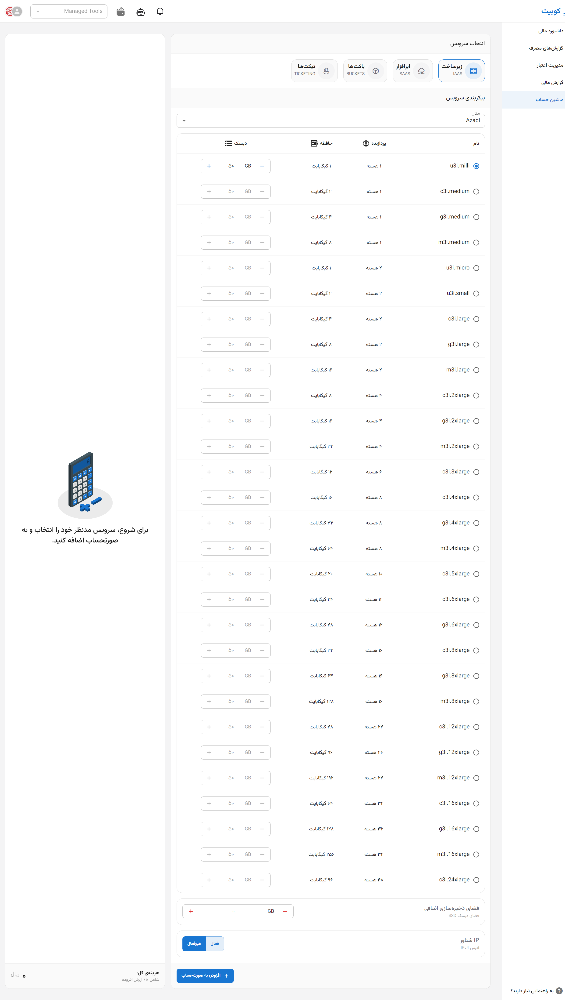

# ماشین حساب

در این بخش می‌توانید از میان انواع سرویس‌های ارائه‌شده توسط **کوبیت**، بسته به نیاز پروژه خود، انتخاب و سفارش‌سازی انجام دهید و پیش‌فاکتور دریافت کنید. در حال حاظر امکان محاسبه فی خدمات کوبیت در چهار دسته کلی زیر ارائه می‌شوند:

:::tip[مبلغ نهایی با جزئیات]
برای مشاهده قیمت نهایی سرویس، پس از پیکربندی، از بخش **[پیش‌فاکتور](#proforma-invoice)** استفاده کنید.
:::

## زیرساخت ابری (IaaS)

سرویس **زیرساخت به عنوان خدمت (Infrastructure as a Service)** این امکان را برای شما فراهم می‌کند تا منابع پردازشی مانند پردازنده (CPU)، حافظه (RAM)، دیسک و شبکه را به‌صورت پویا و بر اساس مصرف واقعی تهیه کنید.

از طریق این بخش، کاربران می‌توانند در قالب پروژه‌های مختلف، ماشین‌های مجازی خود را با مشخصات دلخواه ایجاد و مدیریت کنند.

### امکانات قابل پیکربندی:

- **مکان استقرار ماشین** (لوکیشن دیتاسنتر)
- **نوع ماشین**: استاندارد، بهینه‌شده برای حافظه، یا بهینه‌شده برای پردازنده
- **پردازنده (CPU)**: تعیین تعداد هسته به‌صورت اسلایدری
- **حافظه (RAM)**: تعیین میزان رم موردنیاز به‌صورت اسلایدری
- **دیسک اصلی**: انتخاب نوع (SSD / HDD)، ظرفیت، و تعداد دیسک‌ها
- **دیسک اضافه**: در صورت نیاز به ذخیره‌سازی جداگانه برای بکاپ یا داده‌های موقت
- **IP شناور (Floating IP)**: فعال‌سازی IP عمومی از نوع IPv4 برای دسترسی از اینترنت
- **تنظیمات امنیتی**: ثبت کلیدهای SSH برای ورود امن

---

## ابرافزار (SaaS)

در سرویس **نرم‌افزار به عنوان خدمت** (Software as a Service)، شما بدون نیاز به نصب، پیکربندی یا نگهداری، به مجموعه‌ای از نرم‌افزارهای کاربردی تحت وب دسترسی دارید. این نرم‌افزارها توسط تیم کوبیت توسعه و پشتیبانی می‌شوند.

مزایای این سرویس:

- دسترسی سریع و ساده از طریق مرورگر
- به‌روزرسانی‌های خودکار و بی‌نیاز از دخالت کاربر
- مقرون‌به‌صرفه برای استفاده شخصی یا سازمانی
- مقیاس‌پذیر، قابل افزایش بر اساس نیاز

---

## فضای ذخیره‌سازی (Buckets)

سرویس **فضای ذخیره‌سازی ابری کوبیت** برای ذخیره، مدیریت و اشتراک‌گذاری انواع فایل‌ها و داده‌ها در محیط ابری طراحی شده است.

ویژگی‌ها:

- ذخیره‌سازی امن و رمزنگاری‌شده
- دسترسی به فایل‌ها از هر مکان و هر زمان
- مناسب برای پشتیبان‌گیری، ذخیره فایل‌های رسانه‌ای، لاگ‌ها و دیتاهای برنامه‌ها
- سازگار با APIهای استاندارد مانند S3

---

## پشتیبانی (Ticketing)

سرویس پشتیبانی کوبیت مبتنی بر **ارسال تیکت** طراحی شده و برای پاسخگویی سریع و منظم به سوالات یا مشکلات فنی کاربران راه‌اندازی شده است.

مزایا:

- امکان ارسال درخواست‌های پشتیبانی ۲۴/۷
- پیگیری وضعیت تیکت و دریافت پاسخ در داشبورد کاربری
- ارسال اسناد یا تصاویر مربوط به خطاها
- طبقه‌بندی موضوعات برای تسریع روند پاسخ‌گویی

---

## پیش فاکتور و صورتحساب {#proforma-invoice}

پس از انتخاب سرویس‌های موردنظر و افزودن آن‌ها به صورتحساب، می‌توانید هزینه نهایی را در این بخش مشاهده کنید.

اطلاعات نمایش داده‌شده:

- قیمت هر سرویس بر اساس مدت و میزان منابع
- **۱۰٪ مالیات بر ارزش افزوده** به صورت جداگانه
- جمع کل مبالغ قابل پرداخت به تفکیک

> در صورتی که نیاز به راهنمایی بیشتر در انتخاب سرویس دارید، می‌توانید با ارسال [تیکت](../../ticketing) از مشاوره کارشناسان کوبیت بهره‌مند شوید.
