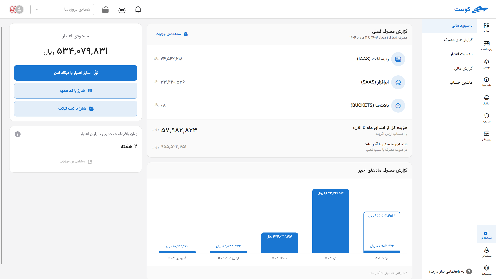
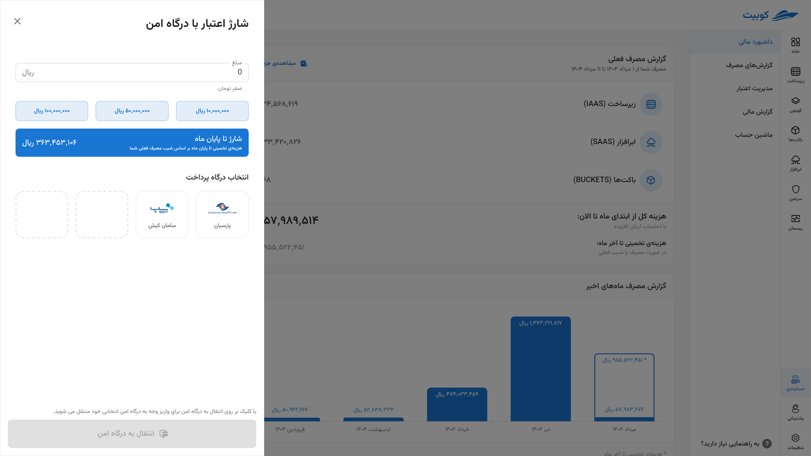
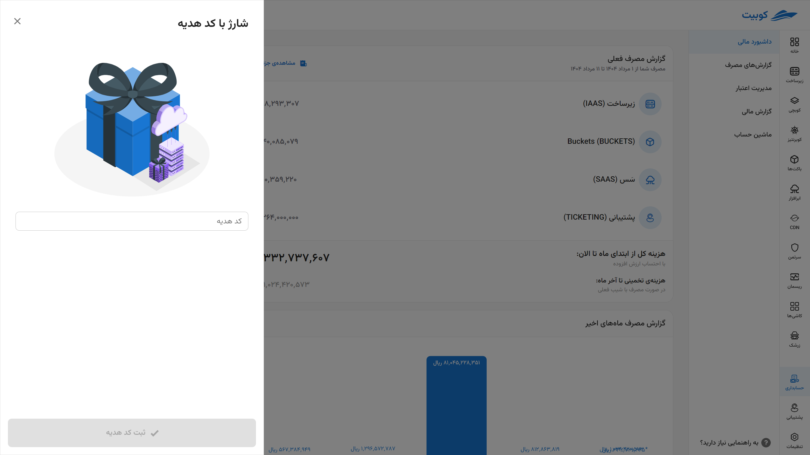
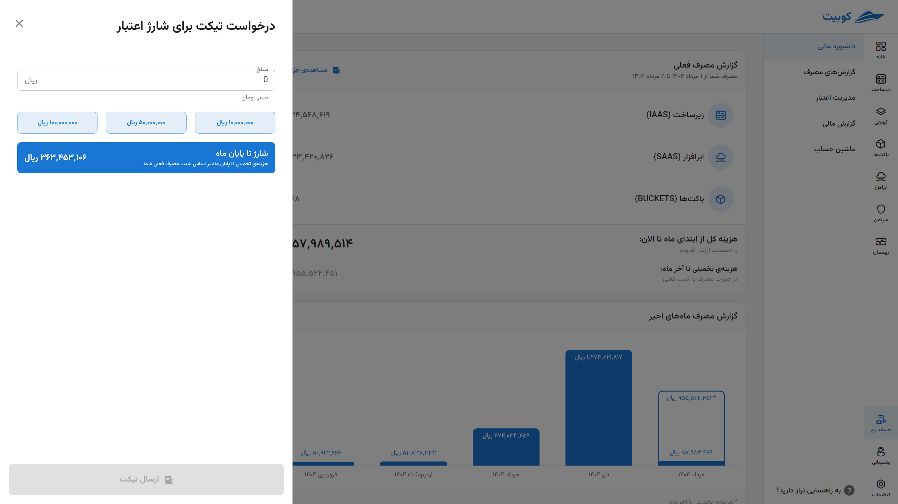

# داشبورد مالی

بخش **داشبورد مالی** طراحی شده تا به شما امکان دهد **در یک نگاه، وضعیت مالی خود را رصد کنید** و درک روشنی از میزان و نحوه‌ی مصرف اعتبارتان داشته باشید

## گزارش مصرف فعلی

- بازه زمانی از ابتدی ماه تا حال
- تفکیک هزینه‌ها بر اساس دسته‌بندی سرویس‌ها:

|                                               نوع سرویس |                                                                                  توضیحات سرویس |
| ------------------------------------------------------: | ---------------------------------------------------------------------------------------------: |
|                     [کوبچی](../../kubchi) (پلتفرم ابری) |                                                      فضای مدیریت‌شده کوبرنتیز توسط سیستم کوبیت |
|                     [زیرساخت](../../iaas) (رایانش ابری) |                                سرویس ارائه‌ دهنده منابع ابری نظیر پردازنده، حافظه، دیسک و شبکه |
|             [باکت‌ها](../../buckets) (مدیریت فضای ابری) |                                                                    ذخیره‌سازی و مدیریت داده‌ها |
| [ابرافزار](../../saas) (نرم‌افزارهای مدیریت شده‌ی ابری) | سرویسی ابری است که با هدف تسهیل، تسریع و ایمن‌سازی دسترسی توسعه‌دهندگان به ابزارهای نرم‌افزاری |
|                   [ریسمان](../../resmon) (مدیریت منابع) |                                    نظارت بر میزان استفاده از منابع (CPU/RAM/Disk) در کل کلاستر |
|                     [سرتمن](../../certman) (امنیت ابری) |                         سامانه‌ متمرکز به منظور تجمیع مدیریت امکانات حفاظتی و امنیتی مورد نیاز |
|                          [زرشک](../../zereshk) (پراکسی) |                                                                       ضد تحریم و پراکسی هوشمند |
|                         [رسان](../../resan) (مرکز پیام) |                                         سرویس پیام‌رسانی مرکزی و ارائه APIهای مختلف ارسال پیام |

- محاسبه هزینه کل از ابتدای ماه با احتساب مالیات بر ارزش افزوده
- با توجه به روند مصرف فعلی، سامانه، تخمینی از هزینه کل تا پایان ماه به شما ارائه می‌دهد تا از بودجه‌تان بهتر استفاده کنید.

## گزارش مصرف ماه‌های اخیر

امکان مشاهده‌ی روند هزینه‌کرد در ماه‌های گذشته برای تحلیل بهتر و بررسی تغییرات مصرف. گزارش ماه جاری همراه با تخمین نمایش می‌شود.

## موجودی اعتبار فعلی

در این بخش، **مقدار اعتبار باقی‌مانده** در حساب کاربری شما به‌صورت لحظه‌ای نمایش داده می‌شود.
همچنین، برای **افزایش اعتبار**، چند روش متنوع و امن در دسترس شما قرار گرفته است:

- **شارژ مستقیم از طریق درگاه بانکی امن**
  پرداخت سریع و آنلاین با کارت‌های شتاب
  
- **استفاده از کد هدیه**
  وارد کردن کد و دریافت اعتبار هدیه
  
- **ثبت تیکت برای پرداخت‌های غیرمستقیم**
  شامل روش‌هایی مانند کارت به کارت، انتقال به حساب، یا سایر روش‌های خاص مورد توافق
  

## پیش‌بینی زمان باقیمانده تا پایان اعتبار

بر اساس **روند فعلی مصرف شما**، سیستم به‌صورت خودکار تخمینی ارائه می‌دهد از اینکه اعتبار فعلی شما تا چند روز آینده پاسخ‌گوی نیازتان خواهد بود.
