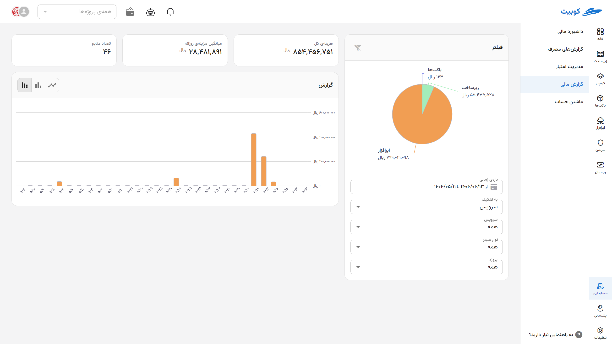
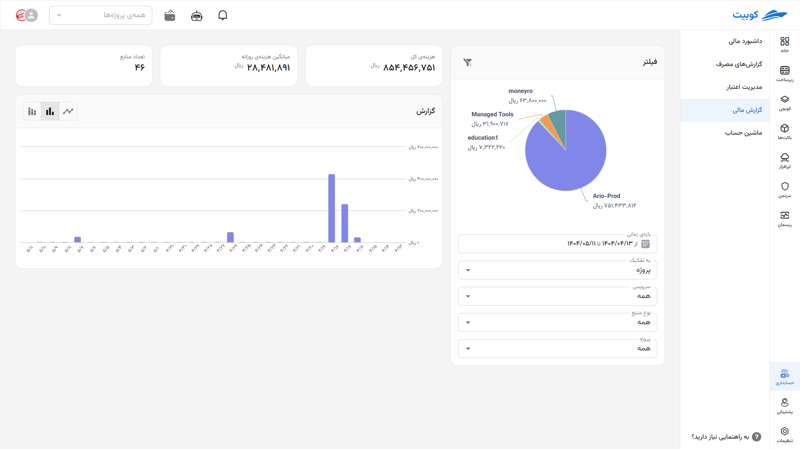
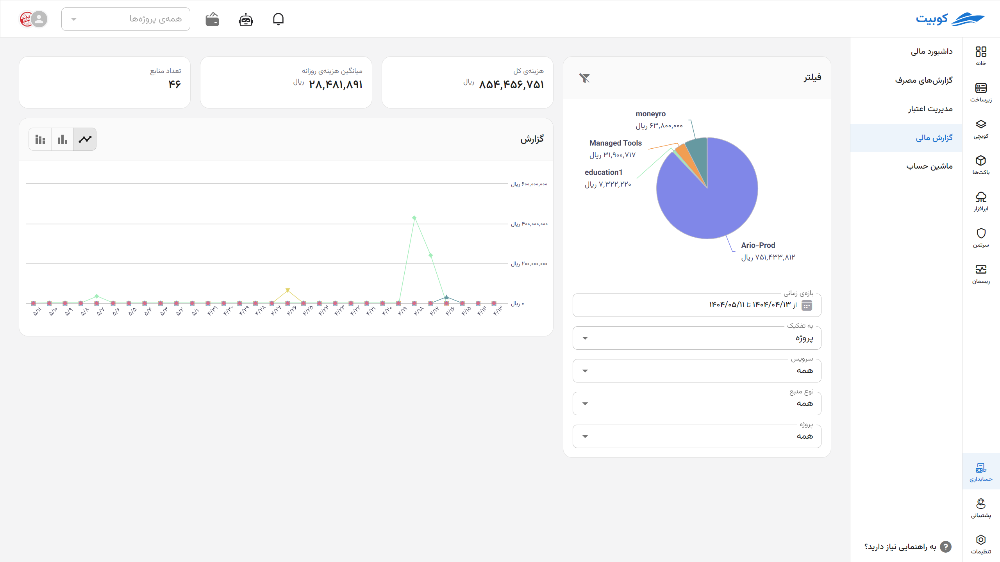

# گزارش مالی

## فیلتر

برای مشاهده دقیق‌تر جزئیات مصرف و هزینه، می‌توانید از فیلترهای زیر استفاده کنید (با زدن دکمه قیف (کادر سبز رنگ در تصویر) به حالت پیش‌فرض برمیگردد):

- **بازه زمانی:**
  انتخاب بازه‌ای مشخص برای تحلیل هزینه‌ها (مثلاً هفته جاری، ماه گذشته یا بازه دلخواه)
- **به تفکیک:**
  امکان انتخاب نحوه دسته‌بندی گزارش‌ها بر اساس دو معیار اصلی:

  1.  **سرویس:** مشاهده جزئیات هزینه و مصرف بر پایه نوع سرویس، مانند زیرساخت، فضای ذخیره‌سازی ابری، کوبچی و سایر خدمات
  2.  **پروژه:** بررسی میزان مصرف و هزینه‌ها در پروژه‌های مختلف به‌صورت مجزا

- **نوع سرویس:**
  انتخاب سرویس خاص برای تمرکز بیشتر روی نوع خاصی از مصرف (مثلاً فقط سرویس ماشین مجازی یا ذخیره‌سازی ابری)
- **نوع منبع:**
  بسته به نوع سرویس انتخاب‌شده، می‌توانید منابع مرتبط (مثل IP شناور، VM، حجم دیسک و غیره) را فیلتر کنید
- **پروژه:**
  نمایش داده‌ها به تفکیک پروژه‌های تعریف‌شده در حساب شما

---

## گزارش هزینه / مصرف

این بخش خلاصه‌ای از وضعیت مصرف و هزینه‌ها را با توجه به فیلترهای انتخاب‌شده ارائه می‌دهد:

- **هزینه کل:**
  مجموع هزینه‌ها در بازه و شرایط فیلترشده
- **میانگین روزانه:**
  متوسط مصرف روزانه منابع در بازه انتخابی
- **تعداد منابع:**  
   تعداد کل منابعی که در بازه موردنظر در حال استفاده بوده‌اند

---

## نمودارها

### نمودار زمانی

تصویرسازی روند مصرف و هزینه‌ها در طول زمان با سه حالت نمایش:

- **میله‌ای پشته‌ای (Stacked) به تفکیک:**  
   نمایش تفکیکی مصرف یا هزینه‌ها بر اساس فیلترهای انتخاب‌شده، در بازه‌های زمانی روزانه، هفتگی یا ماهانه.
  
- **میله‌ای تجمیعی (Aggregated):**  
   نمایش مجموع کل مصرف یا هزینه‌ها در هر بازه زمانی، بدون تفکیک بین منابع یا سرویس‌ها و بر اساس پروژه‌ها.
  
- **نمودار خطی به تفکیک:**  
   ارائه روند تغییرات مصرف و هزینه‌ها در گذر زمان به‌صورت خطی، با امکان تفکیک بر اساس فیلترهای انتخاب‌شده.
  

### نمودار دایره‌ای (Pie Chart)

- نمایش **ترکیب منابع مصرف‌شده** در بازه موردنظر
- تفکیک نوع المان‌ها (مثلاً VM، IP، ترافیک، حجم دیسک و ...)
- نمایش **درصد و مبلغ هزینه‌شده** برای هر نوع منبع به‌صورت بصری
