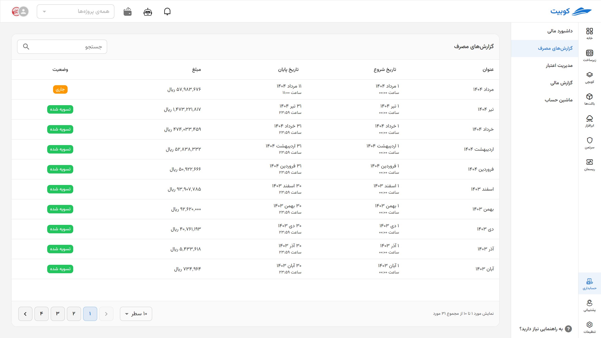
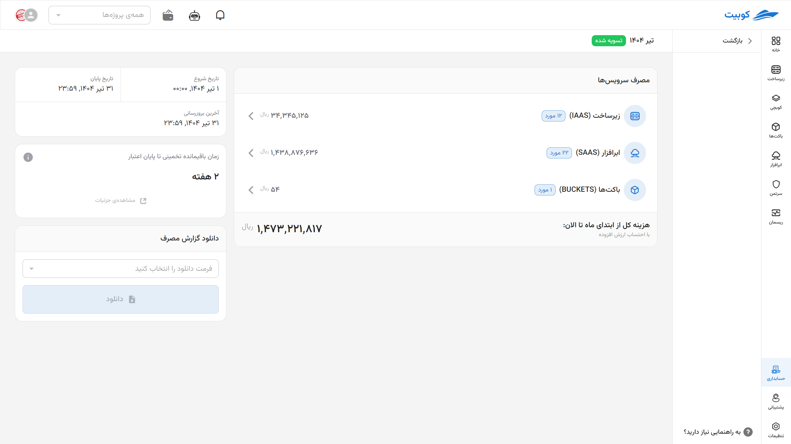
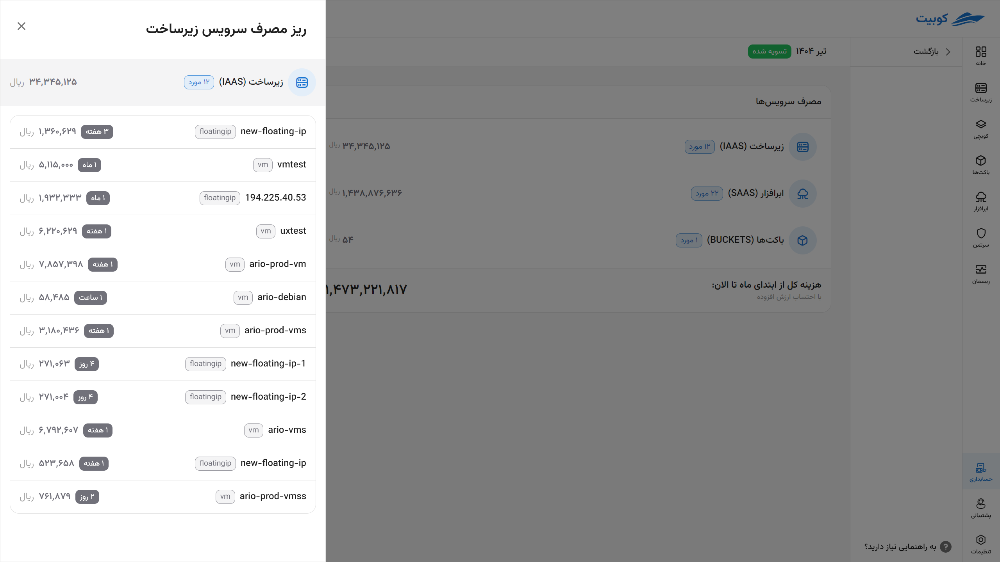

# گزارش‌های مصرف

بخش **گزارش‌های مصرف** به شما امکان می‌دهد تا جزئیات هزینه‌کرد ماهانه خود را به تفکیک سرویس به صورت دقیق و قابل پیگیری مشاهده و بررسی کنید.

## فاکتورهای ماهانه

در این بخش، فاکتورهای صادرشده برای هر ماه نمایش داده می‌شوند. با کلیک روی هر فاکتور، وارد صفحه‌ی جزئیات آن ماه خواهید شد.

**هر فاکتور شامل اطلاعات زیر است:**

- **وضعیت فاکتور:**
  1. **جاری** (فقط برای ماه فعلی)
  2. **تسویه‌شده** (پرداخت کامل انجام شده)
  3. **تسویه‌نشده** (در صورت وجود بدهی یا اعتبار منفی)
- **تاریخ شروع و پایان فاکتور** همراه با ساعت دقیق
- **مبلغ کل فاکتور** با احتساب مالیات بر ارزش افزوده

## مصرف سرویس‌ها

در این بخش، هزینه‌های شما بر اساس دسته‌بندی‌های سرویس‌ها نمایش داده می‌شود.

هر ردیف شامل:

- **نام سرویس**
- **تعداد منابع استفاده‌شده**
- **مجموع هزینه آن سرویس**

با کلیک روی هر سرویس، به صفحه‌ی **ریز مصرف منابع** وارد می‌شوید.

### جزئیات منابع مصرف‌شده

در بخش ریز مصرف هر سرویس، اطلاعات زیر برای هر منبع به تفکیک نمایش داده می‌شود:

| فیلد                 | توضیح                                                            |
| -------------------- | ---------------------------------------------------------------- |
| **نام منبع**         | نامی که شما یا سیستم برای منبع انتخاب کرده‌اید                   |
| **نوع منبع**         | نوع منبع مورد استفاده (مثلاً VM، Floating IP، ترافیک شبکه و...)  |
| **مدت زمان استفاده** | مجموع زمان فعال بودن یا تخصیص منبع طی دوره‌ی گزارش‌شده           |
| **هزینه منبع**       | مبلغ مصرف‌شده برای آن منبع، با احتساب مدت زمان و تعرفه‌های مرتبط |

## تاریخ فاکتور

هر فاکتور شامل بازه زمانی مشخصی است که اطلاعات مالی مربوط به آن را در بر می‌گیرد:

- **تاریخ و ساعت شروع**
- **تاریخ و ساعت پایان**
- **زمان آخرین بروزرسانی فاکتور**

## پیش‌بینی زمان باقیمانده تا پایان اعتبار

در این بخش، سیستم با تحلیل شیب مصرف فعلی، **تخمینی از اینکه اعتبار موجود تا چند وقت آینده پاسخ‌گوی نیاز شما خواهد بود** ارائه می‌دهد. این پیش‌بینی به تصمیم‌گیری بهتر برای شارژ حساب کمک می‌کند.

## دانلود گزارش مصرف

برای دریافت فاکتور یا گزارش‌های مصرف، می‌توانید **فرمت فایل دلخواه** خود را انتخاب کرده و گزارش را دانلود کنید.
