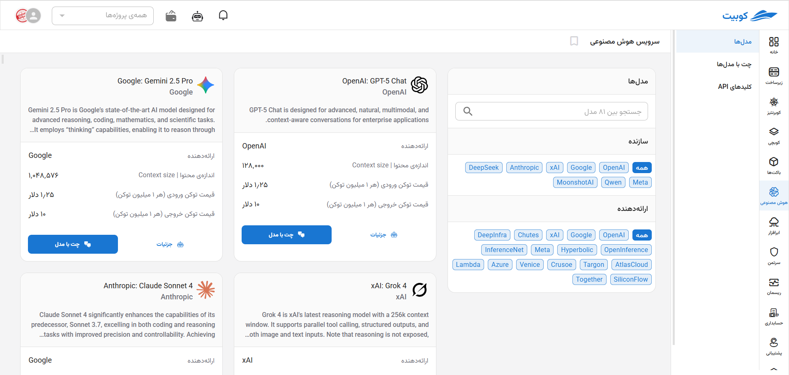
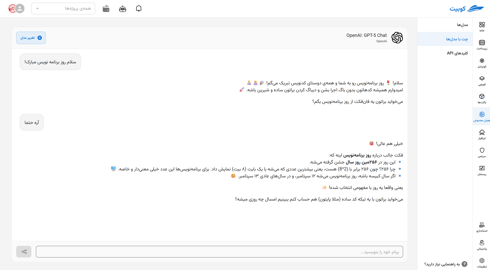
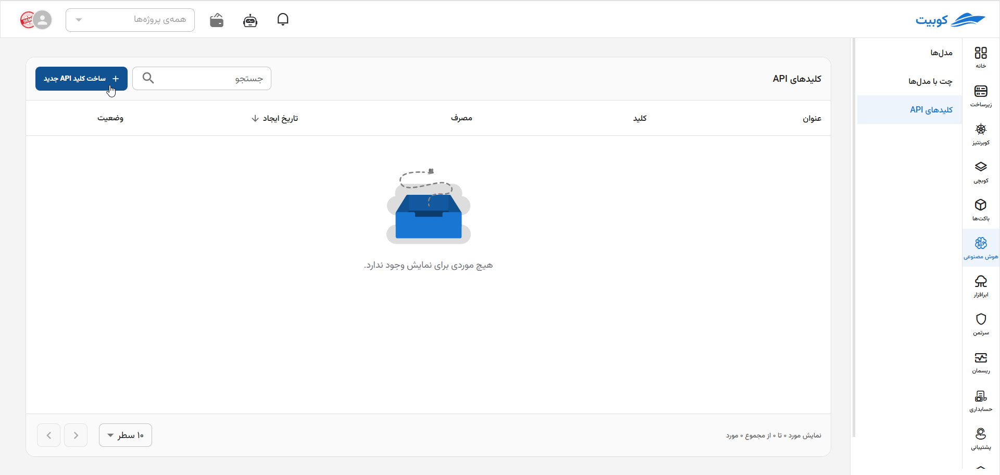
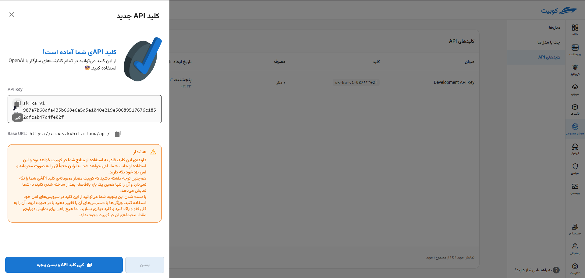

# هوش مصنوعی (AI)

## معرفی

سرویس **هوش مصنوعی** یک بستر ابری و مقیاس‌پذیر برای دسترسی به مدل‌های هوش مصنوعی پیشرفته است. این سرویس به توسعه‌دهندگان، صاحبان کسب‌وکار و استارتاپ‌ها کمک می‌کند بدون نیاز به زیرساخت پیچیده، به‌سادگی از قدرت مدل‌های زبانی بزرگ (LLM) استفاده کنند.

---

## قابلیت‌ها

### 1. LLM به عنوان خدمت (LLMaaS)

- **ارائه APIی ابری** برای استفاده سریع و آسان
- **سازگاری کامل با کلاینت‌های مرسوم OpenAI**
- **مقیاس‌پذیری بالا** برای استفاده در پروژه‌های کوچک تا سازمان‌های بزرگ
- **امکان سوییچ سریع و راحت بین مدل‌ها، Providerها و Endpointها** با کمترین تغییرات



---

### 2. چت با مدل‌های هوش مصنوعی

- **رابط کاربری یکپارچه** برای تست و گفت‌وگو با مدل‌ها
- **ارزیابی و مقایسه مدل‌ها** در یک محیط ساده و کاربرپسند
- **دسترسی به بیش از ۸۰ مدل برتر** از معتبرترین ارائه‌دهندگان جهانی



---

## مزایا

- کاهش زمان توسعه و هزینه‌های زیرساختی
- دسترسی به آخرین مدل‌ها بدون دغدغه بروزرسانی
- مناسب برای تیم‌های توسعه، استارتاپ‌ها و شرکت‌های مقیاس‌پذیر

---

## راهنمای API

برای دریافت کلید API به صفحه‌ی «کلیدهای API» بروید و بر روی دکمه‌ی **ساخت کلید API جدید** کلیک کنید:



سپس در پنجره‌ی باز شده، یک نام اختیاری برای کلید خود انتخاب کنید و دکمه‌ی **ساخت کلید API جدید** را بزنید. کلید شما آماده است:



از کلید ساخته شده و endpoint داده شده، می‌توانید در انواع برنامه‌ها و سرویس‌های ساخت خودتان، مانند Chat Botها، AI Assistantها، AI Agentها، استفاده کنید و به راحتی توانایی‌های منحصر به فرد بهترین مدل‌های هوش مصنوعی را به آن‌ها بیفزایید. هم‌چنین، خواهید توانست با کمترین میزان تغییر در کدهای خود از به‌روزرسانی‌های آینده‌ی این صنعت بهره‌مند شوید.

### احراز هویت

تمامی درخواست‌ها باید شامل header زیر باشند:

```http
Authorization: Bearer YOUR_API_KEY
```

:::info[توجه]
به جای `YOUR_API_KEY` همان کلیدی را که در گام پیشین ساختید، قرار دهید.
:::

---

### نمونه: ارسال پیام به مدل

```bash
curl https://aiaas.kubit.cloud/api/v1/chat/completions \
  -H "Authorization: Bearer YOUR_API_KEY" \
  -H "Content-Type: application/json" \
  -d '{
    "model": "openai/gpt-5",
    "messages": [
      {"role": "system", "content": "You are a helpful assistant"},
      {"role": "user", "content": "سلام! میشه یک داستان کوتاه بگی؟"}
    ]
  }'
```

**پاسخ نمونه:**

```json
{
  "id": "chatcmpl-12345",
  "object": "chat.completion",
  "created": 1758730329,
  "model": "openai/gpt-5",
  "choices": [
    {
      "index": 0,
      "message": {
        "role": "assistant",
        "content": "روزی روزگاری..."
      },
      "finish_reason": "stop"
    }
  ]
}
```

---

### سوییچ سریع و راحت بین مدل‌ها

فقط کافی است مقدار `model` را در درخواست تغییر دهید؛ بدون تغییر در ساختار کد.

---

## موارد استفاده

- چت‌بات‌های هوشمند
- تحلیل متن و داده
- پشتیبانی مشتری
- تولید محتوا و بازاریابی هوشمند
- ارزیابی و مقایسه‌ی عملکرد مدل‌های هوش مصنوعی
