# مدیریت سرویس باکت‌ها

در بخش باکت‌های پنل کوبیت، دسترسی به **باکت‌ها** و **فضاها** فراهم شده است.

همانطور که در [مفاهیم پایه](../#concepts) ذکر شد، باکت‌ها با فضا و فضاها با پروژه‌ها معنی پیدا می‌کنند. بنابراین، باکت‌های یک سازمان توسط پروژه‌ها تفکیک می‌شوند. برای دسترسی به مدیریت باکت‌ها، ابتدا باید یک پروژه را انتخاب کنید.

## انتخاب پروژه{#select-project}

ابتدا از پنل کوبیت، وارد سرویس **باکت‌ها** شوید:
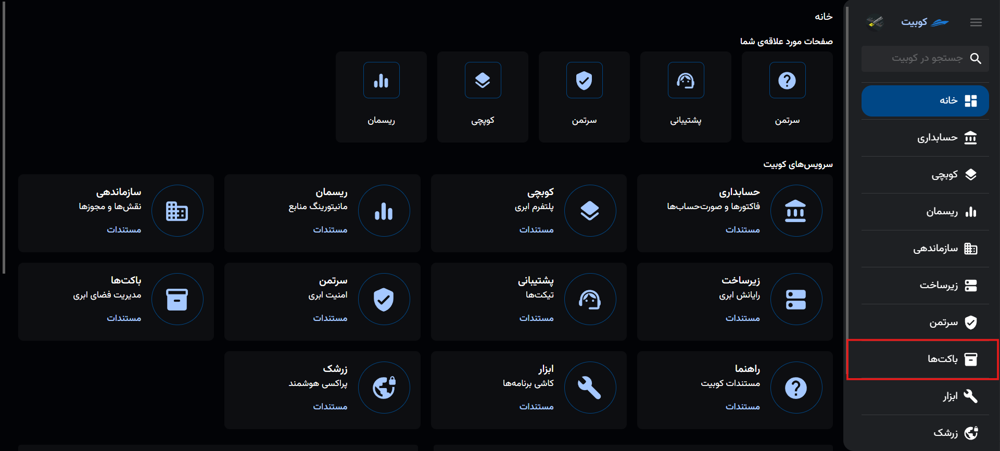

در صفحه اول سرویس، لیستی از پروژه‌های متصل قابل مشاهده است. ابتدا باید پروژه موردنظر را از میان این لیست انتخاب کنید:
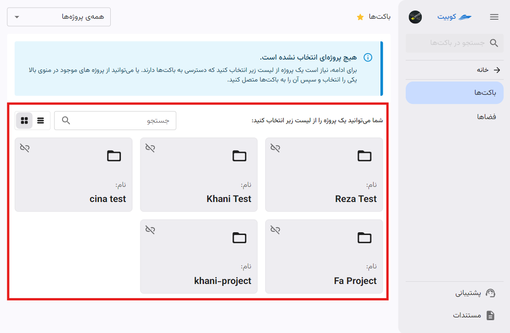

سپس اطلاعات باکت‌ها و فضاهای مرتبط با پروژه انتخاب شده، نمایش داده می‌شوند:
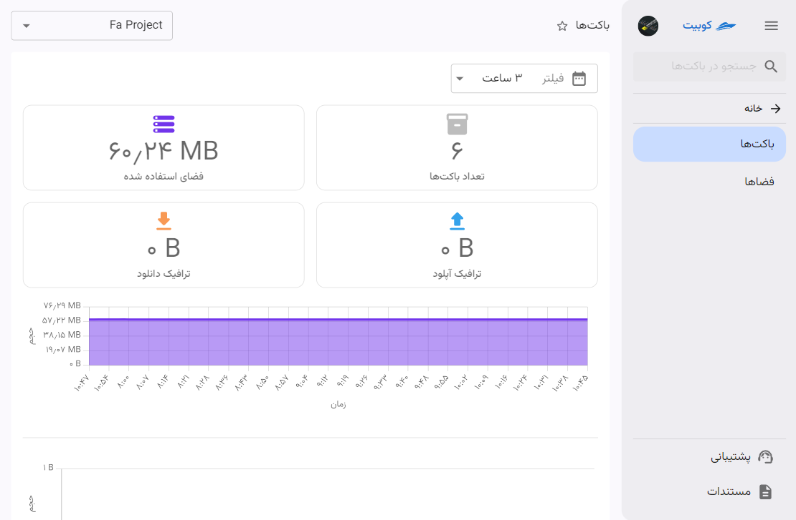

برای دریافت چارت‌های باکت در بازه‌های زمانی مختلف، می‌توانید روی گزینه **فیلتر** کلیک کنید:
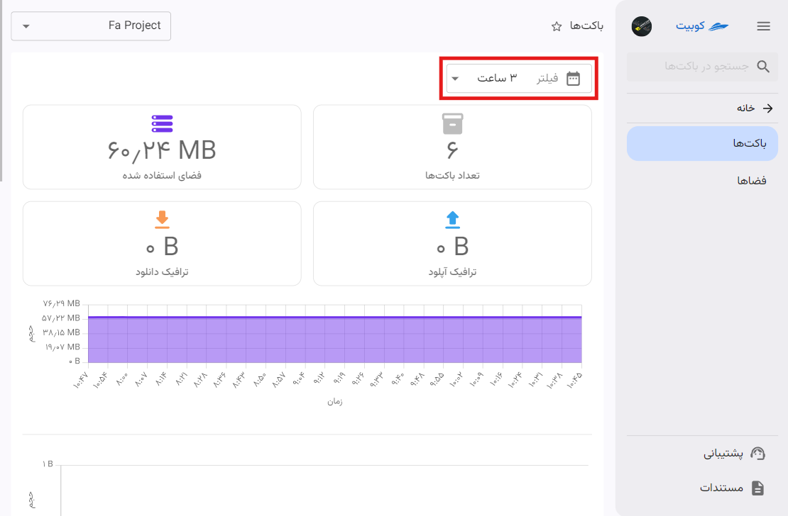

سپس بازه زمانی موردنظر خود را انتخاب کنید تا چارت‌ها بر اساس بازه انتخاب شده به‌روزرسانی شوند:
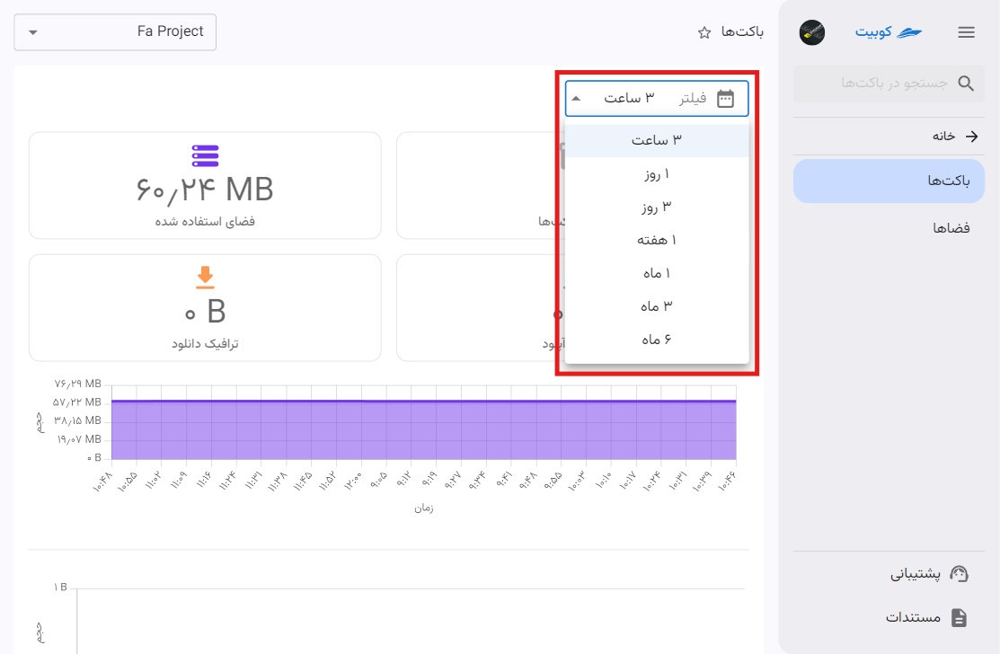

در انتهای صفحه نیز، لیست باکت‌های سازمان وجود دارد:
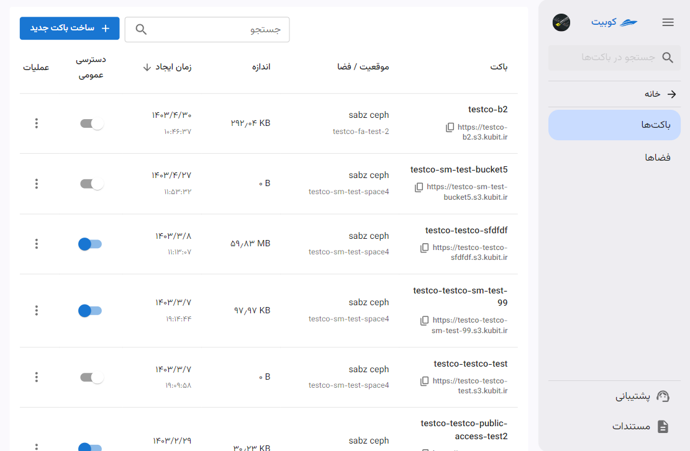

## اتصال پروژه به سرویس باکت

در صورتی که لیست پروژه‌های متصل خالی باشد، باید از طریق گزینه **همه‌ی‌ پروژه‌ها**، پروژه موردنظر خود را انتخاب و به سرویس باکت‌ها متصل کنید:
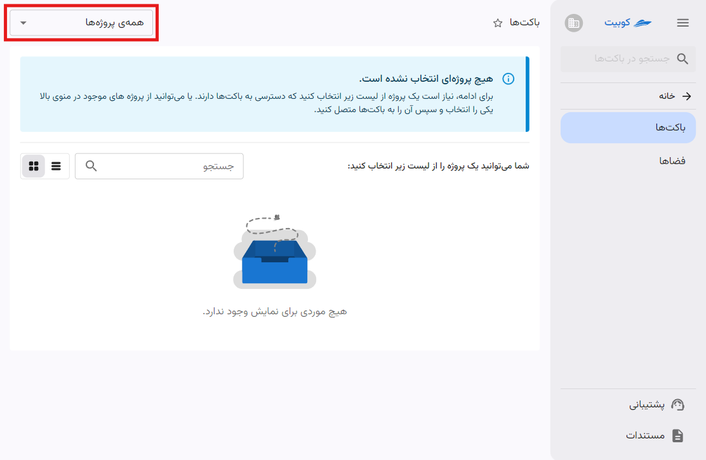

از گزینه همه‌ی پروژه‌های سازمان، پروژه موردنظر خود را انتخاب کنید:
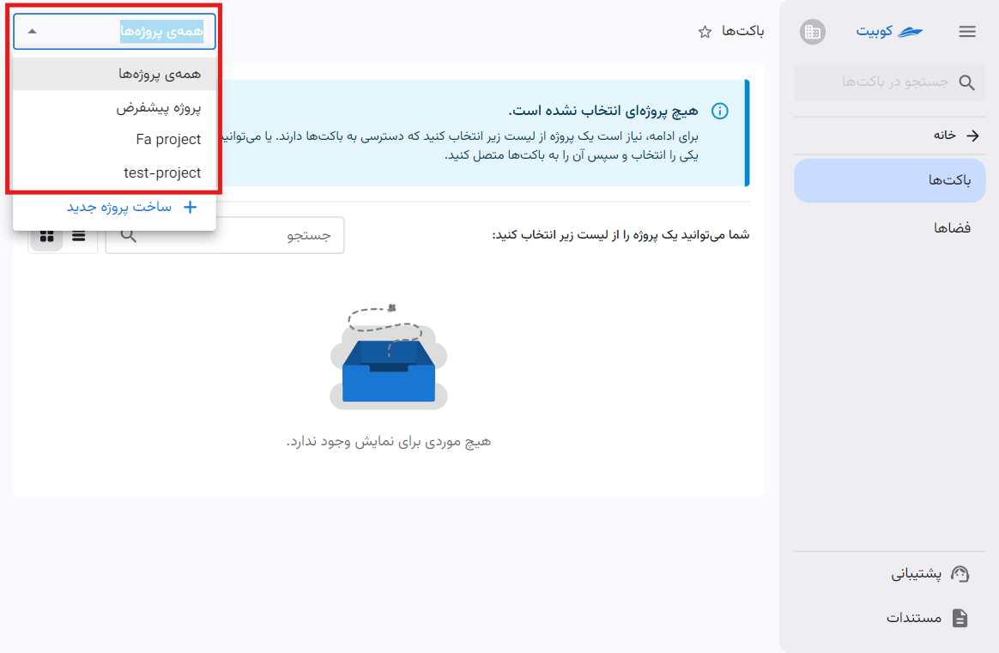

سپس خطای عدم اتصال پروژه را مشاهده می‌کنید. برای اتصال پروژه، روی دکمه **اتصال** کلیک کنید:
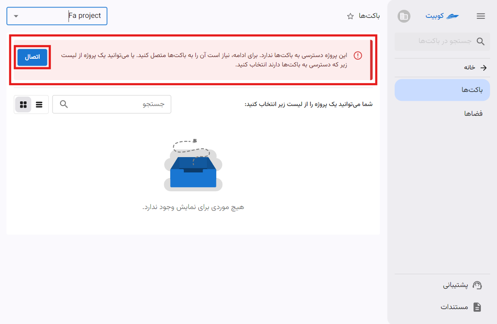

در انتها، پروژه به سرویس باکت متصل شده و به صفحه باکت‌های پروژه هدایت می‌شوید.

## قطع اتصال پروژه

از آیکون قطع اتصال روی کارت هر پروژه، می‌توانید نسبت به قطع اتصال پروژه از سرویس باکت، اقدام کنید:
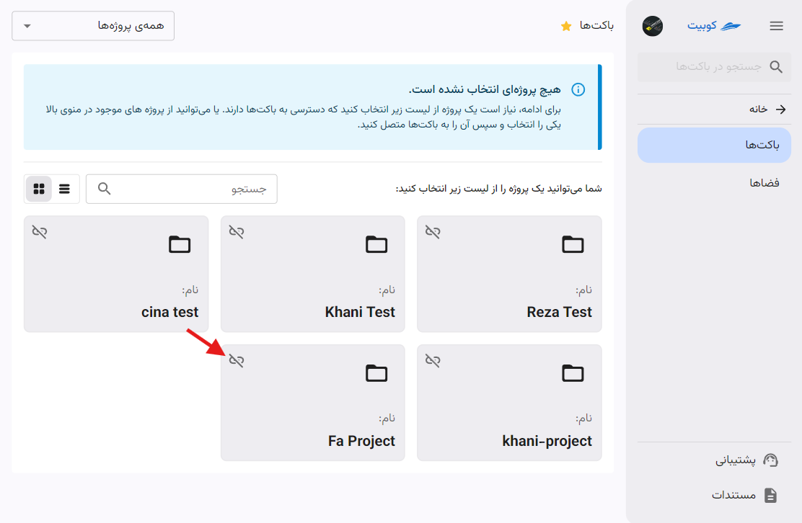
سپس روی **تایید** کلیک کنید:
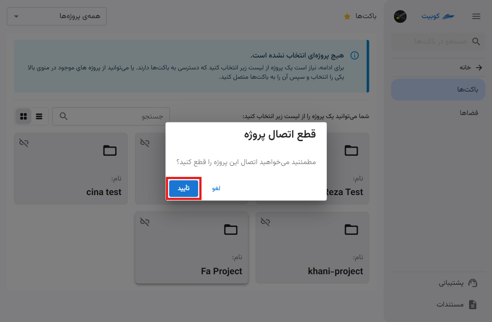

:::tip[ساخت پروژه]
همچنین اگه تمایل به ایجاد پروژه جدید دارید، می‌توانید از طریق گزینه **ایجاد پروژه جدید** اقدام کنید:
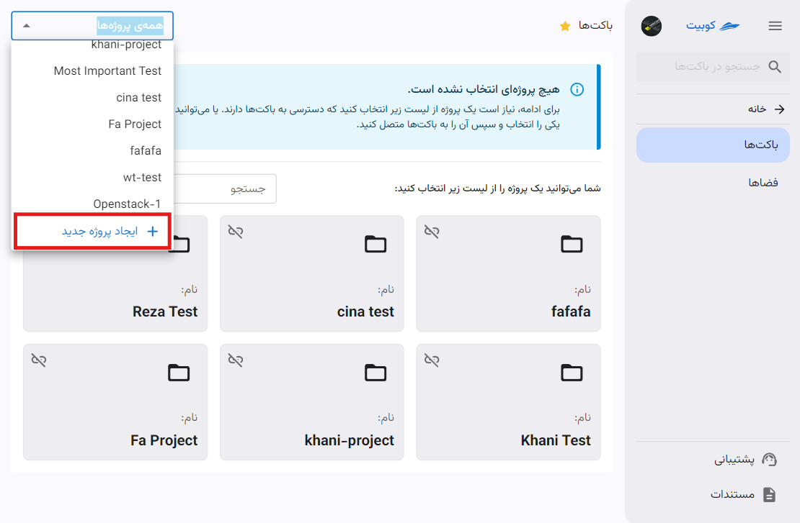
برای مطالعه مراحل ساخت پروژه، به سند [ساخت پروژه](../../organize/project#create-project) مراجعه کنید.
:::
