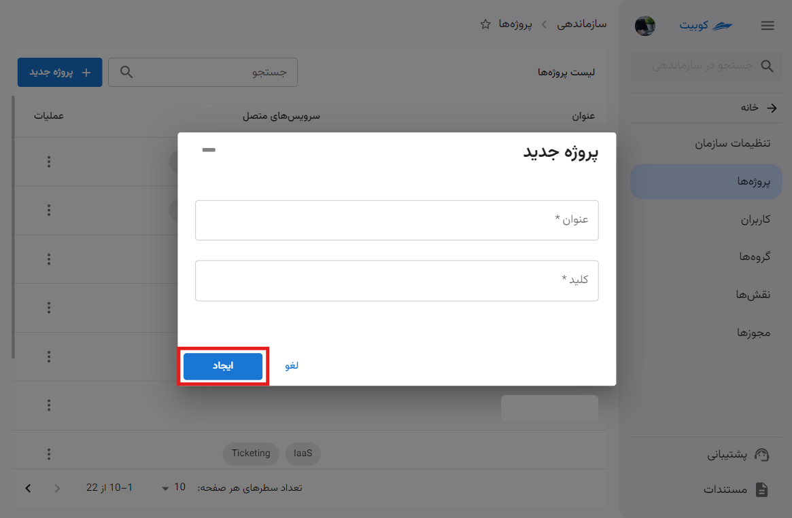

# مدیریت سرویس باکت‌ها

در بخش باکت‌های پنل کوبیت، دسترسی به **باکت‌ها** و **فضاها** فراهم شده است.
همانطور که در [مفاهیم پایه](../#concepts) ذکر شد، باکت‌ها با فضا و فضاها با پروژه‌ها معنی پیدا می‌کنند. بنابراین، باکت‌های یک سازمان توسط پروژه‌ها تفکیک می‌شوند. برای شروع کار با باکت‌ها، ابتدا باید یکی از پروژه‌هایی که قبلا در قسمت سازماندهی ساخته‌اید را به این سرویس متصل کنید، یا یکی از پروژه‌های متصل به باکت را انتخاب کنید.

ابتدا از پنل کوبیت، وارد سرویس **باکت‌ها** شوید:

## اتصال پروژه به سرویس باکت

- از طریق گزینه **همه‌ی‌ پروژه‌ها**، لیست پروژه‌های فعلی سازمان را باز کنید.
- از میان پروژه‌ها، پروژه موردنظر خود را انتخاب کنید.
- سپس خطای عدم اتصال پروژه ظاهر می‌شود. برای اتصال پروژه، روی دکمه **اتصال** کلیک کنید.

در انتها، پروژه به سرویس باکت متصل شده و به صفحه باکت‌های پروژه هدایت می‌شوید.

## انتخاب پروژه{#select-project}

در صفحه اول سرویس، لیستی از پروژه‌های متصل قابل مشاهده است. ابتدا باید پروژه موردنظر را از میان این لیست انتخاب کنید:

در انتها به صفحه اطلاعات باکت‌ها هدایت خواهید شد.

### لیست باکت‌ها

پس از انتخاب پروژه، لیستی از باکت‌های پروژه، نمایش داده می‌شوند:

برای دریافت چارت‌های باکت در بازه‌های زمانی مختلف، می‌توانید روی گزینه **فیلتر** کلیک کنید:

سپس بازه زمانی موردنظر خود را انتخاب کنید تا چارت‌ها بر اساس بازه انتخاب شده به‌روزرسانی شوند:

در انتهای صفحه نیز، لیست باکت‌های پروژه و مشترک در سازمان وجود دارد:

برای توضیحات بیشتر به مستندات [مدیریت باکت‌ها](../bucket) و [مدیریت فضاها](../space) مراجعه کنید.

:::tip[ساخت پروژه]
همچنین اگه تمایل به ایجاد پروژه جدید دارید، می‌توانید از طریق گزینه **ایجاد پروژه جدید** اقدام کنید:

سپس **عنوان** و **کلید** پروژه را وارد کرده و روی **ایجاد** کلیک کنید:

:::

## قطع اتصال پروژه

- برای قطع اتصال پروژه از سرویس باکت، می‌توانید از آیکون قطع اتصال روی کارت پروژه موردنظر اقدام کنید.
- سپس در صورت اطمینان، روی دکمه **تایید** دیالوگ باز شده کلیک کنید.
  
  
