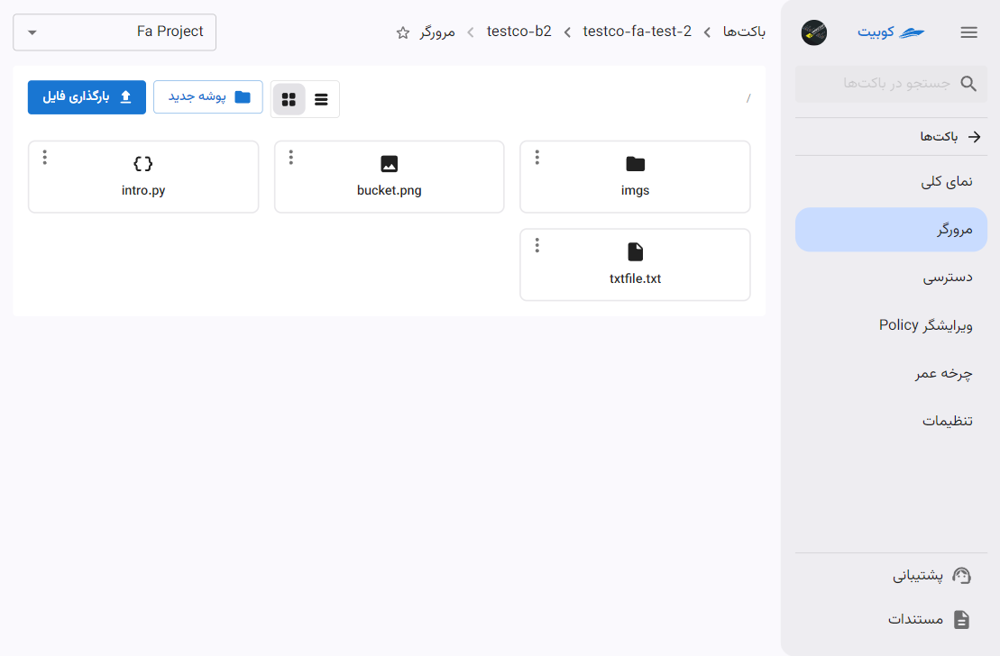
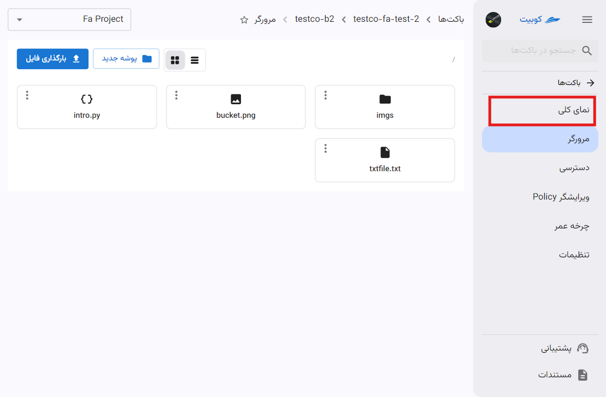

# باکت

در این صفحه، چارت گزارش از وضعیت فضای ذخیره‌سازی سازمان شامل **تعداد باکت‌ها**، **حجم فضای استفاده شده**، **ترافیک آپلود** و **ترافیک دانلود** به همراه لیستی از باکت‌های سازمان (باکت‌های پروژه انتخاب شده و باکت‌های مشترک در سازمان) وجود دارد.

از صفحه سرویس باکت‌ها، پس از [انتخاب یک پروژه متصل](../bucket-settings#select-project)، به صفحه باکت‌های پروژه هدایت خواهید شد:

در انتهای صفحه، لیست باکت‌های سازمان قابل مشاهده است:

با کلیک روی نام هر باکت، به [صفحه مرورگر باکت](./#bucket-browser) هدایت خواهید شد.

## ساخت باکت جدید{#create-bucket}

در صفحه سرویس باکت‌ها، پس از [انتخاب یک پروژه متصل](../bucket-settings#select-project)، روی **ساخت باکت جدید** کلیک کنید تا به فرم ساخت باکت هدایت شوید:

ابتدا **فضا** را انتخاب کرده و **نام** باکت را وارد کنید:

:::info[فضای پیش‌فرض]
به صورت پیش‌فرض آخرین فضای ساخته شده در پروژه به عنوان فضای باکت جدید انتخاب می‌شود. می‌توانید از میان فضاهای موجود، فضای موردنظر خود را انتخاب کنید:

:::

:::info[پیشوند نام باکت]
به صورت پیش‌فرض، نام سازمان به عنوان پیشوند نام باکت تنظیم می‌شود.
:::

### گزینه‌های اختیاری

- **دسترسی عمومی**:
  با فعال‌سازی این گزینه، اشتراک گذاری باکت و دانلود آبجکت‌ها به صورت عمومی فعال می‌شود.
- **نسخه نگاری**:
  برای جلوگیری از اقدامات ناخواسته کاربر و خرابی فایل‌ها، می‌توانید نسخه‌های مختلف از یک آبجکت را نگهداری کنید.
- **برچسب‌ها**:
- **سرویس اکانت**:
  برای تخصیص دسترسی محدود شده به باکت، می‌توانید سرویس اکانت موردنظر خود را در این بخش انتخاب کنید.
  
  :::caution[در چه صورت انتخاب سرویس اکانت الزامی خواهد بود؟]
  توجه داشته باشید در صورتی که تخصیص سرویس اکانت در فضای انتخاب شده ضروری باشد، گزینه سرویس اکانت در ساخت باکت اختیاری نخواهد بود و باید حداقل یک سرویس اکانت به باکت اختصاص دهید.
  :::

در انتها روی **ایجاد باکت** کلیک کنید تا باکت موردنظر ساخته شود.

## مرورگر باکت{#bucket-browser}

در صفحه مرورگر باکت، امکاناتی چون **فایل‌های بارگذاری شده**، **ساخت پوشه جدید**، **بارگذاری فایل** و دسترسی به سایر تنظیمات باکت وجود دارد:

### بارگذاری فایل

برای بارگذاری فایل، رو گزینه **بارگذاری فایل** کلیک کنید:

پس از انتخاب فایل، فایل موردنظر بارگذاری شده و به لیست فایل‌های صفحه **مرورگر** اضافه خواهد شد.

### ساخت پوشه

برای ساخت پوشه جدید، روی گزینه **پوشه جدید** کلیک کنید:

سپس نام پوشه را وارد کرده و روی **ایجاد** کیک کنید:

در انتها پوشه جدید ساخته شده و به لیست آبجکت‌های صفحه **مرورگر** اضافه خواهد شد.

## نمای کلی

در صفحه نمای کلی، به چارت گزارش باکت مربوطه دسترسی خواهید داشت:

## دسترسی

## ویرایشگر Policy

## چرخه عمر

## تنظیمات باکت

در صفحه تنظیمات، امکان تغییر گزینه‌های **دسترسی عمومی**، **نسخه‌نگاری** و **برچسب‌ها** فراهم شده است.

تغییرات موردنظر خود را انجام داده و روی **به‌روزرسانی باکت** کلیک کنید:

برای مقادیر دیگر چون **دسترسی عمومی** و **برچسب‌ها** نیز می‌توانید به همین صورت عمل کنید.
