# مدیریت باکت‌ها

در این صفحه، چارت گزارش از وضعیت فضای ذخیره‌سازی سازمان شامل **تعداد باکت‌ها**، **حجم فضای استفاده شده**، **ترافیک آپلود** و **ترافیک دانلود** به همراه لیستی از باکت‌های سازمان (باکت‌های پروژه انتخاب شده و باکت‌های مشترک در سازمان) وجود دارد.

از صفحه سرویس باکت‌ها، پس از [انتخاب یک پروژه متصل](../bucket-settings#select-project)، به صفحه باکت‌های پروژه هدایت خواهید شد:

## لیست باکت‌ها

در انتهای صفحه سرویس، لیست باکت‌های سازمان به همراه اطلاعاتی چون **نام**، **موقعیت/فضا**، **اندازه**، **زمان ایجاد** و **دسترسی عمومی** برای هر باکت، قابل مشاهده است:

همچنین، با کلیک روی نام هر باکت به صفحه [مرورگر باکت](./#bucket-browser) هدایت خواهید شد.

### دسترسی عمومی

‌از طریق گزینه **دسترسی عمومی** می‌‌توانید تنطیمات دسترسی به باکت را تغییر دهید. در صورت فعال شدن این گزینه، امکان دسترسی به باکت و دانلود آبجکت‌های آن برای عموم، فراهم می‌شود.

#### فعال‌سازی دسترسی عمومی

#### غیرفعال‌سازی دسترسی عمومی

### عملیات‌های هر باکت

در ستون عملیات و از طریق دکمه سه نقطه، لیستی از عملیات‌های موجود برای هر باکت وجود دارد:

#### ویرایش باکت

روی **ویرایش باکت** کلیک کنید تا به **صفحه تنطیمات** هدایت شوید:

برای مطالعه مراحل ویرایش باکت، به بخش [تنظیمات باکت](./#bucket-settings) مراجعه کنید.

#### برچسب‌ها

با کلیک روی گزینه **برچسب‌ها**، لیست برچسب‌های باکت و امکان افزودن برچسب جدید وجود دارد:

علاوه بر برچسب‌های باکت، به صورت پیش‌فرض یک فیلد خالی کلید-مقدار برای ایجاد برچسب جدید، وجود دارد:

##### ایجاد برچسب جدید

در صورت تمایل برای ایجاد برچسب جدید، می‌توانید مقادیر جدید را وارد کرده و روی **به‌روزرسانی** کلیک کنید:
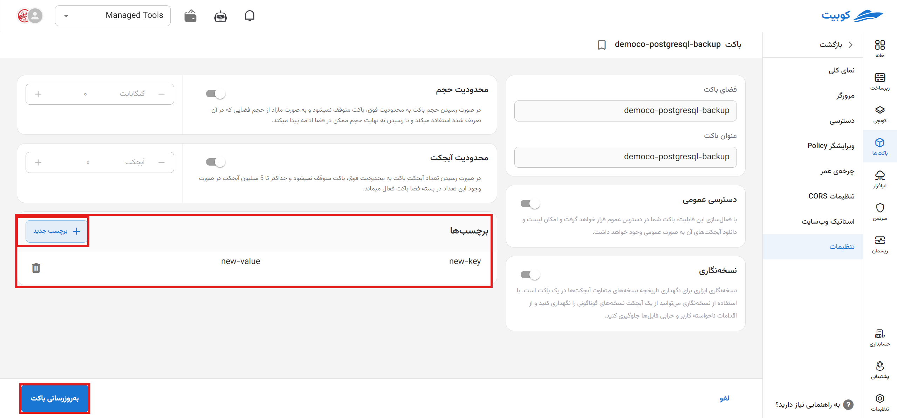

##### حذف برچسب

برای حذف برچسب نیز، تنها کافیست روی آیکون **سطل زباله** کنار کلید-مقدار مرتبط، کلیک کنید:

#### تخلیه باکت

برای تخلیه باکت (حذف تمام آبجکت‌های آپلود شده)، روی **تخلیه باکت** کلیک کنید:

سپس برای انجام عملیات تخلیه، روی گزینه **تخلیه باکت** کلیک کنید:

#### پاک کردن باکت

برای حذف باکت (به همراه حذف تمام آبجکت‌های موجود در آن)، روی **پاک کردن باکت** کلیک کنید:
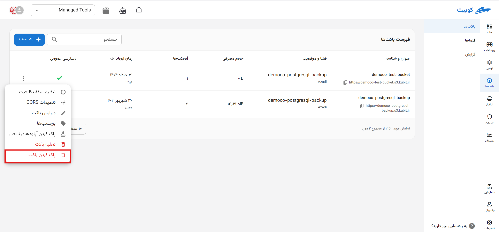

سپس برای انجام عملیات حذف، روی گزینه **پاک کردن باکت** کلیک کنید:
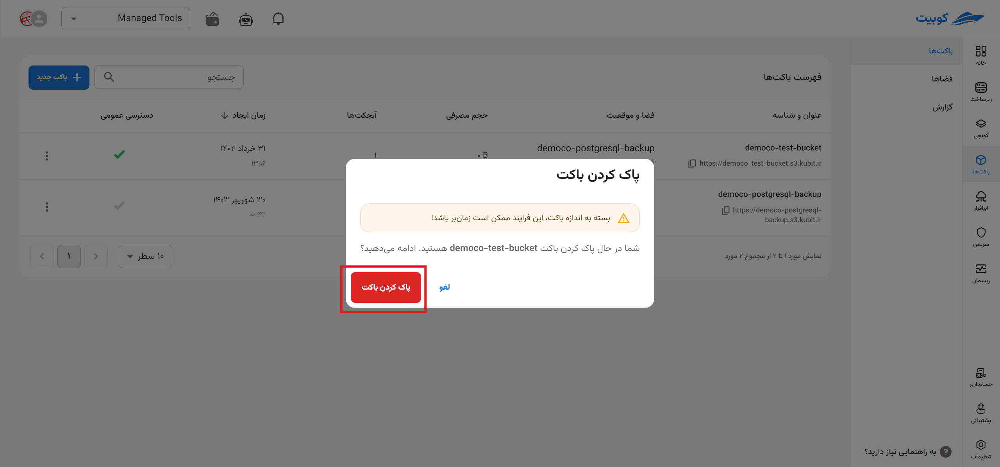

## مرورگر باکت{#bucket-browser}

در صفحه مرورگر باکت، **فایل‌های بارگذاری شده**، **ساخت پوشه جدید**، **بارگذاری فایل** و امکانات مرتبط به آبجکت‌ها وجود دارد:

### جزئیات آبجکت

با کلیک روی هر آبجکت، اطلاعاتی درمورد آبجکت انتخاب شده شامل **نام**، **اندازه**، **آخرین ویرایش** و **مسیر** آبجکت، به همراه دکمه‌های **کپی لینک دانلود** و امکان **دانلود** مستقیم نمایش داده می‌شود:

#### عملیات‌های پوشه

روی دکمه سه نفطه روی کارت پوشه موردنظر کلیک کنید:

سپس لیستی از عملیات‌های موجود چون **کپی** پوشه، **جابه‌جایی** پوشه و **پاک کردن** نمایش داده می‌شود:

هر کدام از این عملیات‌ها، روی تمام آبجکت‌های پوشه اعمال می‌شود.

#### عملیات‌های فایل

روی دکمه سه نفطه روی کارت فایل موردنظر کلیک کنید:
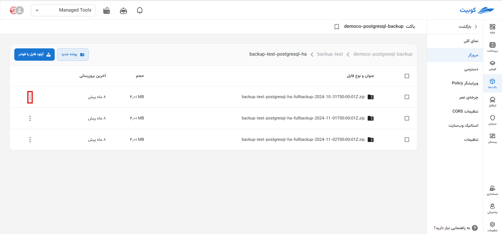

سپس لیستی از عملیات‌های موجود چون ایجاد **لینک زماندار**، **کپی**، **جابه‌جایی**، **برچسب‌ها**، **نسخه‌ها** و **پاک کردن** وجود دارد:

### بارگذاری فایل

برای بارگذاری فایل، رو گزینه **بارگذاری فایل** کلیک کنید:
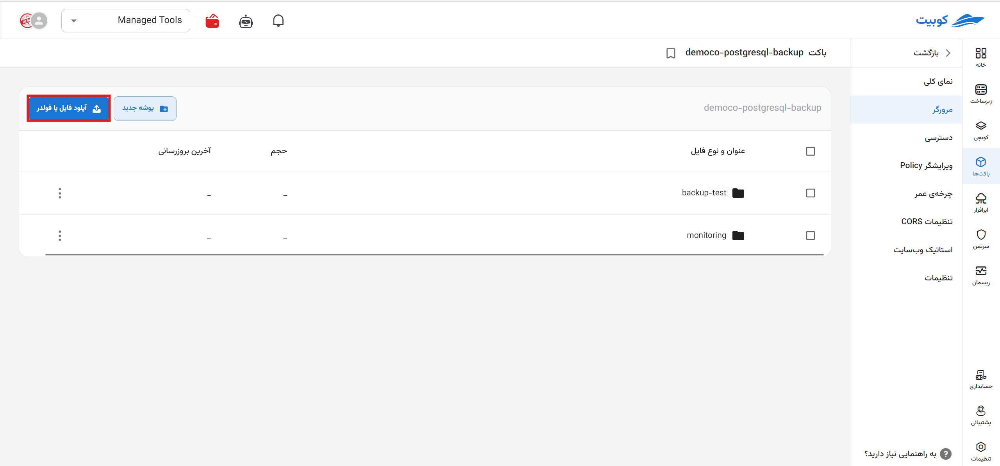
پس از انتخاب فایل، فایل موردنظر بارگذاری شده و به لیست فایل‌های صفحه **مرورگر** اضافه خواهد شد.

:::info[بارگذاری فایل در پوشه]
برای بارگذاری فایل در پوشه، کافیست وارد پوشه موردنظر شوید و مراحل ذکر شده در **بارگذاری فایل** را انجام دهید.
:::

### ساخت پوشه

برای ساخت پوشه جدید، روی گزینه **پوشه جدید** کلیک کنید:

سپس **نام** پوشه را وارد کرده و روی **ایجاد** کیک کنید:

در انتها پوشه جدید ساخته شده و به لیست آبجکت‌های صفحه **مرورگر** اضافه خواهد شد.

## نمای کلی

در صفحه نمای کلی، به چارت گزارش باکت مربوطه دسترسی خواهید داشت:

برای دریافت چارت‌های باکت در بازه‌های زمانی مختلف، می‌توانید روی گزینه **فیلتر** کلیک کرده و بازه موردنظر خود را انتخاب کنید:
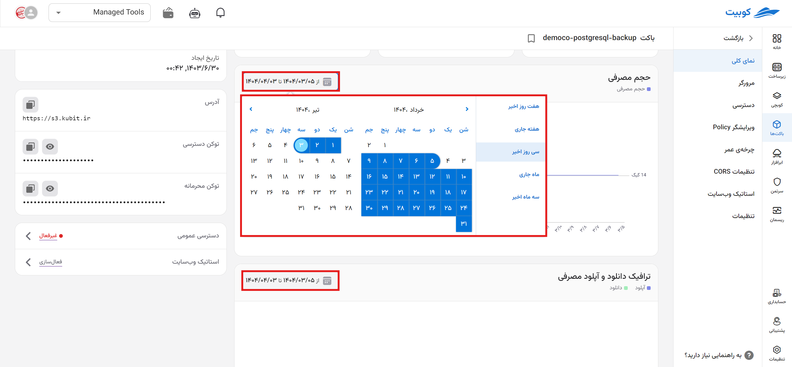

## دسترسی

در صفحه دسترسی، **دسترسی‌های فضا** و **دسترسی‌های سرویس اکانت** وجود دارد:

### دسترسی‌های فضا

در این بخش، **آدرس** و **کلید** دسترسی به فضا، وجود دارد. هر کلید، شامل Access Key و Secret Key می‌باشد:
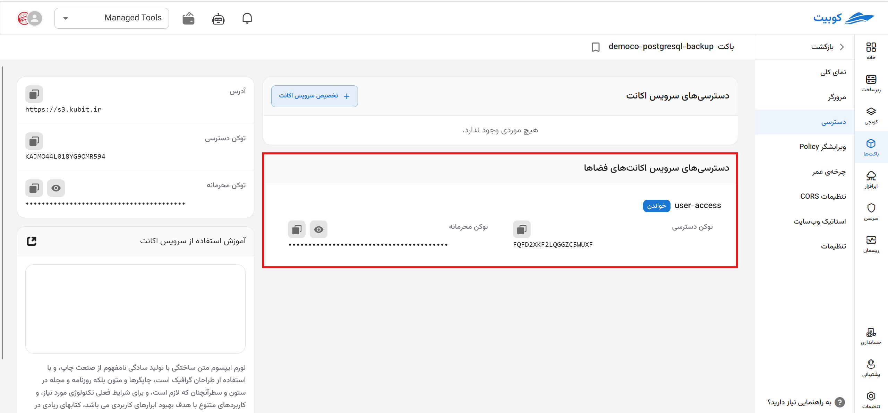

### دسترسی‌های سرویس اکانت

در این بخش، لیست سرویس اکانت‌های تخصیص داده شده به باکت را مشاهده می‌کنید. همچنین می‌توانید سرویس اکانت جدید تخصیص دهید و یا سرویس اکانتی را از باکت، حذف کنید:

#### تخصیص سرویس اکانت

برای تخصیص سرویس اکانت، روی گزینه **تخصیص سریس اکانت** کلیک کنید:

می‌توانید از میان سرویس اکانت‌های موجود، یک سرویس اکانت را انتخاب کنید و یا **ساخت سرویس اکانت جدید** را انتخاب کرده و یک سرویس اکانت جدید بسازید:
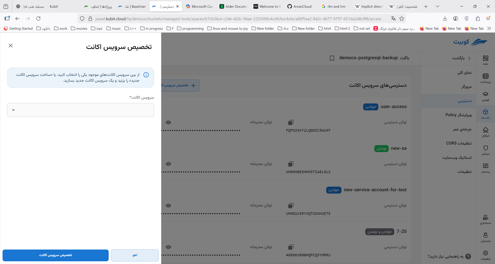

- انتخاب از سرویس اکانت‌های موجود

**سرویس اکانت** و سطح دسترسی آن در باکت را از لیست **دسترسی در باکت**، انتخاب کنید. در انتها روی دکمه **ایجاد** کلیک کنید.

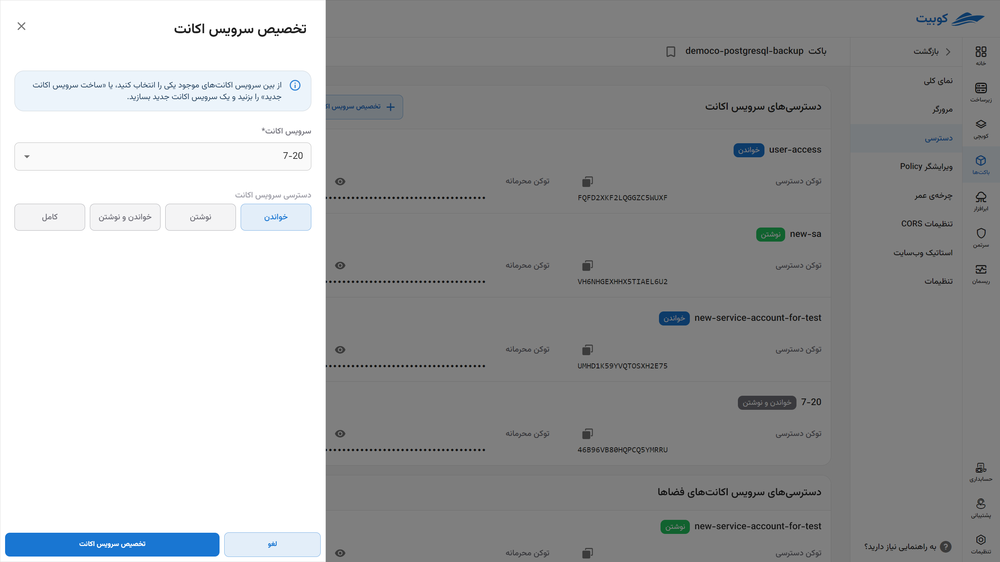

- ساخت سرویس اکانت جدید

  **نام** سرویس اکانت جدید را وارد کرده و سطح دسترسی آن در باکت را از لیست‌ **دسترسی در باکت** انتخاب کنید. در انتها روی **ایجاد** کلیک کنید تا سرویس اکانت ساخته و به باکت تخصیص داده شود.
  
  

#### حذف سرویس اکانت از باکت

- برای حذف، کافیست روی آیکون سطل زباله کنار نام سرویس اکانت، کلیک کنید.
- سپس روی دکمه **پاک کردن سرویس اکانت** کلیک کنید.
  
  

## ویرایشگر Policy

پالیسی، تعریف ُسیاست مبتنی بر منابع است که برای اعطای مجوزهای دسترسی باکت و آبجکت‌های درون آن به دیگران (کاربران) استفاده می‌شود. پالیسی‌ها در فرمت JSON بوده و با مشخص کردن سطح دسترسی، به شکل امن و بهینه فایل‌ها و باکت‌هایتان را مدیریت کنید.

می‌توانید پالیسی را از صفحه **ویرایشگر پالیسی** باکت، مشاهده کنید:

در ادامه به توضیح هر کدام از مقادیر پالیسی پرداخته شده است.

### مقادیر Policy

|            |                                                                                                                                                           توضیحات |
| ---------- | ----------------------------------------------------------------------------------------------------------------------------------------------------------------: |
| Versioning |                                                    نسخه زبان پالیسی را مشخص می‌کند. این نسخه نشان‌دهنده سازگاری با ساختار سیاست JSON معرفی شده در اکتبر 2012 است. |
| Statement  |                                                                                     شامل لیستی از بیانیه‌ها است که هر بیانیه مجموعه‌ای از مجوزها را تعریف می‌کند. |
| Sid        |                                                                              یک شناسه منحصر به فرد برای بیانیه، که اغلب برای مرجع و مقاصد حسابرسی استفاده می‌شود. |
| Effect     |                                         مشخص می‌کند که آیا بیانیه دسترسی را مجاز یا ممنوع می‌کند. در اینجا، "Allow" نشان می‌دهد که مجوزهای مشخص شده اعطا می‌شوند. |
| Principal  |                                                                            حساب‌های AWS یا کاربران/نقش‌های IAM را که پالیسی برای آنها اعمال می‌شود، تعریف می‌کند. |
| Action     |                                                 اقداماتی که این پالیسی مجاز می‌کند را مشخص می‌کند. در این مورد، اجازه دریافت (خواندن) آبجکت‌ها از باکت را می‌دهد. |
| Resource   | نام‌های منابع ARNs و آبجکت‌هایی که پالیسی برای آنها اعمال می‌شود را مشخص می‌کند. در این مورد، نشان می‌دهد این پالیسی برای تمام آبچکت‌های باکت (/\*) اعمال می‌شود. |

### ویرایش Policy

برای ویرایش پالسی از **ویرایشگر Policy** می‌توانید استفاده کنید. به عنوان مثال، مقدار `"s3:ListBucket"` را به **Action** و `"arn:aws:s3:::testco-b2"` را به **Resource** اضافه کرده و روی **ذخیره** کلیک می‌کنیم:
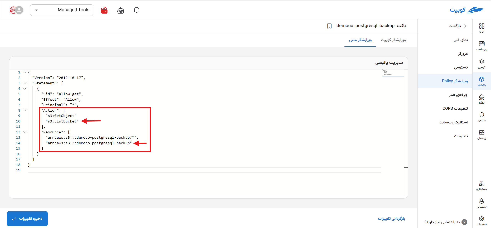
این تغییرات، اجازه دسترسی لیست کردن محتوا و خواندن آبجکت‌های باکت را به کاربر می‌دهد.

## چرخه عمر

در صفحه چرخه عمر، لیستی از **قوانین تعریف شده** به همراه امکان **تعریف قانون جدید** فراهم شده است:

در لیست قوانین، اطلاعاتی چون **نام**، **وضعیت**، **تعداد روزها**، **پیشوند** و **برچسب‌ها** موجود است:

و با کلیک روی هر قانون، به صفحه جزئیات آن قانون هدایت خواهید شد:

### تعریف قانون جدید

برای تعریف قانون، روی گزینه **تعریف قانون جدید** کلیک کنید:

ابتدا **نام** قانون و **تعداد روزها** را وارد کنید:

:::tip[مقادیر اختیاری]
در یک قانون چرخه عمر، پیشوند مشخص می‌کند که ‌قانون بر روی کدام آبجکت‌ها اعمال می‌شود. این قانون فقط آبجکت‌هایی را تحت تاثیر قرار می‌دهد که کلید (نام) آنها با پیشوند مشخص شده شروع شود.
به عنوان مثال برای اعمال قانون روی آبجکت‌های پوشه `imgs` در باکت موردنظر، مقدار پیشوند وارد شده باید برابر `imgs/` باشد.

حتی می‌توان قانون را به یک آبجکت هم محدود کرد. برای این کار، تنها کافیست در فیلد **پیشوند** کلید (نام) آبجکت را هم وارد کنید، مانند `imgs/kubernetes.png`.
:::

:::caution[عدم تعریف پیشوند و برچسب]
توجه داشته باشید در صورتی که پیشوند یا برچسبی وارد نکنید، قانون ساخته شده روی تمام آبجکت‌های باکت اعمال می‌شود.
:::

در انتها پس از وارد کردن اطلاعات موردنیاز، روی **تعریف قانون جدید** کلیک کنید:

### عملیات‌های هر قانون

در ستون عملیات و از طریق دکمه سه نقطه، لیستی از عملیات‌های موجود برای هر قانون وجود دارد:
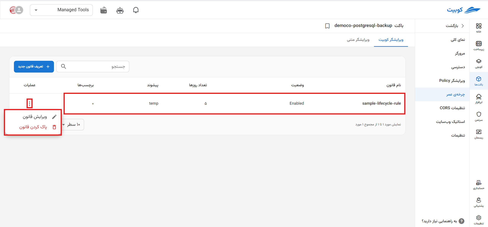

#### ویرایش قانون

برای ویرایش دو مسیر وجود دارد: دکمه سه نقطه در ستون عملیات و صفحه جزئیات قانون.

از طریق دکمه سه نقطه ستون عملیات، روی گزینه **ویرایش قانون** کلیک کنید و یا با کلیک روی قانون موردنظر از لیست قانون‌ها، به صفحه جزئیات آن قانون بروید:

سپس متناسب با تغییرات موردنظر، ویرایش لازم را انجام داده و روی **به‌روزرسانی قانون** کلیک کنید:

#### حذف قانون

برای حذف، روی گزینه **پاک کردن قانون** کلیک کرده و در صورت اطمینان از انجام عملیات، مجدد روی **پاک کردن قانون** کلیک کنید:
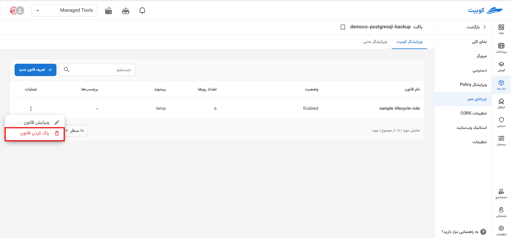

## تنظیمات باکت{#bucket-settings}

در صفحه تنظیمات، امکان تغییر گزینه‌های **دسترسی عمومی**، **نسخه‌نگاری** و **برچسب‌ها** فراهم شده است.
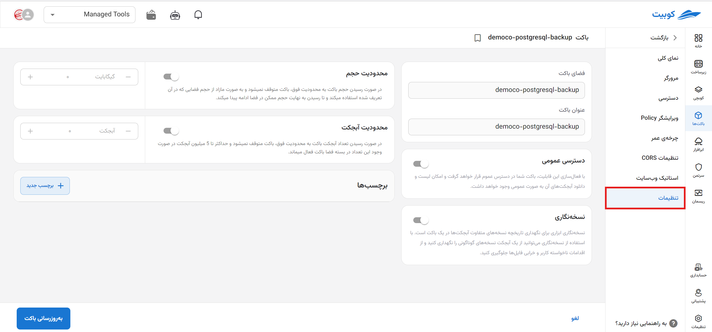

:::caution[فیلدهای غیرقابل ویرایش]
مقادیر **نام** و **فضا** غیرقابل ویرایش می‌باشند.
:::

تغییرات موردنظر خود را انجام داده و روی **به‌روزرسانی باکت** کلیک کنید:

برای مقادیر دیگر چون **دسترسی عمومی** و **برچسب‌ها** نیز می‌توانید به همین صورت عمل کنید.
