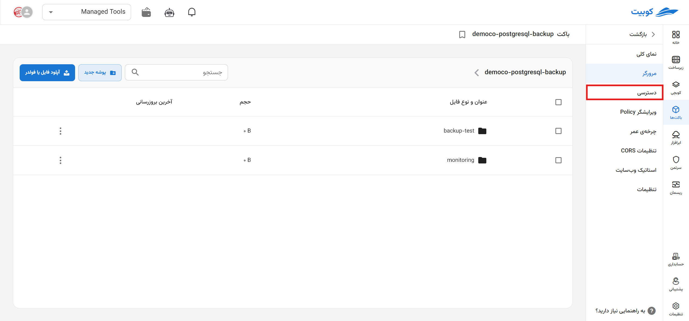

# دسترسی‌ها

تعریف سطوح دسترسی برای مدیریت دسترسی‌ها به باکت و کلیدهای دسترسی Access Token و Secret Token برای احراز هویت و مجوز دسترسی به باکت‌ها و منابع استفاده می‌شوند. Access Token به‌عنوان شناسه کاربر و Secret Token به‌عنوان یک کلید محرمانه برای تأیید صحت آن‌ها عمل می‌کند. سرویس اکانت‌ها نیز برای تخصیص دسترسی محدود و مدیریت شده به کاربران سازمان استفاده می‌شود.

در صفحه دسترسی، **توکن‌های دسترسی** و لیست **سرویس اکانت‌ها** وجود دارد:

### دسترسی‌های فضا

در این بخش، **آدرس** و **کلید** دسترسی به فضا، وجود دارد. هر کلید، شامل Access Key و Secret Key می‌باشد:

### دسترسی‌های سرویس اکانت

در این بخش، لیست سرویس اکانت‌های تخصیص داده شده به باکت را مشاهده می‌کنید. همچنین می‌توانید سرویس اکانت جدید تخصیص دهید و یا سرویس اکانتی را از باکت، حذف کنید:

#### تخصیص سرویس اکانت

برای تخصیص سرویس اکانت، روی گزینه **تخصیص سرویس اکانت** کلیک کنید:

می‌توانید از میان سرویس اکانت‌های موجود، یک سرویس اکانت را انتخاب کنید و یا **ساخت سرویس اکانت جدید** را انتخاب کرده و یک سرویس اکانت جدید بسازید:

##### انتخاب از سرویس اکانت‌های موجود

**سرویس اکانت** و سطح دسترسی آن در باکت را از لیست **دسترسی در باکت**، انتخاب کنید. در انتها روی دکمه **ایجاد** کلیک کنید.

##### ساخت سرویس اکانت جدید

**نام** سرویس اکانت جدید را وارد کرده و سطح دسترسی آن در باکت را از لیست‌ **دسترسی در باکت** انتخاب کنید. در انتها روی **ایجاد** کلیک کنید تا سرویس اکانت ساخته و به باکت تخصیص داده شود.

#### حذف سرویس اکانت از باکت

- برای حذف، کافیست روی آیکون سطل زباله کنار نام سرویس اکانت، کلیک کنید.
- سپس روی دکمه **پاک کردن سرویس اکانت** کلیک کنید.
  
  
