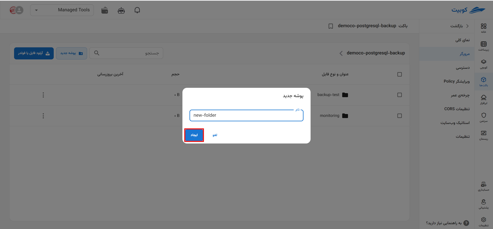
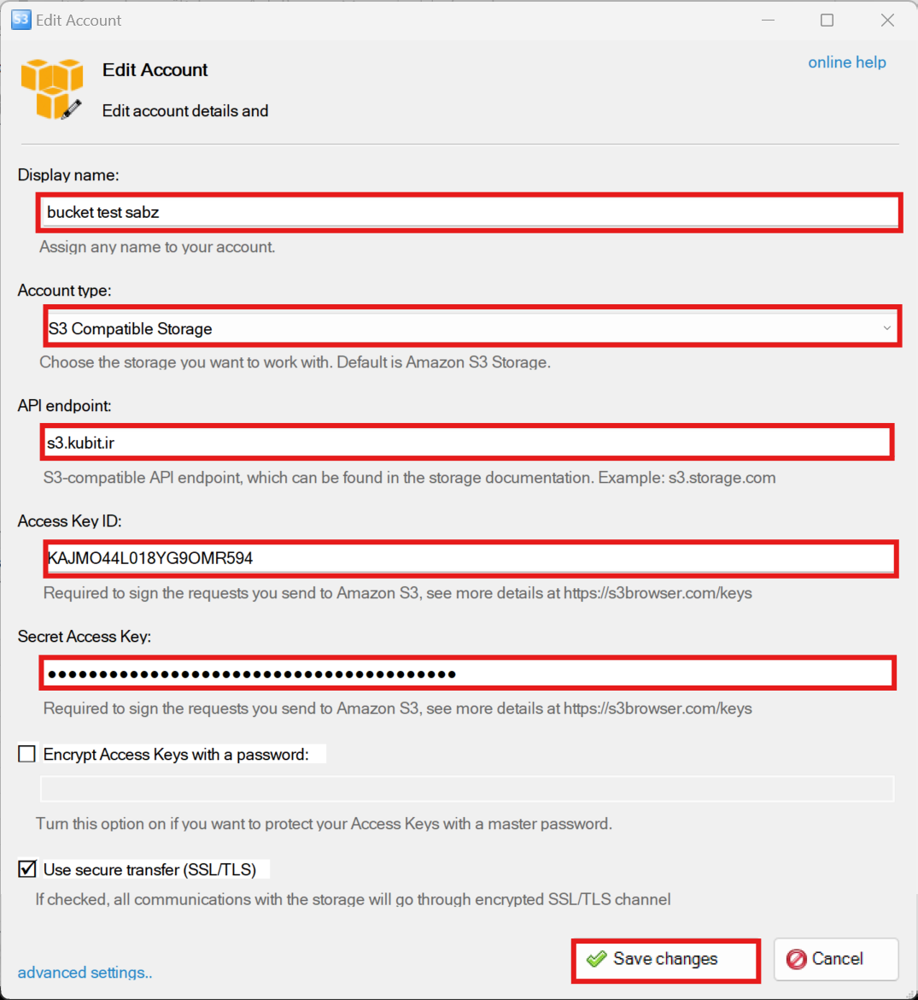

# مرورگر باکت {#broweser}

در صفحه مرورگر باکت، **فایل‌های بارگذاری شده**، **پوشه‌ها**، **ساخت پوشه جدید**، **بارگذاری فایل** و امکانات مرتبط به آبجکت‌ها وجود دارد:

## بارگذاری فایل

برای بارگذاری فایل، رو گزینه **بارگذاری فایل** کلیک کنید:

پس از انتخاب فایل، فایل موردنظر بارگذاری شده و به لیست فایل‌های صفحه **مرورگر** اضافه خواهد شد.

:::info[بارگذاری فایل در پوشه]
برای بارگذاری فایل در پوشه، کافیست وارد پوشه موردنظر شوید و مراحل ذکر شده در **بارگذاری فایل** را انجام دهید.
:::

## ساخت پوشه

برای ساخت پوشه جدید، روی گزینه **پوشه جدید** کلیک کنید:

سپس **نام** پوشه را وارد کرده و روی **ایجاد** کیک کنید:

در انتها پوشه جدید ساخته شده و به لیست آبجکت‌های صفحه **مرورگر** اضافه خواهد شد.

## جزئیات آبجکت

با کلیک روی هر آبجکت، اطلاعاتی درمورد آبجکت انتخاب شده شامل **نام**، **اندازه**، **آخرین ویرایش** و **مسیر** آبجکت، به همراه امکان **کپی لینک دانلود** و **دانلود** مستقیم آبجکت نمایش داده می‌شود:

به ازای آبجکت‌های مختلف، عملیات‌های مختلفی از طریق مرورگر فراهم شده است که در ادامه به توضیح آنها می‌پردازیم.

### عملیات‌های فایل

عملیات‌های مرتبط با یک فایل، شامل **لینک زماندار**، **کپی**، **جابه‌جایی**، **برچسب‌ها**، **نسخه‌ها** و **پاک کردن** می‌باشد. دسترسی به هرکدام از این عملیات‌ها از طریق دکمه سه نقطه روی کارت فایل فراهم شده است:

:::info[غیرفعال بودن نسخه‌ها]
در صورتی که امکان **نسخه‌نگاری** برای باکت غیرفعال باشد، این گزینه در لیست عملیات‌ها نیز غیرفعال خواهد بود.
:::

### عملیات‌های پوشه

عملیات‌های مرتبط با یک پوشه، شامل **کپی**، **جابه‌جایی** و **پاک کردن** می‌باشد. دسترسی به هرکدام از این عملیات‌ها از طریق دکمه سه نقطه روی کارت پوشه فراهم شده است:

## مدیریت فایل‌های فضای ابری با نرم‌افزار ویندوزی S3Browser {#s3browser}

برنامه S3Browser یک راه‌حل قدرتمند و راحت برای کار و دسترسی به فایل های ذخیره شده در فضای ابری می‌باشد. با استفاده از آن می‌توانید به آسانی از فضا ها و باکت های خود استفاده کنید و منابع را مستقیماً دانلود و آپلود کنید.
در گام نخست از طریق ساخت یک سرویس اکانت میزان دسترسی به باکت را مشخص کنید. اگر مقدار‌های پیشفرض در صفحه را وارد کنید، تمام دسترسی ها را به استفاده کننده می‌دهید.

1. API endpoint: در این قسمت آدرس سرویس را از منوی دسترسی عمومی وارد می‌کنیم s3.kubit.ir.
2. Access Key ID: از منوی دسترسی عمومی این مقدار را بردارید.
3. Secret Access Key: این مقدار را نیز از قسمت دسترسی عمومی بردارید.
   
   

اکنون می‌توانید باکت ها و فضا های خود را مشاهده و تغییرات مدنظر را اعمال کنید.
