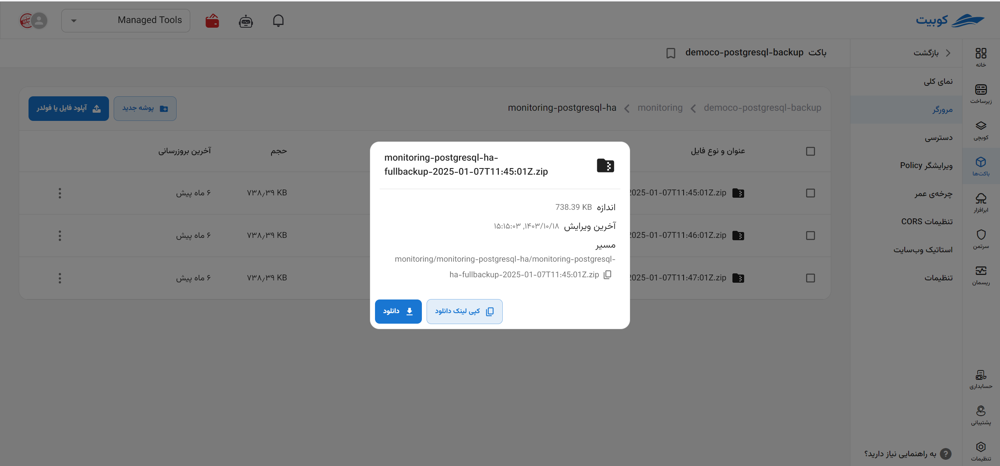

# مرورگر باکت

در صفحه مرورگر باکت، **فایل‌های بارگذاری شده**، **پوشه‌ها**، **ساخت پوشه جدید**، **بارگذاری فایل** و امکانات مرتبط به آبجکت‌ها وجود دارد:

## بارگذاری فایل

برای بارگذاری فایل، رو گزینه **بارگذاری فایل** کلیک کنید:

پس از انتخاب فایل، فایل موردنظر بارگذاری شده و به لیست فایل‌های صفحه **مرورگر** اضافه خواهد شد.

:::info[بارگذاری فایل در پوشه]
برای بارگذاری فایل در پوشه، کافیست وارد پوشه موردنظر شوید و مراحل ذکر شده در **بارگذاری فایل** را انجام دهید.
:::

## ساخت پوشه

برای ساخت پوشه جدید، روی گزینه **پوشه جدید** کلیک کنید:

سپس **نام** پوشه را وارد کرده و روی **ایجاد** کیک کنید:

در انتها پوشه جدید ساخته شده و به لیست آبجکت‌های صفحه **مرورگر** اضافه خواهد شد.

## جزئیات آبجکت

با کلیک روی هر آبجکت، اطلاعاتی درمورد آبجکت انتخاب شده شامل **نام**، **اندازه**، **آخرین ویرایش** و **مسیر** آبجکت، به همراه امکان **کپی لینک دانلود** و **دانلود** مستقیم آبجکت نمایش داده می‌شود:

به ازای آبجکت‌های مختلف، عملیات‌های مختلفی از طریق مرورگر فراهم شده است که در ادامه به توضیح آنها می‌پردازیم.

### عملیات‌های فایل

عملیات‌های مرتبط با یک فایل، شامل **لینک زماندار**، **کپی**، **جابه‌جایی**، **برچسب‌ها**، **نسخه‌ها** و **پاک کردن** می‌باشد. دسترسی به هرکدام از این عملیات‌ها از طریق دکمه سه نقطه روی کارت فایل فراهم شده است:

:::info[غیرفعال بودن نسخه‌ها]
در صورتی که امکان **نسخه‌نگاری** برای باکت غیرفعال باشد، این گزینه در لیست عملیات‌ها نیز غیرفعال خواهد بود.
:::

### عملیات‌های پوشه

عملیات‌های مرتبط با یک پوشه، شامل **کپی**، **جابه‌جایی** و **پاک کردن** می‌باشد. دسترسی به هرکدام از این عملیات‌ها از طریق دکمه سه نقطه روی کارت پوشه فراهم شده است:

