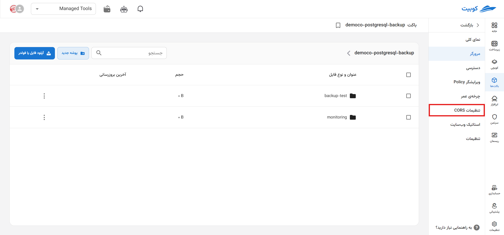
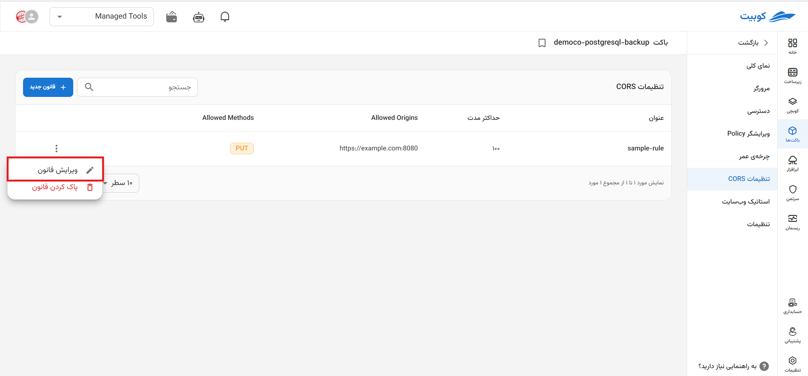
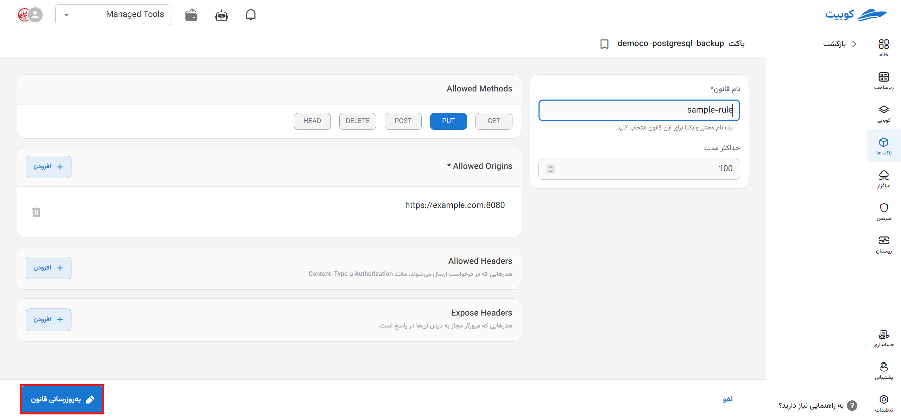

# تنظیمات CORS

تنظیمات CORS (Cross-Origin Resource Sharing) به شما امکان می‌دهد درخواست‌های از منابع خارجی (دامنه‌های دیگر) را به باکت خود مدیریت کنید.

در صفحه تنظیمات CORS، لیستی از **قوانین** تعریف شده، به همراه امکان **تعریف قانون جدید**، **ویرایش** و **حذف** وجود دارد.
در لیست قوانین، اطلاعاتی چون **نام** قانون، و مقادیری مانند **Allowed Origins**، **Allowed Methods**، **AllowedHeaders** و ... که برای قانون تنظیم شده است، وجود دارند.
با کلیک روی هر **نام**، به صفحه **جزئیات** آن قانون هدایت خواهید شد.

## تعریف یک قانون CORS{#cors-example}

برای تنظیم قوانین CORS، باید با چند المنت اصلی آشنا شوید که برای هر کدام از آن‌ها، مقادیری را به عنوان تنظیمات مشخص می‌کنید. این مقادیر تعیین می‌کنند که دسترسی به منابع چگونه و از کجا مجاز است. این تنظیمات شامل فیلدهای زیر می‌باشند:

- **نام قانون (اجباری)**: نامی معتبر و یکتا که برای تشخیص قانون CORS انتخاب می‌شود.

- **AllowedHeaders:** لیستی از هدرهای HTTP که می‌توانند همراه درخواست ارسال شوند. این هدرها به سرور اعلام می‌کنند که کدام داده‌های اضافی (مانند توکن‌ها یا فرمت‌ها) قابل قبول هستند. مانند `Content-Type`، `Authorization` و ...

- **AllowedMethods:** لیستی از متدهای HTTP (مانند `GET`، `POST`، `PUT`، `DELETE`, `HEAD`) که به مرورگر اجازه می‌دهد از آن‌ها برای درخواست به سرور استفاده کند. این متدها مشخص می‌کنند که چه نوع درخواست‌هایی مجاز هستند.

- **AllowedOrigins (اجباری)**: آدرس‌های (URL) دامنه‌هایی که به آن‌ها اجازه دسترسی به منابع داده می‌شود. این فیلد تعیین می‌کند که درخواست‌ها فقط از آدرس‌های مشخص شده پذیرفته شوند.

- **ExposeHeaders**: هدرهای خاصی که به مرورگر اجازه می‌دهد آن‌ها را در پاسخ مشاهده کند. این به مرورگر اجازه می‌دهد به هدرهایی خاص که شاید به‌طور پیش‌فرض در دسترس نباشند، دسترسی پیدا کند.

برای تعریف قانون جدید، با کلیک روی دکمه **تعریف قانون جدید** به زیرصفحه **قانون جدید** هدایت خواهید شد. فرمی شامل اطلاعات موردنیاز برای ایجاد قانون (که در بالا توضیح داده شد)، نمایش داده می‌شود.

### ویرایش

- برای ویرایش قانون، روی دکمه سه نقطه در ستون عملیات قانون موردنظر کلیک کنید.
- سپس روی گزینه **ویرایش قانون** کلیک کنید تا به فرم ویرایش هدایت شوید.
- سپس مطابق با تغییرات موردنظر، ویرایش لازم را اعمال کرده و روی **به‌روزرسانی قانون** کلیک کنید.
  
  

### حذف

- برای حذف قانون، روی دکمه سه نقطه در ستون عملیات قانون موردنظر کلیک کنید.
- سپس روی گزینه **پاک کردن قانون** کلیک کنید.
  
