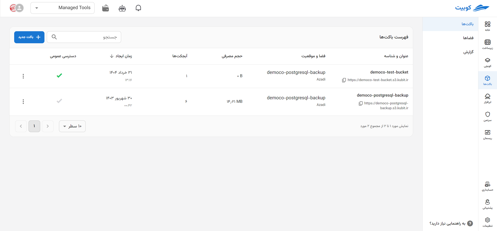
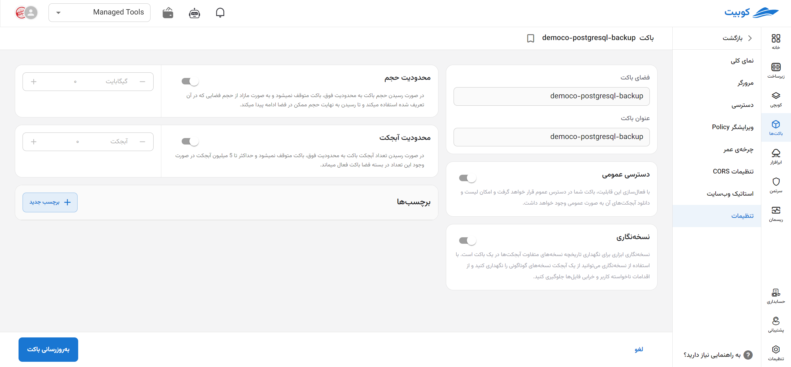
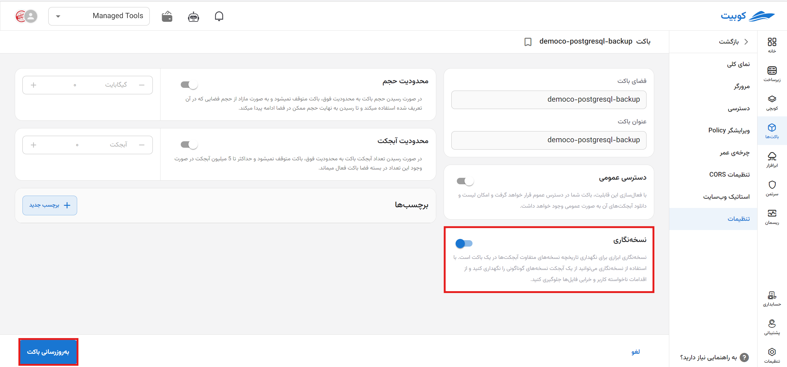
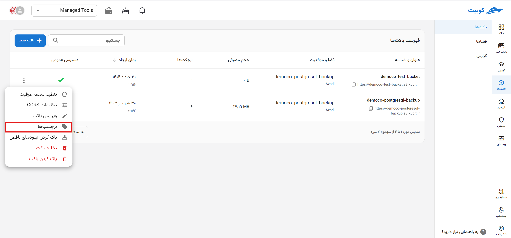
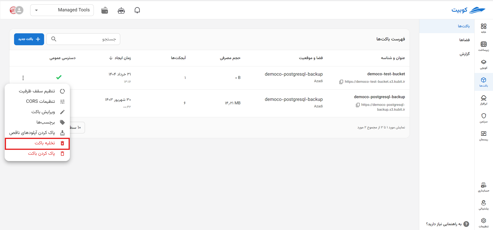

---
subDocuments:
  - browser
  - access-settings
  - policy
  - lifecycle
  - cors
  - static-website9
---

# مدیریت باکت‌ها

در این صفحه، چارت گزارش از وضعیت فضای ذخیره‌سازی سازمان شامل **تعداد باکت‌ها**، **حجم فضای استفاده شده**، **ترافیک آپلود** و **ترافیک دانلود** به همراه لیستی از باکت‌های سازمان (باکت‌های پروژه انتخاب شده و باکت‌های مشترک در سازمان) وجود دارد.

از صفحه سرویس باکت‌ها، پس از [اتصال](../getting-started#bind-project) / [انتخاب](../getting-started#select-project) پروژه، به صفحه باکت‌های پروژه هدایت خواهید شد:

## لیست باکت‌ها

در انتهای صفحه سرویس، لیست باکت‌های سازمان به همراه اطلاعاتی چون **نام**، **موقعیت/فضا**، **اندازه**، **زمان ایجاد** و **دسترسی عمومی** برای هر باکت، قابل مشاهده است:

همچنین، با کلیک روی نام هر باکت به صفحه [مرورگر باکت](./browser) هدایت خواهید شد.

### دسترسی عمومی

‌از طریق گزینه **دسترسی عمومی** می‌‌توانید تنطیمات دسترسی به باکت را تغییر داده و نسبت به فعال‌سازی/غیرفعال‌سازی آن اقدام کنید. در صورت فعال شدن این گزینه، امکان دسترسی به باکت و دانلود آبجکت‌های آن برای عموم، فراهم می‌شود.

### عملیات‌های هر باکت

در ستون عملیات و از طریق دکمه سه نقطه، لیستی از عملیات‌های موجود برای هر باکت وجود دارد. با کلیک روی هرکدام به صفحه/دیالوگ مربوطه هدایت خواهید شد:

#### ویرایش باکت

از طریق **ویرایش باکت** می‌توانید نسبت به ویرایش تنظیمات باکت از قبیل تغییر وضعیت **دسترسی عمومی**، **نسخه‌نگاری** و **برچسب‌ها** اقدام کنید. پس از کلیک روی **ویرایش باکت** به صفحه **تنظیمات باکت** هدایت خواهید شد:

:::caution[فیلدهای غیرقابل ویرایش]
توجه داشته باشید که مقادیر **نام** و **فضا** غیرقابل ویرایش می‌باشند.
:::

تغییرات موردنظر خود را انجام داده و روی **به‌روزرسانی باکت** کلیک کنید:

برای مقادیر دیگر چون **دسترسی عمومی** و **برچسب‌ها** نیز می‌توانید به همین صورت عمل کنید.

#### برچسب‌ها

با کلیک روی گزینه **برچسب‌ها**، لیست برچسب‌های باکت و امکان افزودن برچسب جدید وجود دارد:

##### ایجاد برچسب جدید

در صورت تمایل برای ایجاد برچسب جدید، می‌توانید مقادیر جدید را وارد کرده و روی **به‌روزرسانی** کلیک کنید:

##### حذف برچسب

برای حذف برچسب نیز، تنها کافیست روی آیکون **سطل زباله** کنار کلید-مقدار مرتبط، کلیک کنید:

#### تخلیه باکت

برای تخلیه باکت (حذف تمام آبجکت‌های موجود)، روی **تخلیه باکت** کلیک کنید:

سپس برای انجام عملیات تخلیه، روی گزینه **تخلیه باکت** کلیک کنید:

#### پاک کردن باکت

برای حذف باکت (به همراه حذف تمام آبجکت‌های موجود)، روی **پاک کردن باکت** کلیک کنید:

سپس برای انجام عملیات حذف، روی گزینه **پاک کردن باکت** کلیک کنید:

## نمای کلی

در صفحه نمای کلی، به چارت گزارش باکت مربوطه دسترسی خواهید داشت:

برای دریافت چارت‌های باکت در بازه‌های زمانی مختلف، می‌توانید روی گزینه **فیلتر** کلیک کرده و بازه موردنظر خود را انتخاب کنید:

