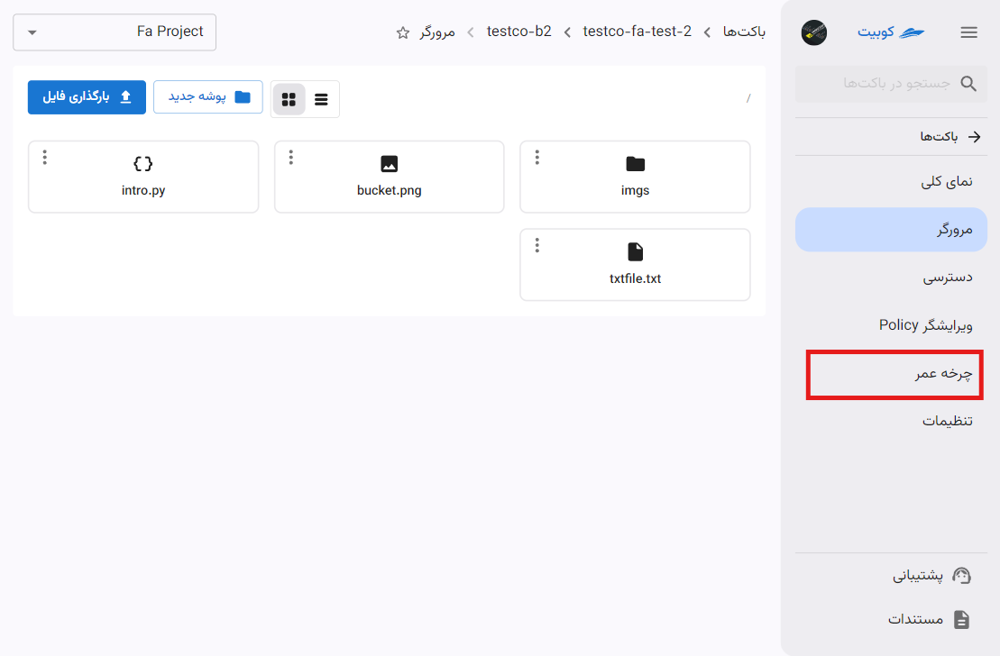
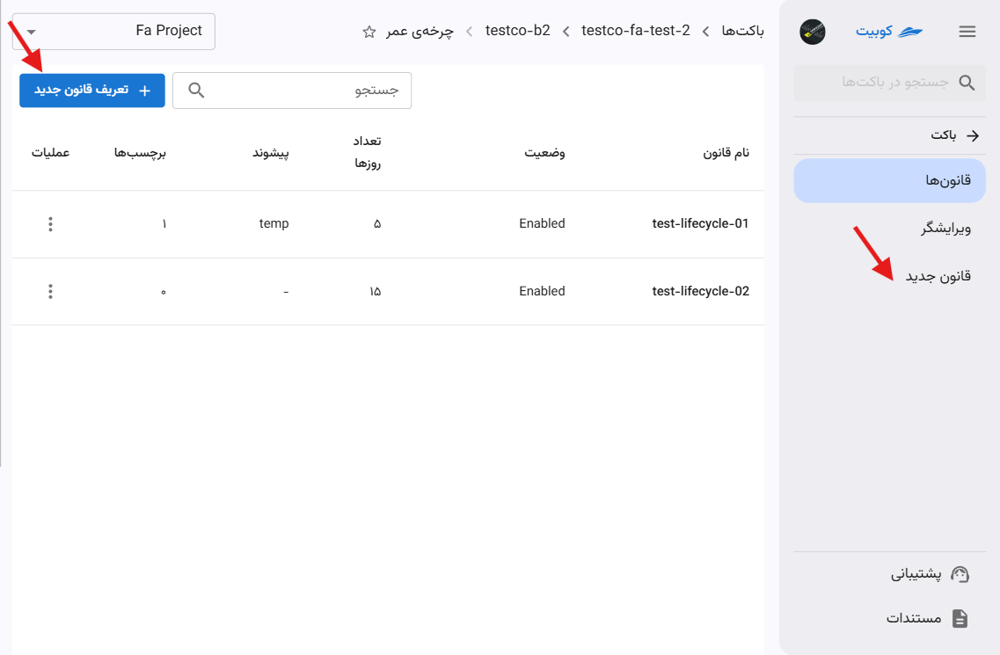
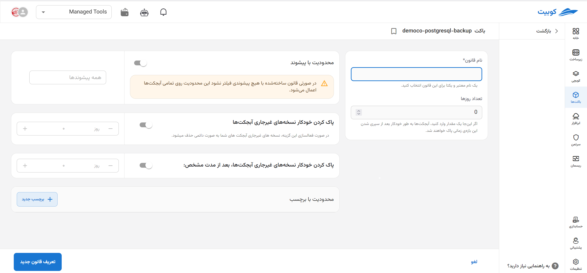
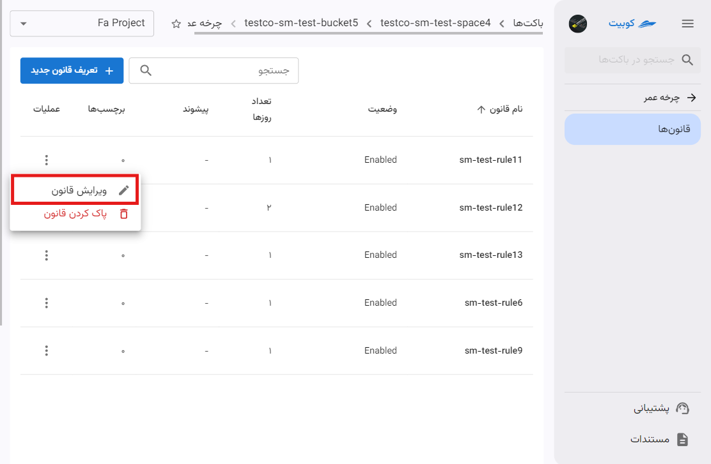
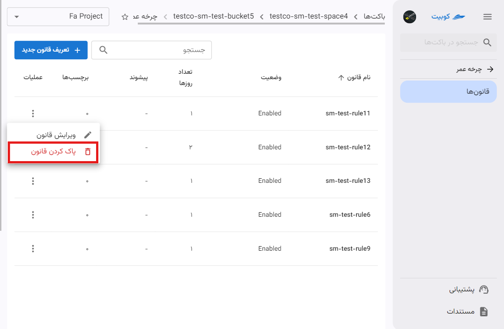
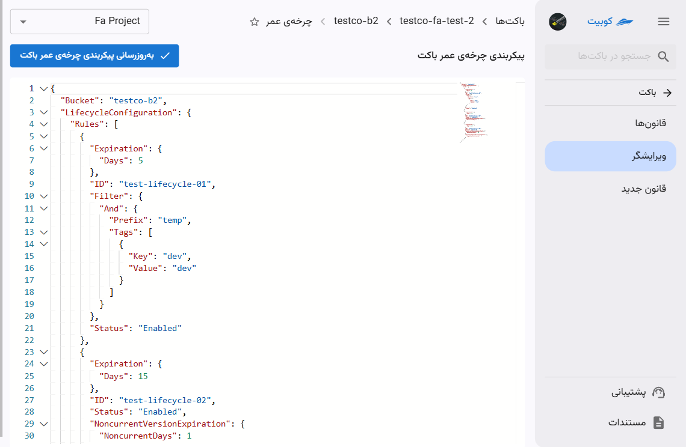
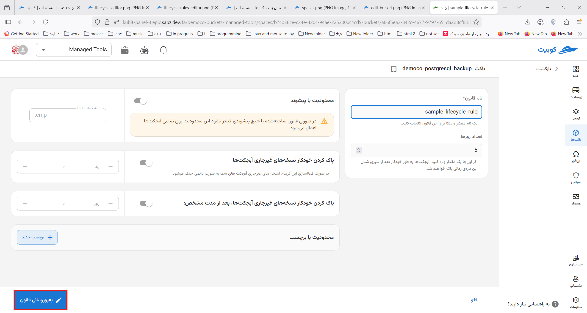
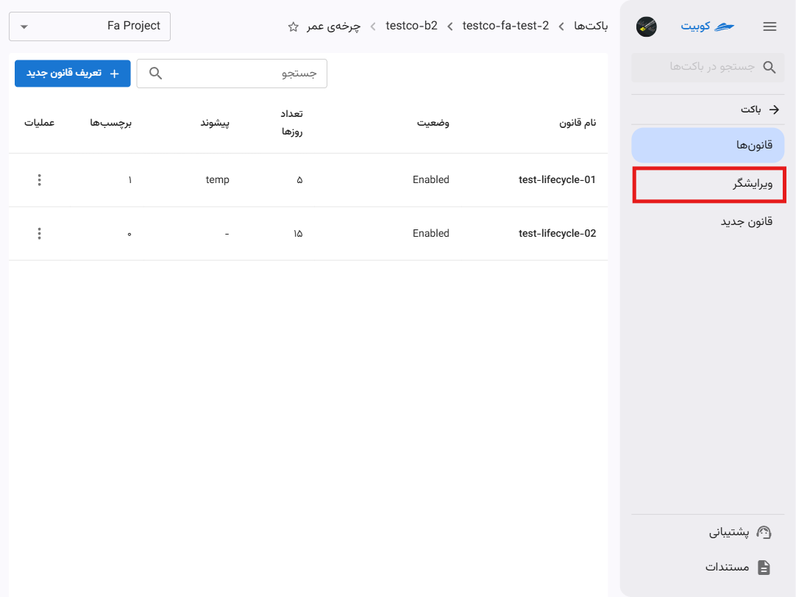

# چرخه عمر

**چرخه عمر (Lifecycle)** در مفهوم S3 (فضای ذخیره‌سازی ابری) مجموعه‌ای از قوانین است که به شما امکان می‌دهد مدیریت خودکار آبجکت‌ها را برای کاهش هزینه‌ها و بهینه‌سازی ذخیره‌سازی انجام دهید. با استفاده از این قابلیت، می‌توانید آبجکت‌ها را به لایه‌های ذخیره‌سازی ارزان‌تر منتقل کنید یا پس از مدت زمان مشخصی حذف کنید.
در صفحه چرخه عمر، لیستی از **قوانین تعریف شده** به همراه امکان **تعریف قانون جدید** فراهم شده است:


در لیست قوانین، اطلاعاتی چون **نام**، **وضعیت**، **تعداد روزها**، **پیشوند** و تعداد **برچسب‌ها** موجود است:


## تعریف قانون جدید

مقادیری که در یک قانون می‌توانند تنظیم شوند به همراه توضیحات، عبارتند از:

- **نام قانون (اجباری)**: نامی معتبر و یکتا که برای تشخیص قانون چرخه عمر انتخاب می‌شود.
- **تعداد روزها**: بازه زمانی پاک کردن آبجکت‌ها پس از ایجاد آنها.
- **محدودسازی گسترهٔ اعتبار قانون**
  - **پیشوند**: اعمال قانون تنها بر روی آبجکت‌هایی که نام آنها با پیشوند مشخص شده شروع شود. به عنوان مثال برای اعمال قانون روی آبجکت‌های پوشه `imgs` در باکت موردنظر، مقدار پیشوند وارد شده باید برابر `imgs/` باشد. حتی می‌توان با وارد کردن نام یک آبجکت، قانون را در سطح آبجکت هم محدود کرد، مانند `imgs/kubernetes.png`.
  - **برچسب‌ها**: اعمال قانون بر روی آبجکت‌هایی که برچسب وارد شده را داشته باشند.
- **حذف نسخه‌های غیرجاری** (_ویژه باکت‌های دارای نسخه‌نگاری_): حذف نسخه‌های غیرجاری آبجکت‌ها بعد از بازه زمانی مشخص.
- **حذف آپلودهای چند بخشیِ ناقص**: حذف آبجکت‌هایی که بعد از آپلود چند بخشی، تکمیل نشده‌اند.

:::caution[عدم اعمال محدودیت بر روی قانون]
توجه داشته باشید در صورتی که پیشوند یا برچسبی وارد نکنید، قانون ساخته شده روی تمام آبجکت‌های باکت اعمال می‌شود.
:::

برای تعریف قانون جدید، با کلیک روی دکمه **تعریف قانون جدید** به زیرصفحه **قانون جدید** هدایت خواهید شد. فرمی شامل اطلاعات موردنیاز برای ایجاد قانون (که در بالا توضیح داده شد)، نمایش داده می‌شود.



## ویرایش قانون

- برای ویرایش قانون، روی دکمه سه نقطه در ستون عملیات قانون موردنظر کلیک کنید.
- سپس روی گزینه **ویرایش قانون** کلیک کنید تا به فرم ویرایش هدایت شوید.
- سپس مطابق با تغییرات موردنظر، ویرایش لازم را اعمال کرده و روی **به‌روزرسانی قانون** کلیک کنید.
  

## حذف قانون

- برای حذف قانون، روی دکمه سه نقطه در ستون عملیات قانون موردنظر کلیک کنید.
- سپس روی گزینه **پاک کردن قانون** کلیک کنید.
  

## ویرایشگر چرخه عمر

می‌توان از ویرایشگر گرافیکی برای تغییرات مد نظر خود استفاده و سپس بروزرسانی کنید.


همچنین امکان تعریف و ویرایش قوانین چرخه عمر از طریق ویرایشگر JSON وجود دارد که لیستی از قوانین موجود در باکت می‌باشد.


- نمونه یک قانون چرخه عمر

```
{
  "Rules": [
    {
      "ID": "ExampleRule",
      "Status": "Enabled",
      "Filter": {
        "And": {
          "Prefix": "logs/",
          "Tags": [
            {
              "Key": "Environment",
              "Value": "Production"
            },
          ]
        }
      },
      "Transitions": [
        {
          "Days": 30,
          "StorageClass": "GLACIER"
        }
      ],
      "Expiration": {
        "Days": 365
      },
      "AbortIncompleteMultipartUpload": {
        "DaysAfterInitiation": 7
      }
    }
  ]
}
```

### کلیدهای هر قانون

- **ID**: یک شناسه اختیاری برای قانون. به شناسایی و مدیریت قوانین کمک می‌کند. مثال: `MoveToGlacierAfter30Days`
- **Status**: وضعیت قانون را مشخص می‌کند. مقدارهای ممکن: `Enabled`, `Disabled`
- **Filter**: تعیین می‌کند این قانون برای کدام آبجکت‌ها اعمال شود.
  - _Prefix_: آبجکت‌هایی با پیشوند مشخص شده را هدف قرار می‌دهد. مثال: `logs/` (فقط آبجکت‌هایی که مسیرشان با logs/ شروع می‌شود).
  - _Tags_ (اختیاری): بر اساس برچسب‌ها (Tags) آبجکت‌ها را هدف قرار می‌دهد. مثال:
  ```
  "Tags": [
    {
      "Key": "Environment",
      "Value": "Production"
    },
  ]
  ```
- **Transitions**: انتقال آبجکت‌ها به لایه‌های ذخیره‌سازی ارزان‌تر را تعریف می‌کند.
  ساختار: آرایه‌ای از انتقال‌ها که هر انتقال شامل:
  - _Days_: تعداد روزهایی که پس از ایجاد آبجکت، انتقال انجام شود. مثال: `30` (بعد از 30 روز منتقل شود).
  - _Date_ (اختیاری): تاریخ مشخص برای انتقال. مثال: `2025-01-01T00:00:00Z`
  - _StorageClass_: کلاس ذخیره‌سازی مقصد. مقدارهای ممکن:
    `GLACIER`,`DEEP_ARCHIVE`, `STANDARD_IA (Standard-Infrequent Access)`,
- **Expiration**: مشخص می‌کند که آبجکت‌ها بعد از چه مدت حذف شوند.
  - _Days_: تعداد روزهایی که پس از ایجاد آبجکت، حذف انجام شود. مثال: `365` (بعد از یک سال حذف شود).
  - _Date_ (اختیاری): تاریخ مشخص برای حذف. مثال:`2025-01-01T00:00:00Z`
- **NoncurrentVersionTransitions** (اختیاری): انتقال نسخه‌های قدیمی آبجکت (Noncurrent Versions) به کلاس‌های ذخیره‌سازی ارزان‌تر.
  - _NoncurrentDays_: تعداد روزهایی که پس از غیر فعال شدن یک نسخه از آبجکت، انتقال انجام شود. مثال: `30`
  - _StorageClass_:کلاس ذخیره‌سازی مقصد. مثال: `GLACIER`
- **NoncurrentVersionExpiration** (اختیاری): مشخص می‌کند که نسخه‌های قدیمی آبجکت‌ها بعد از چه مدت حذف شوند.
  - _NoncurrentDays_: تعداد روزهایی که پس از غیر فعال شدن یک نسخه از آبجکت، حذف انجام شود. مثال: `180`
- **AbortIncompleteMultipartUpload** (اختیاری): آپلودهای چندبخشی ناقص را پس از تعداد روز مشخص حذف می‌کند.
  - _DaysAfterInitiation_: تعداد روزهایی که پس از شروع آپلود، عملیات حذف انجام شود. مثال: `7`
