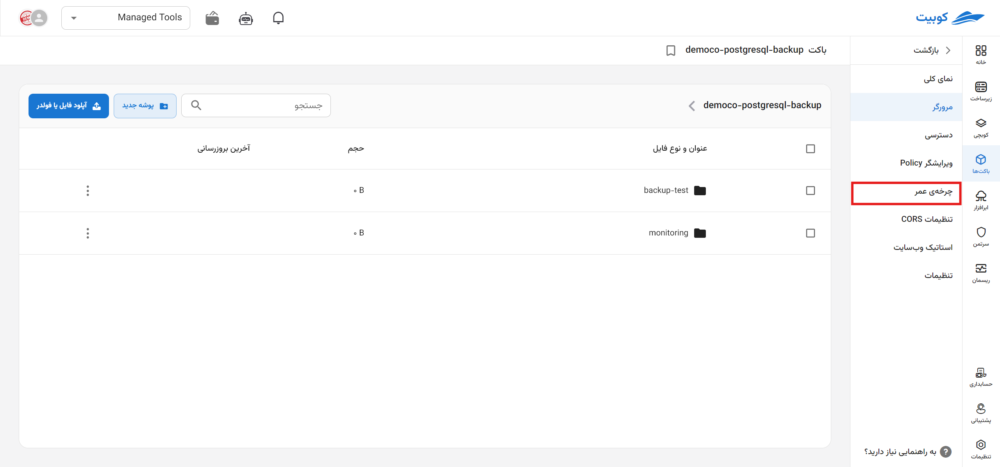
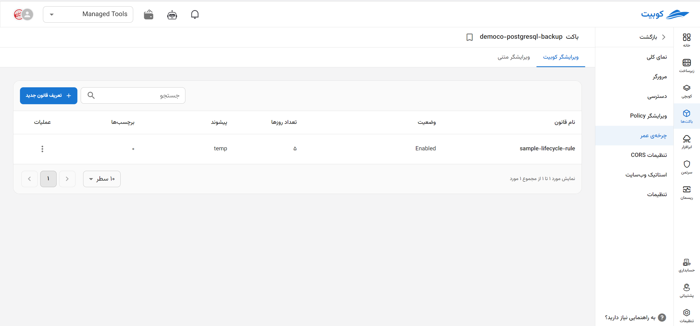
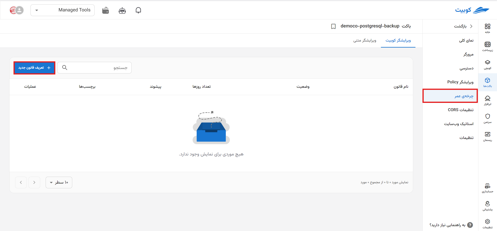

# چرخه عمر

در صفحه چرخه عمر، لیستی از **قوانین تعریف شده** به همراه امکان **تعریف قانون جدید** فراهم شده است:

در لیست قوانین، اطلاعاتی چون **نام**، **وضعیت**، **تعداد روزها**، **پیشوند** و **برچسب‌ها** موجود است:

و با کلیک روی هر قانون، به صفحه جزئیات آن قانون هدایت خواهید شد:

### تعریف قانون جدید

برای تعریف قانون، روی گزینه **تعریف قانون جدید** کلیک کنید:

ابتدا **نام** قانون و **تعداد روزها** را وارد کنید:

:::tip[مقادیر اختیاری]
در یک قانون چرخه عمر، پیشوند مشخص می‌کند که ‌قانون بر روی کدام آبجکت‌ها اعمال می‌شود. این قانون فقط آبجکت‌هایی را تحت تاثیر قرار می‌دهد که کلید (نام) آنها با پیشوند مشخص شده شروع شود.
به عنوان مثال برای اعمال قانون روی آبجکت‌های پوشه `imgs` در باکت موردنظر، مقدار پیشوند وارد شده باید برابر `imgs/` باشد.

حتی می‌توان قانون را به یک آبجکت هم محدود کرد. برای این کار، تنها کافیست در فیلد **پیشوند** کلید (نام) آبجکت را هم وارد کنید، مانند `imgs/kubernetes.png`.
:::

:::caution[عدم تعریف پیشوند و برچسب]
توجه داشته باشید در صورتی که پیشوند یا برچسبی وارد نکنید، قانون ساخته شده روی تمام آبجکت‌های باکت اعمال می‌شود.
:::

در انتها پس از وارد کردن اطلاعات موردنیاز، روی **تعریف قانون جدید** کلیک کنید:

### عملیات‌های هر قانون

در ستون عملیات و از طریق دکمه سه نقطه، لیستی از عملیات‌های موجود برای هر قانون وجود دارد:

#### ویرایش قانون

برای ویرایش دو مسیر وجود دارد: دکمه سه نقطه در ستون عملیات و صفحه جزئیات قانون.

از طریق دکمه سه نقطه ستون عملیات، روی گزینه **ویرایش قانون** کلیک کنید و یا با کلیک روی قانون موردنظر از لیست قانون‌ها، به صفحه جزئیات آن قانون بروید:

سپس متناسب با تغییرات موردنظر، ویرایش لازم را انجام داده و روی **به‌روزرسانی قانون** کلیک کنید:

#### حذف قانون

برای حذف، روی گزینه **پاک کردن قانون** کلیک کرده و در صورت اطمینان از انجام عملیات، مجدد روی **پاک کردن قانون** کلیک کنید:

