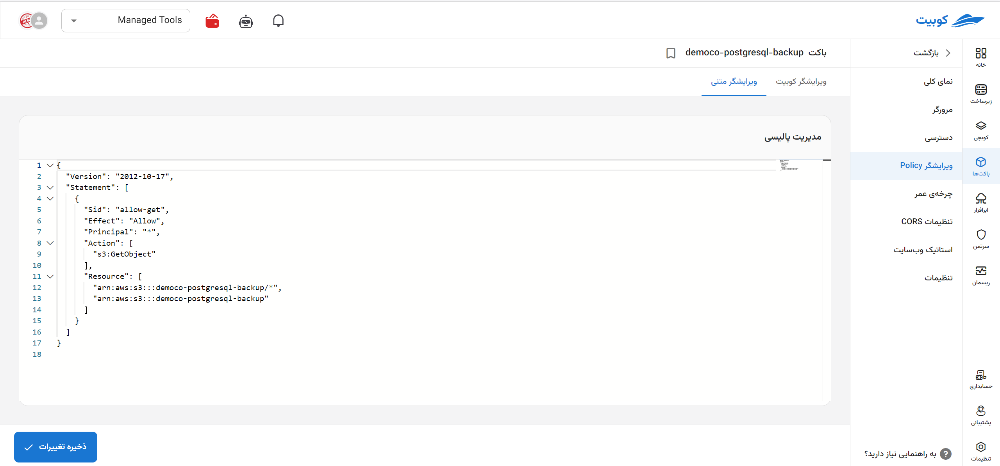

# ویرایشگر Policy

پالیسی، سیاست مبتنی بر منابع است که برای اعطای مجوزهای دسترسی باکت و آبجکت‌های درون آن به دیگران (کاربران) استفاده می‌شود. پالیسی‌ها در فرمت JSON بوده و با مشخص کردن سطح دسترسی، به شکل امن و بهینه فایل‌ها و باکت‌هایتان را مدیریت کنید.

از طریق صفحه **ویرایشگر پالیسی** ویرایشگری برای تعریف و ویرایش پالیسی‌های مرتبط با باکت وجود دارد که از طریق آن می‌توانید سیاست‌های دسترسی مورد نیاز خود را تعریف کنید.


در ادامه به توضیح هر کدام از مقادیر پالیسی پرداخته شده است.

### مقادیر Policy

|            |                                                                                                                                                                                  توضیحات |
| ---------- | ---------------------------------------------------------------------------------------------------------------------------------------------------------------------------------------: |
| Versioning |                                                                           نسخه زبان پالیسی را مشخص می‌کند. این نسخه نشان‌دهنده سازگاری با ساختار سیاست JSON معرفی شده در اکتبر 2012 است. |
| Statement  |                                                                                                          شامل لیستی از قوانین دسترسی است که هر کدام مجموعه‌ای از مجوزها را تعریف می‌کند. |
| Sid        |                                                                                                                                    یک شناسه اختیاری که برای تمایز قوانین استفاده می‌شود. |
| Effect     |                         مشخص می‌کند که آیا قانون دسترسی را مجاز یا ممنوع می‌کند. در اینجا، `Allow` نشان می‌دهد که مجوزهای مشخص شده اعطا می‌شوند و از `Deny` برای محدودیت استفاده می‌شود. |
| Principal  |          تعیین می‌کند این قانون برای چه کاربرانی یا سرویس‌هایی اعمال می‌شود. به طور مثال `*` برای همه کاربران و `{ "AWS": "arn:aws:iam::123456789012:user/ExampleUser" }` برای یک کاربر. |
| Action     |                                                         اقداماتی که این پالیسی مجاز می‌کند را مشخص می‌کند. در این مورد `s3:GetObject`، اجازه دریافت (خواندن) آبجکت‌ها از باکت را می‌دهد. |
| Resource   | نام‌های منابع ARNs و آبجکت‌هایی که پالیسی برای آنها اعمال می‌شود را مشخص می‌کند. در این مورد، نشان می‌دهد این پالیسی برای تمام آبچکت‌های باکت `*/arn:aws:s3:::bucket-name` اعمال می‌شود. |

- نمونه یک پالیسی

```
{
  "Version": "2012-10-17",
  "Statement": [
    {
      "Sid": "PublicReadGetObject",
      "Effect": "Allow",
      "Principal": "*",
      "Action": "s3:GetObject",
      "Resource": "arn:aws:s3:::example-bucket/*"
    }
  ]
}
```

### مجوزها

لیست تمام مجوزهای ممکن برای اعمال در پالیسی، در جدول زیر موجود می‌باشد.

|               مجوزها               |                         توضیحات                         |
| :--------------------------------: | :-----------------------------------------------------: |
|         دسترسی کامل (\*/)          |    اجازه انجام هرگونه عملیات بر روی باکت را می‌دهد.     |
|             GetObject              |         اجازه خواندن آبجکت‌های باکت را می‌دهد.          |
|             PutObject              |          اجازه نوشتن آبجکت‌های باکت را می‌دهد.          |
|            DeleteObject            |           اجازه حذف آبجکت‌های باکت را می‌دهد.           |
|             ListBucket             |         اجازه لیست کردن محتوای باکت را می‌دهد.          |
|         GetBucketLocation          |            اجازه خواندن مکان باکت را می‌دهد.            |
|          PutBucketPolicy           |           اجازه نوشتن پالیسی باکت را می‌دهد.            |
|          GetBucketPolicy           |           اجازه خواندن پالیسی باکت را می‌دهد.           |
|         DeleteBucketPolicy         |            اجازه حذف پالیسی باکت را می‌دهد.             |
|            GetObjectAcl            |       اجازه خواندن ACL آبجکت‌های باکت را می‌دهد.        |
|            PutObjectAcl            |        اجازه تغییر ACL آبجکت‌های باکت را می‌دهد.        |
|            GetBucketAcl            |            اجازه خواندن ACL باکت را می‌دهد.             |
|            PutBucketAcl            |             اجازه تغییر ACL باکت را می‌دهد.             |
|          ListAllMyBuckets          |     اجازه لیست کردن تمام باکت‌های کاربر را می‌دهد.      |
|            CreateBucket            |            اجازه ایجاد باکت جدید را می‌دهد.             |
|            DeleteBucket            |                اجازه حذف باکت را می‌دهد.                |
|          GetBucketLogging          |     اجازه خواندن تنظیمات لاگ‌گذاری باکت را می‌دهد.      |
|          PutBucketLogging          |      اجازه تغییر تنظیمات لاگ‌گذاری باکت را می‌دهد.      |
|     PutLifecycleConfiguration      |      اجازه تغییر تنظیمات چرخه عمر باکت را می‌دهد.       |
|     GetLifecycleConfiguration      |      اجازه خواندن تنظیمات چرخه عمر باکت را می‌دهد.      |
|        GetBucketVersioning         |     اجازه خواندن وضعیت نسخه‌برداری باکت را می‌دهد.      |
|        PutBucketVersioning         |      اجازه تغییر وضعیت نسخه‌برداری باکت را می‌دهد.      |
|          GetObjectVersion          | اجازه خواندن آبجکت‌های نسخه‌برداری شده باکت را می‌دهد.  |
|        DeleteObjectVersion         |   اجازه حذف آبجکت‌های نسخه‌برداری شده باکت را می‌دهد.   |
|           RestoreObject            | اجازه بازیابی آبجکت‌های نسخه‌برداری شده باکت را می‌دهد. |
|          GetBucketTagging          |         اجازه خواندن برچسب‌های باکت را می‌دهد.          |
|          PutBucketTagging          |          اجازه تغییر برچسب‌های باکت را می‌دهد.          |
|        DeleteBucketTagging         |           اجازه حذف برچسب‌های باکت را می‌دهد.           |
|          GetObjectTagging          |    اجازه خواندن برچسب‌های آبجکت‌های باکت را می‌دهد.     |
|          PutObjectTagging          |     اجازه تغییر برچسب‌های آبجکت‌های باکت را می‌دهد.     |
|        DeleteObjectTagging         |      اجازه حذف برچسب‌های آبجکت‌های باکت را می‌دهد.      |
| GetBucketNotificationConfiguration |     اجازه خواندن تنظیمات اعلان‌های باکت را می‌دهد.      |
| PutBucketNotificationConfiguration |      اجازه تغییر تنظیمات اعلان‌های باکت را می‌دهد.      |
|       GetBucketPolicyStatus        |        اجازه خواندن وضعیت پالیسی باکت را می‌دهد.        |
|           GetBucketCors            |        اجازه خواندن تنظیمات CORS باکت را می‌دهد.        |
|           PutBucketCors            |        اجازه تغییر تنظیمات CORS باکت را می‌دهد.         |
|          DeleteBucketCors          |         اجازه حذف تنظیمات CORS باکت را می‌دهد.          |
|      GetBucketRequestPayment       | اجازه خواندن تنظیمات پرداخت درخواست‌های باکت را می‌دهد. |
|      PutBucketRequestPayment       | اجازه تغییر تنظیمات پرداخت درخواست‌های باکت را می‌دهد.  |
|          GetBucketWebsite          |      اجازه خواندن تنظیمات وب‌سایت باکت را می‌دهد.       |
|          PutBucketWebsite          |       اجازه تغییر تنظیمات وب‌سایت باکت را می‌دهد.       |
|        DeleteBucketWebsite         |        اجازه حذف تنظیمات وب‌سایت باکت را می‌دهد.        |
|        GetBucketEncryption         |          اجازه خواندن رمزنگاری باکت را می‌دهد.          |
|        PutBucketEncryption         |          اجازه تغییر رمزنگاری باکت را می‌دهد.           |
|     PutBucketOwnershipControls     |        اجازه تغییر کنترل مالکیت باکت را می‌دهد.         |
|     GetBucketOwnershipControls     |        اجازه خواندن کنترل مالکیت باکت را می‌دهد.        |
|         GetBucketLifecycle         |          اجازه خواندن چرخه عمر باکت را می‌دهد.          |
|         PutBucketLifecycle         |          اجازه تغییر چرخه عمر باکت را می‌دهد.           |
|       DeleteBucketLifecycle        |           اجازه حذف چرخه عمر باکت را می‌دهد.            |
|        AbortMultipartUpload        |    اجازه لغو آپلود‌های چند‌قسمتی در باکت را می‌دهد.     |

### ویرایش Policy

برای ویرایش پالسی از **ویرایشگر Policy** می‌توانید استفاده کنید. به عنوان مثال، مقدار `"s3:ListBucket"` را به **Action** و `"arn:aws:s3:::testco-b2"` را به **Resource** اضافه کرده و روی **ذخیره** کلیک می‌کنیم:

این تغییرات، اجازه دسترسی لیست کردن محتوا و خواندن آبجکت‌های باکت را به کاربر می‌دهد.
