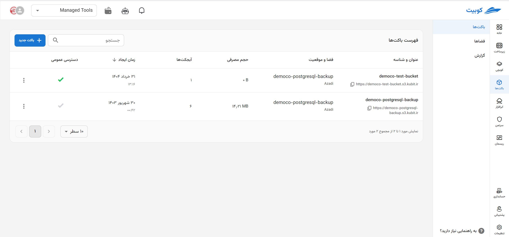
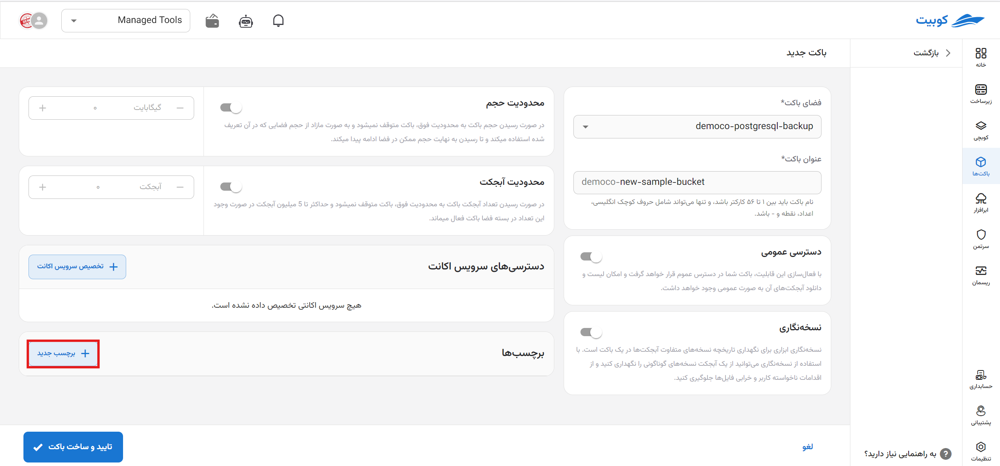

# ساخت باکت جدید (گام دوم)

در صفحه سرویس باکت‌ها، پس از [اتصال](../getting-started#bind-project) / [انتخاب](../getting-started#select-project)، روی **ساخت باکت جدید** کلیک کنید تا به فرم ساخت باکت هدایت شوید:

## گام اول: انتخاب فضا و نام

ابتدا **فضا** را انتخاب کرده و **نام** باکت را وارد کنید:

:::warning[نام باکت]
نام باکت باید بین ۳ تا ۶۳ کاراکتر باشد و تنها می‌تواند شامل حروف انگلیسی، اعداد، نقطه و خط تیره باشد.
همچنین امکان ویرایش نام باکت پس از ساخت، وجود ندارد.
:::

:::info[مقادیر پیش‌فرض فرم ساخت باکت]

- به صورت خودکار **آخرین فضای ساخته شده** در پروژه به عنوان فضای باکت انتخاب می‌شود. البته می‌توانید از میان فضاهای موجود، فضای موردنظر خود را انتخاب کنید.
- در صورتی که **نام سازمان به عنوان پیشوند در نام باکت** تنظیم شده باشد، نام باکت به صورت `TestOrg-bucketname` خواهد بود.
  

:::

## گام دوم: تنظیمات باکت

پس از فضا و نام، تنظیمات دیگری برای باکتِ در حال ساخت می‌توان اتجام داد که به صورت اختیاری می‌باشند:

- **دسترسی عمومی**:
  با فعال‌سازی این گزینه، اشتراک گذاری باکت و دانلود آبجکت‌ها به صورت عمومی فعال می‌شود.
- **نسخه نگاری**:
  برای جلوگیری از اقدامات ناخواسته کاربر و خرابی فایل‌ها، می‌توانید نسخه‌های مختلف از یک آبجکت را نگهداری کنید.
- **برچسب‌ها**:
  برای دسته‌بندی، کنترل منابع و مدیریت دسترسی باکت، می‌توانید برچسب‌های مختلفی را به باکت نسبت دهید.
- **سرویس اکانت**:
  برای تخصیص دسترسی محدود شده به باکت، می‌توانید سرویس اکانت موردنظر خود را در این بخش انتخاب کنید.
  

### افزودن برچسب

روی **افزودن برچسب** کلیک کنید تا فیلدهای خالی کلید-مقدار ایجاد شوند، سپس با مقادیر موردنظر آنها را پر کنید:

### انتخاب سرویس اکانت

:::caution[در چه صورت انتخاب سرویس اکانت الزامی خواهد بود؟]
توجه داشته باشید در صورتی که تخصیص سرویس اکانت در فضای انتخاب شده ضروری باشد، گزینه سرویس اکانت در ساخت باکت اختیاری نخواهد بود و باید حداقل یک سرویس اکانت به باکت اختصاص دهید.
:::

برای انتخاب سرویس اکانت، دو حالت ممکن است پیش بیاید: یا سرویس اکانتی در فضای انتخاب شده وجود دارد یا ندارد. اگر لیستی از سرویس اکانت‌ها موجود باشد، می‌توانید یکی از آن‌ها را انتخاب کنید. در صورتی که سرویس اکانتی وجود نداشته باشد، می‌توانید گزینه **ساخت سرویس اکانت جدید** را انتخاب کنید تا به صورت خودکار یک سرویس اکانت جدید ساخته شود:

:::tip[ساخت خودکار سرویس اکانت]
در صورتی که تمایل به ساخت سرویس اکانت جدید داشته باشید، یک سرویس اکانت با دسترسی کامل به صورت خودکار ساخته شده و به این باکت تخصیص داده می‌شود:

:::
پس از انتخاب سرویس اکانت، روی **تایید و ساخت باکت** کلیک کنید تا باکت موردنظر ساخته شود:
