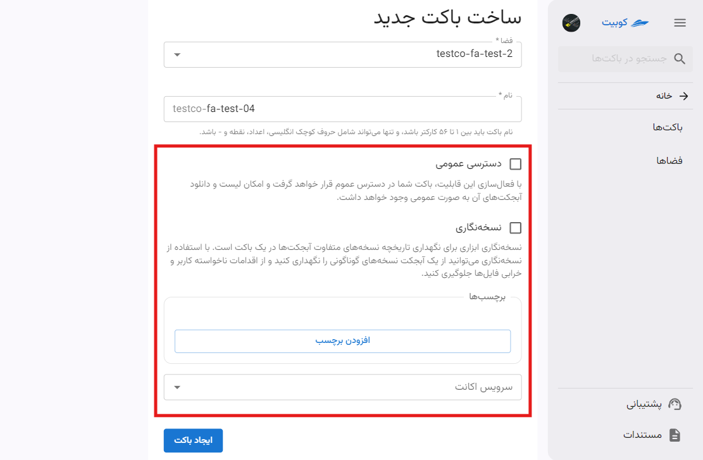
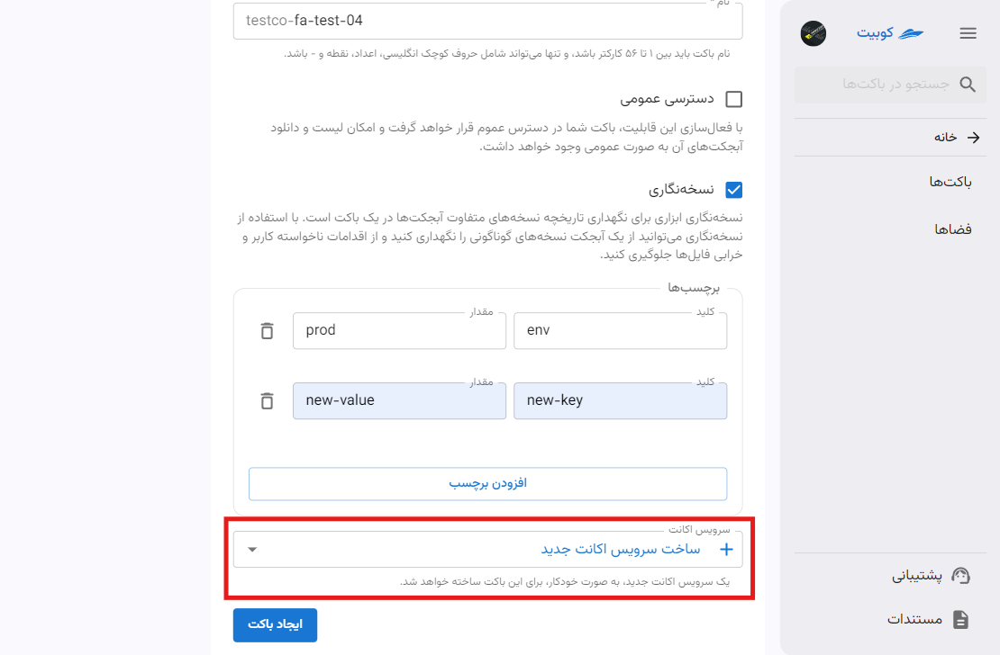

# ساخت باکت جدید

در صفحه سرویس باکت‌ها، پس از [انتخاب یک پروژه متصل](../bucket-settings#select-project)، روی **ساخت باکت جدید** کلیک کنید تا به فرم ساخت باکت هدایت شوید:

ابتدا **فضا** را انتخاب کرده و **نام** باکت را وارد کنید:

:::info[فضای پیش‌فرض]
به صورت پیش‌فرض آخرین فضای ساخته شده در پروژه به عنوان فضای باکت جدید انتخاب می‌شود. می‌توانید از میان فضاهای موجود، فضای موردنظر خود را انتخاب کنید:

:::

:::info[پیشوند نام باکت]
به صورت پیش‌فرض، نام سازمان به عنوان پیشوند نام باکت تنظیم می‌شود.
:::

## گزینه‌های اختیاری

- **دسترسی عمومی**:
  با فعال‌سازی این گزینه، اشتراک گذاری باکت و دانلود آبجکت‌ها به صورت عمومی فعال می‌شود.
- **نسخه نگاری**:
  برای جلوگیری از اقدامات ناخواسته کاربر و خرابی فایل‌ها، می‌توانید نسخه‌های مختلف از یک آبجکت را نگهداری کنید.
- **برچسب‌ها**:
  برای دسته‌بندی، کنترل منابع و مدیریت دسترسی باکت، می‌توانید برچسب‌های مختلفی را به باکت نسبت دهید.
- **سرویس اکانت**:
  برای تخصیص دسترسی محدود شده به باکت، می‌توانید سرویس اکانت موردنظر خود را در این بخش انتخاب کنید.
  

### افزودن برچسب

روی **افزودن برچسب** کلیک کنید تا فیلدهای خالی کلید-مقدار ایجاد شوند، سپس با مقادیر موردنظر آنها را پر کنید:

### انتخاب سرویس اکانت برای باکت

:::caution[در چه صورت انتخاب سرویس اکانت الزامی خواهد بود؟]
توجه داشته باشید در صورتی که تخصیص سرویس اکانت در فضای انتخاب شده ضروری باشد، گزینه سرویس اکانت در ساخت باکت اختیاری نخواهد بود و باید حداقل یک سرویس اکانت به باکت اختصاص دهید.
:::

برای انتخاب سرویس اکانت، دو حالت ممکن است پیش بیاید: یا سرویس اکانتی در فضای انتخاب شده وجود دارد یا ندارد. اگر لیستی از سرویس اکانت‌ها موجود باشد، می‌توانید یکی از آن‌ها را انتخاب کنید. در صورتی که سرویس اکانتی وجود نداشته باشد، می‌توانید گزینه **ساخت سرویس اکانت جدید** را انتخاب کنید تا به صورت خودکار یک سرویس اکانت جدید ساخته شود.

:::tip[ساخت خودکار سرویس اکانت]
در صورتی که تمایل به ساخت سرویس اکانت جدید داشته باشید، یک سرویس اکانت با دسترسی کامل به صورت خودکار ساخته شده و به این باکت تخصیص داده می‌شود.

:::
پس از انتخاب سرویس اکانت، روی **ایجاد باکت** کلیک کنید تا باکت موردنظر ساخته شود.

